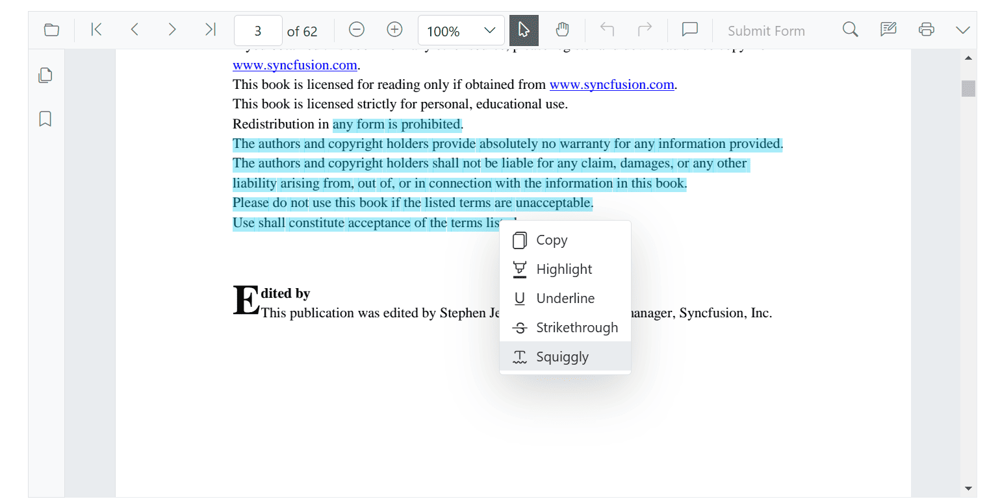
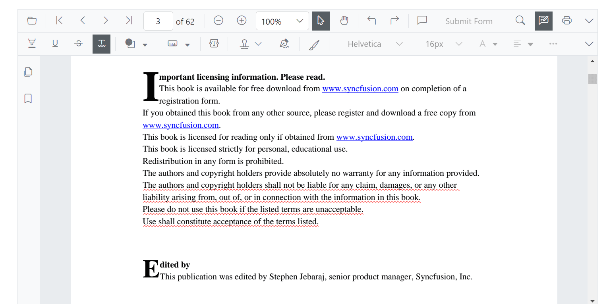
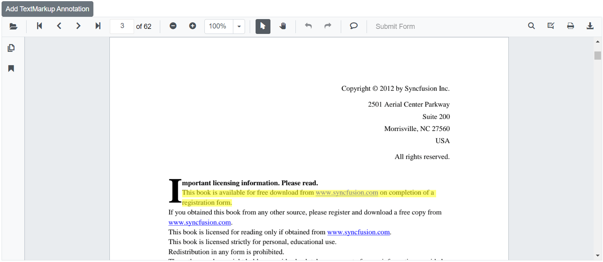
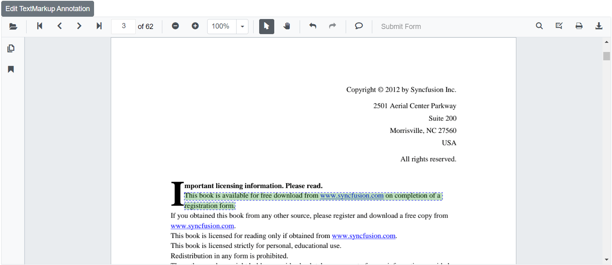

# Text markup annotations in Blazor SfPdfViewer Component

The SfPdfViewer control supports adding, editing, and deleting text markup annotations, including highlight, underline, strikethrough, and squiggly, in a PDF document.


## Adding text markup annotation to the PDF Document

Text markup annotations can be added using either the annotation toolbar or the context menu.

## Highlight a text

There are two ways to highlight text in a PDF document.

**Using the context menu.**

* Select text in the PDF document and right-click it.
* Select the **Highlight** option in the context menu.


**Using the annotation toolbar.**

* Click the **Edit Annotation** button in the SfPdfViewer toolbar. A toolbar appears below it.
* Select the **Highlight** button in the annotation toolbar to enable highlight mode.
* Select the text to add the highlight annotation.
* Alternatively, select the text first and then click **Highlight** to apply it.


In pan mode, entering highlight mode switches the viewer to text select mode to enable text selection for highlighting.

```cshtml

@using Syncfusion.Blazor.SfPdfViewer
@using Syncfusion.Blazor.Buttons

<SfButton OnClick="OnClick">Highlight</SfButton>
<SfPdfViewer2 DocumentPath="@DocumentPath"
              @ref="viewer"
              Width="100%"
              Height="100%">
</SfPdfViewer2>

@code {
    SfPdfViewer2 viewer;

    public async void OnClick(MouseEventArgs args)
    {
        await viewer.SetAnnotationModeAsync(AnnotationType.Highlight);
    }
    private string DocumentPath { get; set; } = "wwwroot/Data/PDF_Succinctly.pdf";
}

```

## Underline a text

There are two ways to underline text in a PDF document.

**Using the context menu.**

* Select text in the PDF document and right-click it.
* Select the **Underline** option in the context menu.


**Using the annotation toolbar.**

* Click the **Edit Annotation** button in the SfPdfViewer toolbar. A toolbar appears below it.
* Select the **Underline** button in the annotation toolbar to enable underline mode.
* Select the text to add the underline annotation.
* Alternatively, select the text first and then click **Underline** to apply it.


In pan mode, entering underline mode switches the viewer to text select mode to enable text selection for underlining.

```cshtml

@using Syncfusion.Blazor.SfPdfViewer
@using Syncfusion.Blazor.Buttons

<SfButton OnClick="OnClick">Underline</SfButton>
<SfPdfViewer2 DocumentPath="@DocumentPath"
              @ref="viewer"
              Width="100%"
              Height="100%">
</SfPdfViewer2>

@code {
    SfPdfViewer2 viewer;

    public void OnClick(MouseEventArgs args)
    {
        viewer.SetAnnotationModeAsync(AnnotationType.Underline);
    }
    private string DocumentPath { get; set; } = "wwwroot/Data/PDF_Succinctly.pdf";
}

```

## Strikethrough a text

There are two ways to apply strikethrough to text in a PDF document:

Using the context menu.

* Select text in the PDF document and right-click it.
* Select the **Strikethrough** option in the context menu.


**Using the annotation toolbar.**

* Click the **Edit Annotation** button in the SfPdfViewer toolbar. A toolbar appears below it.
* Select the **Strikethrough** button in the annotation toolbar to enable strikethrough mode.
* Select the text to add the strikethrough annotation.
* Alternatively, select the text first and then click **Strikethrough** to apply it.


In pan mode, entering strikethrough mode switches the viewer to text select mode to enable text selection for striking through.

```cshtml

@using Syncfusion.Blazor.SfPdfViewer
@using Syncfusion.Blazor.Buttons

<SfButton OnClick="OnClick">Strikethrough</SfButton>
<SfPdfViewer2 DocumentPath="@DocumentPath"
              @ref="viewer"
              Width="100%"
              Height="100%">
</SfPdfViewer2>

@code {
    SfPdfViewer2 viewer;

    public void OnClick(MouseEventArgs args)
    {
        viewer.SetAnnotationModeAsync(AnnotationType.Strikethrough);
    }
    private string DocumentPath { get; set; } = "wwwroot/Data/PDF_Succinctly.pdf";
}

```
## Squiggly a text

There are two ways to apply squiggly to text in a PDF document:

Using the context menu.

* Select text in the PDF document and right-click it.
* Select the **Squiggly** option in the context menu.



**Using the annotation toolbar.**

* Click the **Edit Annotation** button in the SfPdfViewer toolbar. A toolbar appears below it.
* Select the **Squiggly** button in the annotation toolbar to enable squiggly mode.
* Select the text to add the squiggly annotation.
* Alternatively, select the text first and then click **Squiggly** to apply it.



In pan mode, entering squiggly mode switches the viewer to text select mode to enable text selection for applying the squiggly annotation.

```cshtml

@using Syncfusion.Blazor.SfPdfViewer
@using Syncfusion.Blazor.Buttons

<SfButton OnClick="OnClick">squiggly</SfButton>
<SfPdfViewer2 DocumentPath="@DocumentPath"
              @ref="viewer"
              Width="100%"
              Height="100%">
</SfPdfViewer2>

@code {
    SfPdfViewer2 viewer;

    public void OnClick(MouseEventArgs args)
    {
        viewer.SetAnnotationModeAsync(AnnotationType.Squiggly);
    }
    private string DocumentPath { get; set; } = "wwwroot/Data/PDF_Succinctly.pdf";
}

```

## Editing the properties of the text markup annotation

The color and opacity of a text markup annotation can be changed using the **Edit Color** and **Edit Opacity** tools in the annotation toolbar.

### Editing color

Change the annotation color using the color palette in the **Edit Color** tool.


### Editing opacity

Change the annotation opacity using the range slider in the **Edit Opacity** tool.


## Text markup annotation settings

Set default properties for text markup annotations before rendering the component using the [HighlightSettings](https://help.syncfusion.com/cr/blazor/Syncfusion.Blazor.SfPdfViewer.PdfViewerBase.html#Syncfusion_Blazor_SfPdfViewer_PdfViewerBase_HighlightSettings), [UnderlineSettings](https://help.syncfusion.com/cr/blazor/Syncfusion.Blazor.SfPdfViewer.PdfViewerBase.html#Syncfusion_Blazor_SfPdfViewer_PdfViewerBase_UnderlineSettings), [StrikethroughSettings](https://help.syncfusion.com/cr/blazor/Syncfusion.Blazor.SfPdfViewer.PdfViewerBase.html#Syncfusion_Blazor_SfPdfViewer_PdfViewerBase_StrikethroughSettings), and [SquigglySettings](https://help.syncfusion.com/cr/blazor/Syncfusion.Blazor.SfPdfViewer.PdfViewerBase.html#Syncfusion_Blazor_SfPdfViewer_PdfViewerBase_SquigglySettings) parameters.

N> After changing the default color and opacity using the **Edit Color** and **Edit Opacity** tools, those values become the new defaults for subsequent annotations.

```cshtml

@using Syncfusion.Blazor.SfPdfViewer

<SfPdfViewer2 @ref="@viewer"
              DocumentPath="@DocumentPath"
              HighlightSettings="@HighlightSettings"
              UnderlineSettings="@UnderlineSettings"
              StrikethroughSettings="@StrikethroughSettings"
              SquigglySettings="@SquigglySettings"
              Height="100%"
              Width="100%">
</SfPdfViewer2>

@code {
    SfPdfViewer2 viewer;
    private string DocumentPath { get; set; } = "wwwroot/Data/PDF_Succinctly.pdf";

    PdfViewerHighlightSettings HighlightSettings = new PdfViewerHighlightSettings
        {
            Color = "green",
            Opacity = 0.6
        };

    PdfViewerUnderlineSettings UnderlineSettings = new PdfViewerUnderlineSettings
        {
            Color = "blue",
            Opacity = 0.6
        };

    PdfViewerStrikethroughSettings StrikethroughSettings = new PdfViewerStrikethroughSettings
        {
            Color = "orange",
            Opacity = 0.6
        };

    PdfViewerSquigglySettings SquigglySettings = new PdfViewerSquigglySettings
        {
            Color = "red",
            Opacity = 0.6
        };
}

```
## Add text markup annotation programmatically

The Blazor SfPdfViewer supports programmatically adding text markup annotations such as Highlight, Underline, Strikethrough, and Squiggly using the [AddAnnotationAsync](https://help.syncfusion.com/cr/blazor/Syncfusion.Blazor.SfPdfViewer.PdfViewerBase.html#Syncfusion_Blazor_SfPdfViewer_PdfViewerBase_AddAnnotationAsync_Syncfusion_Blazor_SfPdfViewer_PdfAnnotation_) method.

Below is an example demonstrating how to add a text markup annotation to a PDF document:

```cshtml

@using Syncfusion.Blazor.Buttons
@using Syncfusion.Blazor.SfPdfViewer

<SfButton OnClick="@AddTextMarkupAnnotation">Add TextMarkup Annotation</SfButton>
<SfPdfViewer2 Width="100%" Height="100%" DocumentPath="@DocumentPath" @ref="@Viewer" />

@code {
    SfPdfViewer2 Viewer;
    public string DocumentPath { get; set; } = "wwwroot/Data/PDF_Succinctly.pdf";

    public async void AddTextMarkupAnnotation(MouseEventArgs args)
    {
        PdfAnnotation annotation = new PdfAnnotation();
        // Set the Text markup annotation type like highlight, underline, strikethrough, Squiggly.
        annotation.Type = AnnotationType.Highlight;
        // Set the PageNumber starts from 0. So, if set to 2 it represents the page 3. 
        annotation.PageNumber = 2;
        List<Bound> bounds = new List<Bound>();
        Bound bound = new Bound();
        bound.X = 148;
        bound.Y = 313;
        bound.Width = 520;
        bound.Height = 15;
        bounds.Add(bound);
        bound = new Bound();
        bound.X = 148;
        bound.Y = 332;
        bound.Width = 102;
        bound.Height = 15;
        bounds.Add(bound);
        // Set the Text Markup annotation bounds value
        annotation.Bounds = bounds;
        await Viewer.AddAnnotationAsync(annotation);
    }
}

```

This example adds a text markup annotation to the third page of the PDF document (page index is zero-based).



[View sample in GitHub](https://github.com/SyncfusionExamples/blazor-pdf-viewer-examples/tree/master/Annotations/Programmatic%20Support/Text%20Markup/Add).

## Edit text markup annotation programmatically

The Blazor SfPdfViewer supports programmatically editing text markup annotations using the [EditAnnotationAsync](https://help.syncfusion.com/cr/blazor/Syncfusion.Blazor.SfPdfViewer.PdfViewerBase.html#Syncfusion_Blazor_SfPdfViewer_PdfViewerBase_EditAnnotationAsync_Syncfusion_Blazor_SfPdfViewer_PdfAnnotation_) method.

Below is an example demonstrating how to edit a text markup annotation programmatically:

```cshtml

@using Syncfusion.Blazor.Buttons
@using Syncfusion.Blazor.SfPdfViewer

<SfButton OnClick="@EditTextMarkupAnnotation">Edit TextMarkup Annotation</SfButton>
<SfPdfViewer2 Width="100%" Height="100%" DocumentPath="@DocumentPath" @ref="@Viewer" />

@code {
    SfPdfViewer2 Viewer;
    public string DocumentPath { get; set; } = "wwwroot/Data/TextMarkupAnnotation.pdf";

    public async void EditTextMarkupAnnotation(MouseEventArgs args)
    {
        // Get annotation collection
        List<PdfAnnotation> annotationCollection = await Viewer.GetAnnotationsAsync();
        // Select the annotation want to edit
        PdfAnnotation annotation = annotationCollection[0];
        // Change the color of the text markup annotation to green        
        annotation.Color = "#008000";
        // Change the opacity of the text markup annotation to 50% (0.5)        
        annotation.Opacity = 0.5;
        await Viewer.EditAnnotationAsync(annotation);
    }
}

```

This code edits an existing text markup annotation programmatically.



[View sample in GitHub](https://github.com/SyncfusionExamples/blazor-pdf-viewer-examples/tree/master/Annotations/Programmatic%20Support/Text%20Markup/Edit).

## Delete annotation programmatically

The Blazor SfPdfViewer can also remove annotations programmatically using the [DeleteAnnotationAsync](https://help.syncfusion.com/cr/blazor/Syncfusion.Blazor.SfPdfViewer.PdfViewerBase.html#Syncfusion_Blazor_SfPdfViewer_PdfViewerBase_DeleteAnnotationAsync_Syncfusion_Blazor_SfPdfViewer_PdfAnnotation_) method.

Below is an example demonstrating how to delete an annotation programmatically:

```cshtml

@using Syncfusion.Blazor.Buttons
@using Syncfusion.Blazor.SfPdfViewer

<SfButton OnClick="@DeleteAnnotation">Delete Annotation</SfButton>
<SfPdfViewer2 Width="100%" Height="100%" DocumentPath="@DocumentPath" @ref="@Viewer" />

@code {
    SfPdfViewer2 Viewer;
    public string DocumentPath { get; set; } = "wwwroot/Data/Annotation.pdf";

    public async void DeleteAnnotation(MouseEventArgs args)
    {
        // Get the annotation collection
        List<PdfAnnotation> annotationCollection = await Viewer.GetAnnotationsAsync();
        // Select the annotation you want to delete
        PdfAnnotation annotation = annotationCollection[0];
        // Delete the specified PdfAnnotation
        await Viewer.DeleteAnnotationAsync(annotation);
        // Alternatively, you can also delete the specified PdfAnnotation based on AnnotationId
        //await Viewer.DeleteAnnotationAsync(annotation.Id);
    }
}

```
This example demonstrates how to programmatically delete an annotation within the Syncfusion<sup style="font-size:70%">&reg;</sup> Blazor SfPdfViewer using the [DeleteAnnotationAsync](https://help.syncfusion.com/cr/blazor/Syncfusion.Blazor.SfPdfViewer.PdfViewerBase.html#Syncfusion_Blazor_SfPdfViewer_PdfViewerBase_DeleteAnnotationAsync_Syncfusion_Blazor_SfPdfViewer_PdfAnnotation_) method.

N> Alternatively, the annotation can be deleted using its annotation ID with the [DeleteAnnotationAsync](https://help.syncfusion.com/cr/blazor/Syncfusion.Blazor.SfPdfViewer.PdfViewerBase.html#Syncfusion_Blazor_SfPdfViewer_PdfViewerBase_DeleteAnnotationAsync_System_String_) method.

[View sample in GitHub](https://github.com/SyncfusionExamples/blazor-pdf-viewer-examples/tree/master/Annotations/Programmatic%20Support/Delete%20Annotation).

## See also

* [How to change the highlight color of the text](../faqs/how-to-change-the-highlighted-color-of-the-text)