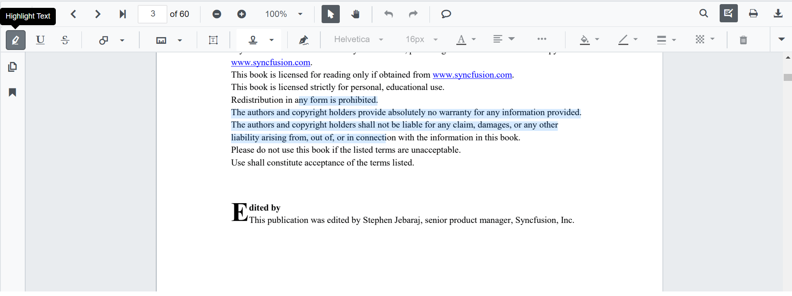
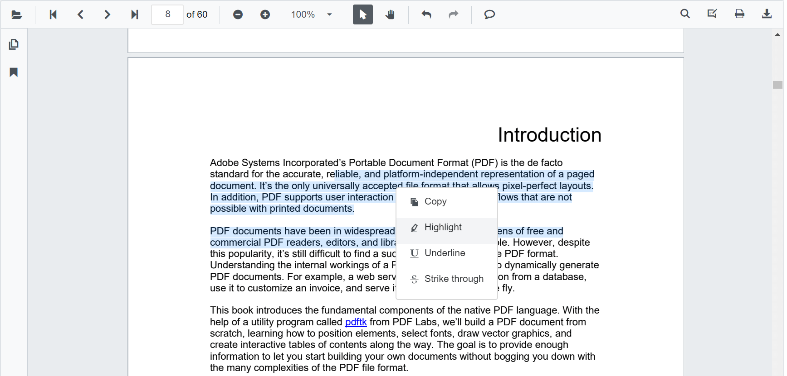
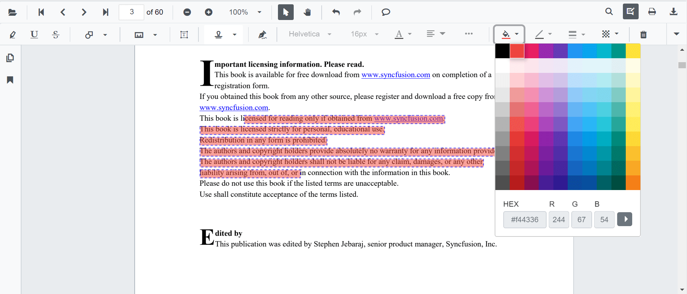
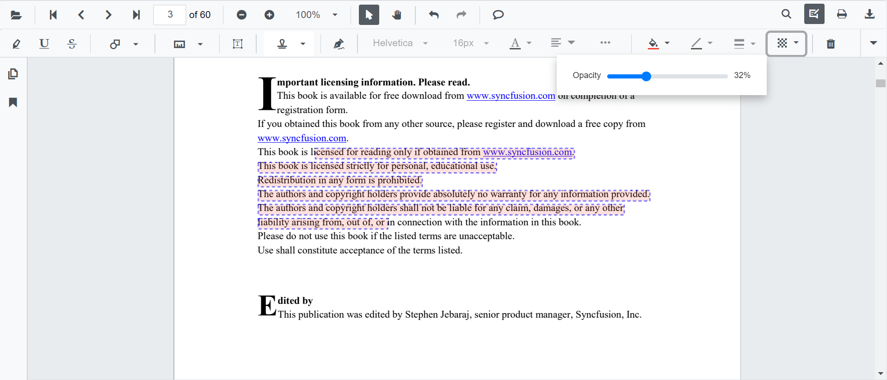

# Highlight Annotation in Blazor SfPdfViewer Component

This guide explains how to **enable**, **apply**, **customize**, and **manage** *Highlight* text markup annotations in the Syncfusion **Blazor SfPdfViewer** component.

## Enable Highlight Annotation in the Viewer

Highlight is enabled by default. To use the annotation toolbar, add the `SfPdfViewer` component to your Blazor page:

```cshtml
@using Syncfusion.Blazor.SfPdfViewer

<SfPdfViewer2 DocumentPath="@DocumentPath"
              Width="100%"
              Height="100%">
</SfPdfViewer2>

@code {
    private string DocumentPath { get; set; } = "wwwroot/Data/PDF_Succinctly.pdf";
}
```

## Disable TextMarkup Annotation

To disable all text markup annotations (including highlight) so they do not appear in the toolbar or context menu, set `EnableTextMarkupAnnotation="false"`:

```cshtml
@using Syncfusion.Blazor.SfPdfViewer

<SfPdfViewer2 DocumentPath="@DocumentPath"
              EnableTextMarkupAnnotation="false"
              Width="100%"
              Height="100%">
</SfPdfViewer2>

@code {
    private string DocumentPath { get; set; } = "wwwroot/Data/PDF_Succinctly.pdf";
}
```

## Add Highlight Annotation

### Add Highlight Annotation Using the Toolbar

1. Click the **Edit Annotation** button in the SfPdfViewer toolbar. An annotation toolbar appears below the main toolbar.
2. Select the **Highlight** button in the annotation toolbar to enable highlight mode.
3. Select the text in the document to add the highlight annotation.
   - Alternatively, select the text first and then click **Highlight** to apply it.
   - If **Pan Mode** is active, the viewer automatically switches to **Text Selection** mode.



### Apply Highlight Annotation Using the Context Menu

1. Select text in the document.
2. Right-click the selected text region.
3. Choose **Highlight** from the context menu.



### Enable Highlight Annotation Mode Programmatically

Switch the viewer into highlight mode using [`SetAnnotationModeAsync`](https://help.syncfusion.com/cr/blazor/Syncfusion.Blazor.SfPdfViewer.PdfViewerBase.html#Syncfusion_Blazor_SfPdfViewer_PdfViewerBase_SetAnnotationModeAsync_Syncfusion_Blazor_SfPdfViewer_AnnotationType_).

```cshtml
@page "/enable-highlight"
@using Syncfusion.Blazor.SfPdfViewer
@using Syncfusion.Blazor.Buttons

<SfButton OnClick="EnableHighlightMode">Highlight</SfButton>
<SfPdfViewer2 DocumentPath="@DocumentPath"
              @ref="Viewer"
              Width="100%"
              Height="100%">
</SfPdfViewer2>

@code {
    private SfPdfViewer2 Viewer;
    private string DocumentPath { get; set; } = "wwwroot/Data/PDF_Succinctly.pdf";

    private async Task EnableHighlightMode(MouseEventArgs args)
    {
        await Viewer.SetAnnotationModeAsync(AnnotationType.Highlight);
    }
}
```

#### Exit Highlight Annotation Mode

Switch back to normal mode using:

```csharp
private async Task DisableHighlightMode()
{
    await viewer.SetAnnotationModeAsync(AnnotationType.None);
}
```

### Add Highlight Annotation Programmatically

Use [`AddAnnotationAsync()`](https://help.syncfusion.com/cr/blazor/Syncfusion.Blazor.SfPdfViewer.PdfViewerBase.html#Syncfusion_Blazor_SfPdfViewer_PdfViewerBase_AddAnnotationAsync_Syncfusion_Blazor_SfPdfViewer_PdfAnnotation_) to insert a highlight at a specific location.

```cshtml
@page "/add-highlight"
@using Syncfusion.Blazor.Buttons
@using Syncfusion.Blazor.SfPdfViewer

<SfButton OnClick="@AddHighlight">Add Highlight</SfButton>
<SfPdfViewer2 Width="100%" Height="100%" DocumentPath="@DocumentPath" @ref="@Viewer" />

@code {
    private SfPdfViewer2 Viewer;
    private string DocumentPath { get; set; } = "wwwroot/Data/PDF_Succinctly.pdf";

    private async Task AddHighlight(MouseEventArgs args)
    {
        PdfAnnotation annotation = new PdfAnnotation
        {
            Type = AnnotationType.Highlight,
            // PageNumber is 0-based in the SfPdfViewer API
            PageNumber = 0,
            Color = "#ffff00",
            Opacity = 0.9,
            Bounds = new List<Bound>
            {
                new Bound { X = 97, Y = 110, Width = 350, Height = 14 }
            }
        };
        await Viewer.AddAnnotationAsync(annotation);
    }
}
```

## Customize Highlight Annotation Appearance

Configure default highlight settings such as **color** and **opacity** using [`HighlightSettings`](https://help.syncfusion.com/cr/blazor/Syncfusion.Blazor.SfPdfViewer.PdfViewerBase.html#Syncfusion_Blazor_SfPdfViewer_PdfViewerBase_HighlightSettings).

```cshtml
@using Syncfusion.Blazor.SfPdfViewer

<SfPdfViewer2 @ref="@Viewer"
              DocumentPath="@DocumentPath"
              HighlightSettings="@HighlightSettingsModel"
              Height="100%"
              Width="100%">
</SfPdfViewer2>

@code {
    private SfPdfViewer2 Viewer;
    private string DocumentPath { get; set; } = "wwwroot/Data/PDF_Succinctly.pdf";

    private PdfViewerHighlightSettings HighlightSettingsModel = new PdfViewerHighlightSettings
    {
        Color = "#ffff00",
        Opacity = 0.9
    };
}
```

N> After changing the default color and opacity using the **Edit Color** and **Edit Opacity** tools, those values become the new defaults for subsequent annotations.

## Manage Highlight Annotation (Edit, Delete)

### Edit Highlight Annotation

#### Edit Highlight Annotation Appearance Using the UI

Use the annotation toolbar:

- **Edit Color** tool to change the highlight color.



- **Edit Opacity** slider to adjust the transparency.



#### Edit Highlight Annotation Programmatically

Modify an existing highlight programmatically using [`EditAnnotationAsync()`](https://help.syncfusion.com/cr/blazor/Syncfusion.Blazor.SfPdfViewer.PdfViewerBase.html#Syncfusion_Blazor_SfPdfViewer_PdfViewerBase_EditAnnotationAsync_Syncfusion_Blazor_SfPdfViewer_PdfAnnotation_).

```cshtml
@using Syncfusion.Blazor.Buttons
@using Syncfusion.Blazor.SfPdfViewer

<SfButton OnClick="@EditHighlight">Edit Highlight</SfButton>
<SfPdfViewer2 Width="100%" Height="100%" DocumentPath="@DocumentPath" @ref="@Viewer" />

@code {
    private SfPdfViewer2 Viewer;
    private string DocumentPath { get; set; } = "wwwroot/Data/PDF_Succinctly.pdf";

    private async Task EditHighlight(MouseEventArgs args)
    {
        // Get the annotation collection
        List<PdfAnnotation> annotationCollection = await Viewer.GetAnnotationsAsync();
        if (annotationCollection is null || annotationCollection.Count == 0)
        {
            return;
        }
        // Select the first highlight annotation on the first page
        PdfAnnotation annotation = annotationCollection
            .FirstOrDefault(a => a.Type == AnnotationType.Highlight && a.PageNumber == 0)
            ?? annotationCollection[0];
        // Change the color of the highlight annotation to blue
        annotation.Color = "#0000ff";
        // Change the opacity to 80% (0.8)
        annotation.Opacity = 0.8;
        await Viewer.EditAnnotationAsync(annotation);
    }
}
```

### Delete Highlight Annotation

The SfPdfViewer supports deleting existing annotations through both the UI and the API. To delete from the UI, select the highlight and press **Delete** or use the **Delete** tool on the annotation toolbar.

To delete programmatically, use [`DeleteAnnotationAsync()`](https://help.syncfusion.com/cr/blazor/Syncfusion.Blazor.SfPdfViewer.PdfViewerBase.html#Syncfusion_Blazor_SfPdfViewer_PdfViewerBase_DeleteAnnotationAsync_Syncfusion_Blazor_SfPdfViewer_PdfAnnotation_):

```cshtml
@using Syncfusion.Blazor.Buttons
@using Syncfusion.Blazor.SfPdfViewer

<SfButton OnClick="@DeleteHighlight">Delete Highlight</SfButton>
<SfPdfViewer2 Width="100%" Height="100%" DocumentPath="@DocumentPath" @ref="@Viewer" />

@code {
    private SfPdfViewer2 Viewer;
    private string DocumentPath { get; set; } = "wwwroot/Data/PDF_Succinctly.pdf";

    private async Task DeleteHighlight(MouseEventArgs args)
    {
        // Get the annotation collection
        List<PdfAnnotation> annotationCollection = await Viewer.GetAnnotationsAsync();
        if (annotationCollection is null || annotationCollection.Count == 0)
        {
            return;
        }
        // Select the first highlight annotation on the first page
        PdfAnnotation annotation = annotationCollection
            .FirstOrDefault(a => a.Type == AnnotationType.Highlight && a.PageNumber == 0)
            ?? annotationCollection[0];
        // Delete the specified annotation
        await Viewer.DeleteAnnotationAsync(annotation);
    }
}
```

## Add Multiple Highlight Annotations with Custom Properties

To add several highlights with different colors and positions in one operation, call [`AddAnnotationAsync()`](https://help.syncfusion.com/cr/blazor/Syncfusion.Blazor.SfPdfViewer.PdfViewerBase.html#Syncfusion_Blazor_SfPdfViewer_PdfViewerBase_AddAnnotationAsync_Syncfusion_Blazor_SfPdfViewer_PdfAnnotation_) for each [`PdfAnnotation`](https://help.syncfusion.com/cr/blazor/Syncfusion.Blazor.SfPdfViewer.PdfAnnotation.html). This is an extension of the [Add Highlight Programmatically](#add-highlight-programmatically) example.

```cshtml
@page "/add-multiple-highlights"
@using Syncfusion.Blazor.Buttons
@using Syncfusion.Blazor.SfPdfViewer
@using System.Collections.Generic

<SfButton OnClick="@AddMultipleHighlights">Add Multiple Highlights</SfButton>
<SfPdfViewer2 Width="100%" Height="100%" DocumentPath="@DocumentPath" @ref="@Viewer" />

@code {
    private SfPdfViewer2 Viewer;
    private string DocumentPath { get; set; } = "wwwroot/Data/PDF_Succinctly.pdf";

    private async Task AddMultipleHighlights(MouseEventArgs args)
    {
        // Highlight 1 - Yellow on the first page (index 0)
        await Viewer.AddAnnotationAsync(new PdfAnnotation
        {
            Type = AnnotationType.Highlight,
            PageNumber = 0,
            Color = "#ffff00",
            Opacity = 0.9,
            Bounds = new List<Bound>
            {
                new Bound { X = 100, Y = 150, Width = 320, Height = 14 }
            }
        });

        // Highlight 2 - Red on the first page (index 0)
        await Viewer.AddAnnotationAsync(new PdfAnnotation
        {
            Type = AnnotationType.Highlight,
            PageNumber = 0,
            Color = "#ff1010",
            Opacity = 0.9,
            Bounds = new List<Bound>
            {
                new Bound { X = 110, Y = 220, Width = 300, Height = 14 }
            }
        });
    }
}
```

## Handle Highlight Annotation Events

The SfPdfViewer provides annotation life-cycle events that fire when highlight annotations are added, modified, selected, or removed. Subscribe to events through the `PdfViewerEvents` tag.

```cshtml
@page "/highlight-events"
@using Syncfusion.Blazor.SfPdfViewer

<SfPdfViewer2 DocumentPath="@DocumentPath"
              Height="100%"
              Width="100%">
    <PdfViewerEvents AnnotationAdded="@OnAnnotationAdded"
                     AnnotationRemoved="@OnAnnotationRemoved"
                     AnnotationPropertiesChanged="@OnAnnotationPropertiesChanged" />
</SfPdfViewer2>

@code {
    private string DocumentPath { get; set; } = "wwwroot/Data/PDF_Succinctly.pdf";

    private async Task OnAnnotationAdded(AnnotationAddEventArgs args)
    {
        if (args.AnnotationType == AnnotationType.Highlight)
        {
            // Highlight was added
        }
    }

    private async Task OnAnnotationRemoved(AnnotationRemoveEventArgs args)
    {
        if (args.AnnotationType == AnnotationType.Highlight)
        {
            // Highlight was removed
        }
    }

    private async Task OnAnnotationPropertiesChanged(AnnotationPropertiesChangeEventArgs args)
    {
        if (args.AnnotationType == AnnotationType.Highlight)
        {
            // Highlight color or opacity changed
        }
    }
}
```

For the full list of available events and their descriptions, see [Annotation Events](../events).

## Export and Import

The SfPdfViewer supports exporting and importing annotations as **JSON** or **XFDF**, allowing you to save annotations as a separate file or load existing annotations back into the viewer. For full details on supported formats and steps to export or import annotations, see [Export and Import Annotations](../import-export-annotation).

## See also

- [Annotation Events](../events)
- [Export and Import Annotations](../import-export-annotation)
- [Delete Annotations](../delete-annotation)
