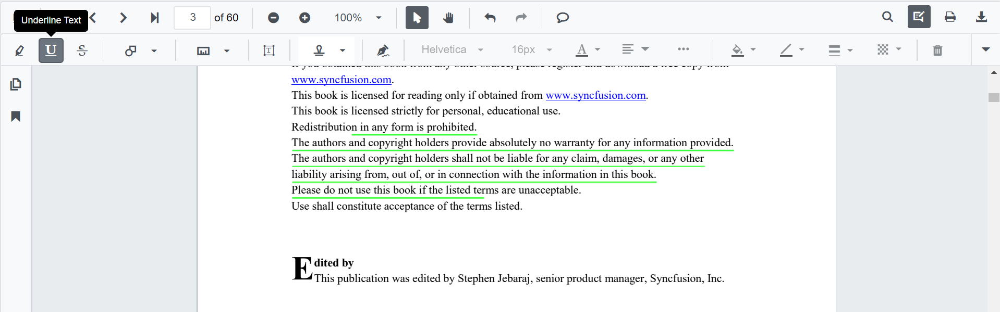
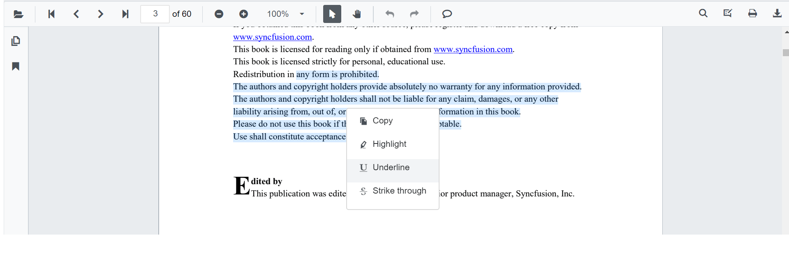

# Underline Annotation in Blazor SfPdfViewer

This guide explains how to **enable**, **apply**, **customize**, and **manage** *Underline* text markup annotations in the Syncfusion **Blazor SfPdfViewer**. You can underline text using the toolbar or context menu, programmatically invoke underline mode, customize default settings, handle events, and export the PDF with annotations.

## Enable Underline in the Viewer

The SfPdfViewer component supports underlining text in PDF documents by default. To enable the annotation toolbar and underlining functionality, simply add the SfPdfViewer component to your Blazor page:

```cshtml
@using Syncfusion.Blazor.SfPdfViewer

<SfPdfViewer2 DocumentPath="@DocumentPath"
              Width="100%"
              Height="100%">
</SfPdfViewer2>

@code {
    private string DocumentPath { get; set; } = "wwwroot/Data/PDF_Succinctly.pdf";
}
```

## Add Underline Annotation

### Add Underline Using the Toolbar

1. Click the **Edit Annotation** button in the SfPdfViewer toolbar. A toolbar appears below it.
2. Select the **Underline** button in the annotation toolbar to enable underline mode.
3. Select the text to add the underline annotation.
   - Alternatively, select the text first and then click **Underline** to apply it.
   - If **Pan Mode** is active, the viewer automatically switches to **Text Selection** mode.



### Apply Underline Using Context Menu

Right-click a selected text region → select **Underline**.



### Enable Underline Mode

Switch the viewer into underline mode using `SetAnnotationModeAsync()`.

```cshtml
@using Syncfusion.Blazor.SfPdfViewer
@using Syncfusion.Blazor.Buttons

<SfButton OnClick="OnClick">Underline</SfButton>
<SfPdfViewer2 DocumentPath="@DocumentPath"
              @ref="viewer"
              Width="100%"
              Height="100%">
</SfPdfViewer2>

@code {
    SfPdfViewer2 viewer;

    public async void OnClick(MouseEventArgs args)
    {
        await viewer.SetAnnotationModeAsync(AnnotationType.Underline);
    }
    private string DocumentPath { get; set; } = "wwwroot/Data/PDF_Succinctly.pdf";
}
```

#### Exit Underline Mode

Switch back to normal mode using:

```cshtml
public async void DisableUnderlineMode()
{
    await viewer.SetAnnotationModeAsync(AnnotationType.None);
}
```

### Add Underline Programmatically

Use [`AddAnnotationAsync()`](https://help.syncfusion.com/cr/blazor/Syncfusion.Blazor.SfPdfViewer.PdfViewerBase.html#Syncfusion_Blazor_SfPdfViewer_PdfViewerBase_AddAnnotationAsync_Syncfusion_Blazor_SfPdfViewer_PdfAnnotation_) to insert an underline at a specific location.

```cshtml
@using Syncfusion.Blazor.Buttons
@using Syncfusion.Blazor.SfPdfViewer

<SfButton OnClick="@AddUnderline">Add Underline</SfButton>
<SfPdfViewer2 Width="100%" Height="100%" DocumentPath="@DocumentPath" @ref="@Viewer" />

@code {
    SfPdfViewer2 Viewer;
    public string DocumentPath { get; set; } = "wwwroot/Data/PDF_Succinctly.pdf";

    public async void AddUnderline(MouseEventArgs args)
    {
        PdfAnnotation annotation = new PdfAnnotation();
        annotation.Type = AnnotationType.Underline;
        annotation.PageNumber = 0;
        List<Bound> bounds = new List<Bound>();
        Bound bound = new Bound();
        bound.X = 97;
        bound.Y = 110;
        bound.Width = 350;
        bound.Height = 14;
        bounds.Add(bound);
        annotation.Bounds = bounds;
        await Viewer.AddAnnotationAsync(annotation);
    }
}
```

## Customize Underline Appearance

Configure default underline settings such as **color** and **opacity** using [`UnderlineSettings`](https://help.syncfusion.com/cr/blazor/Syncfusion.Blazor.SfPdfViewer.PdfViewerBase.html#Syncfusion_Blazor_SfPdfViewer_PdfViewerBase_UnderlineSettings).

```cshtml
@using Syncfusion.Blazor.SfPdfViewer

<SfPdfViewer2 @ref="@viewer"
              DocumentPath="@DocumentPath"
              UnderlineSettings="@UnderlineSettings"
              Height="100%"
              Width="100%">
</SfPdfViewer2>

@code {
    SfPdfViewer2 viewer;
    private string DocumentPath { get; set; } = "wwwroot/Data/PDF_Succinctly.pdf";

    PdfViewerUnderlineSettings UnderlineSettings = new PdfViewerUnderlineSettings
    {
        Color = "#00aa00",
        Opacity = 0.9
    };
}
```

N> After changing the default color and opacity using the **Edit Color** and **Edit Opacity** tools, those values become the new defaults for subsequent annotations.

## Manage Underline (Edit, Delete)

### Edit Underline

#### Edit Underline Appearance (UI)

Use the annotation toolbar:
- **Edit Color** tool to change the underline color


- **Edit Opacity** slider to adjust the transparency


#### Edit Underline Programmatically

Modify an existing underline programmatically using [`EditAnnotationAsync()`](https://help.syncfusion.com/cr/blazor/Syncfusion.Blazor.SfPdfViewer.PdfViewerBase.html#Syncfusion_Blazor_SfPdfViewer_PdfViewerBase_EditAnnotationAsync_Syncfusion_Blazor_SfPdfViewer_PdfAnnotation_).

```cshtml
@using Syncfusion.Blazor.Buttons
@using Syncfusion.Blazor.SfPdfViewer

<SfButton OnClick="@EditUnderline">Edit Underline</SfButton>
<SfPdfViewer2 Width="100%" Height="100%" DocumentPath="@DocumentPath" @ref="@Viewer" />

@code {
    SfPdfViewer2 Viewer;
    public string DocumentPath { get; set; } = "wwwroot/Data/Underline.pdf";

    public async void EditUnderline(MouseEventArgs args)
    {
        // Get annotation collection
        List<PdfAnnotation> annotationCollection = await Viewer.GetAnnotationsAsync();
        // Select the annotation you want to edit
        PdfAnnotation annotation = annotationCollection[0];
        // Change the color of the underline annotation to blue
        annotation.Color = "#0000ff";
        // Change the opacity to 80% (0.8)
        annotation.Opacity = 0.8;
        await Viewer.EditAnnotationAsync(annotation);
    }
}
```

### Delete Underline

The SfPdfViewer supports deleting existing annotations through both the UI and API.
Use [`DeleteAnnotationAsync()`](https://help.syncfusion.com/cr/blazor/Syncfusion.Blazor.SfPdfViewer.PdfViewerBase.html#Syncfusion_Blazor_SfPdfViewer_PdfViewerBase_DeleteAnnotationAsync_Syncfusion_Blazor_SfPdfViewer_PdfAnnotation_) to remove an annotation programmatically:

```cshtml
@using Syncfusion.Blazor.Buttons
@using Syncfusion.Blazor.SfPdfViewer

<SfButton OnClick="@DeleteUnderline">Delete Underline</SfButton>
<SfPdfViewer2 Width="100%" Height="100%" DocumentPath="@DocumentPath" @ref="@Viewer" />

@code {
    SfPdfViewer2 Viewer;
    public string DocumentPath { get; set; } = "wwwroot/Data/Underline.pdf";

    public async void DeleteUnderline(MouseEventArgs args)
    {
        // Get the annotation collection
        List<PdfAnnotation> annotationCollection = await Viewer.GetAnnotationsAsync();
        // Select the annotation you want to delete
        PdfAnnotation annotation = annotationCollection[0];
        // Delete the specified annotation
        await Viewer.DeleteAnnotationAsync(annotation);
    }
}
```

## Add Multiple Underlines with Custom Properties

Set custom properties for individual underlines when adding them programmatically:

```cshtml
@using Syncfusion.Blazor.Buttons
@using Syncfusion.Blazor.SfPdfViewer

<SfButton OnClick="@AddMultipleUnderlines">Add Multiple Underlines</SfButton>
<SfPdfViewer2 Width="100%" Height="100%" DocumentPath="@DocumentPath" @ref="@Viewer" />

@code {
    SfPdfViewer2 Viewer;
    public string DocumentPath { get; set; } = "wwwroot/Data/PDF_Succinctly.pdf";

    public async void AddMultipleUnderlines(MouseEventArgs args)
    {
        // Underline 1 - Yellow
        PdfAnnotation annotation1 = new PdfAnnotation();
        annotation1.Type = AnnotationType.Underline;
        annotation1.PageNumber = 0;
        List<Bound> bounds1 = new List<Bound>();
        Bound bound1 = new Bound();
        bound1.X = 100;
        bound1.Y = 150;
        bound1.Width = 320;
        bound1.Height = 14;
        bounds1.Add(bound1);
        annotation1.Bounds = bounds1;
        annotation1.Color = "#ffff00";
        annotation1.Opacity = 0.9;
        await Viewer.AddAnnotationAsync(annotation1);

        // Underline 2 - Red
        PdfAnnotation annotation2 = new PdfAnnotation();
        annotation2.Type = AnnotationType.Underline;
        annotation2.PageNumber = 0;
        List<Bound> bounds2 = new List<Bound>();
        Bound bound2 = new Bound();
        bound2.X = 110;
        bound2.Y = 220;
        bound2.Width = 300;
        bound2.Height = 14;
        bounds2.Add(bound2);
        annotation2.Bounds = bounds2;
        annotation2.Color = "#ff1010";
        annotation2.Opacity = 0.9;
        await Viewer.AddAnnotationAsync(annotation2);
    }
}
```

## Disable TextMarkup Annotation

Disable text markup annotations (including underline) using the `EnableTextMarkupAnnotation` property:

```cshtml
@using Syncfusion.Blazor.SfPdfViewer

<SfPdfViewer2 DocumentPath="@DocumentPath"
              EnableTextMarkupAnnotation="false"
              Width="100%"
              Height="100%">
</SfPdfViewer2>

@code {
    private string DocumentPath { get; set; } = "wwwroot/Data/PDF_Succinctly.pdf";
}
```

## Handle Underline Events

The SfPdfViewer provides annotation life-cycle events that notify when underline annotations are added, modified, selected, or removed. For the full list of available events and their descriptions, see [**Annotation Events**](../events).

## Export and Import

The SfPdfViewer supports exporting and importing annotations, allowing you to save annotations as a separate file or load existing annotations back into the viewer. For full details on supported formats and steps to export or import annotations, see [**Export and Import Annotation**](../import-export-annotation)

## See Also

- [Annotation Events](../events)
- [Export and Import Annotations](../import-export-annotation)
- [Delete Annotations](../delete-annotation)
