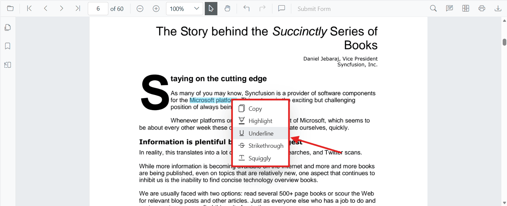
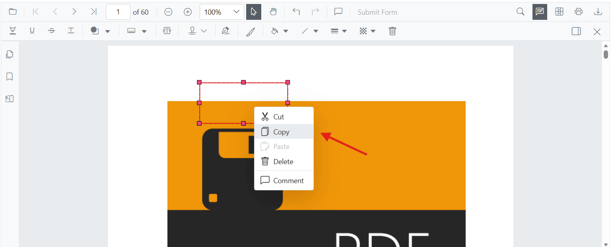
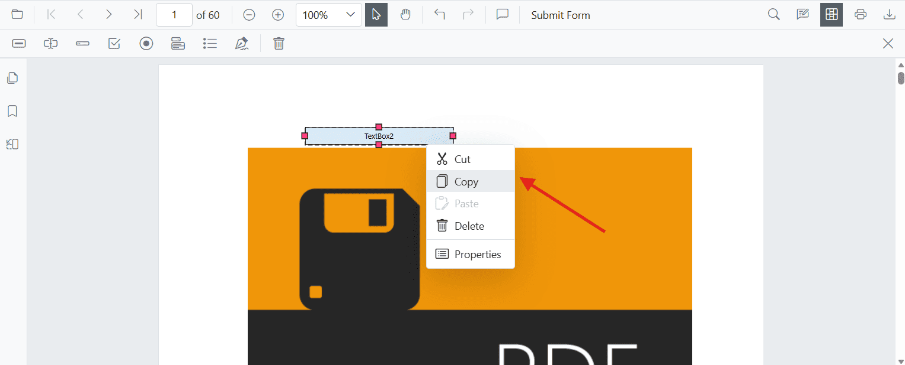
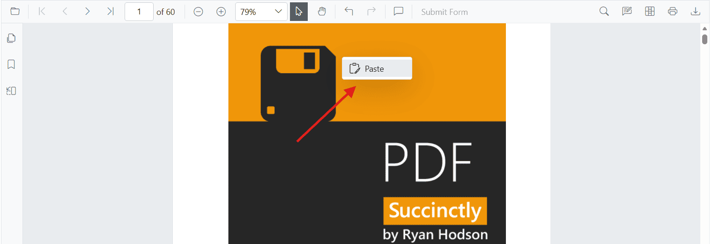
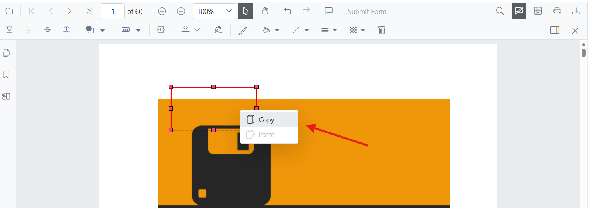

# Context Menu in Blazor PDF Viewer

The Blazor PDF Viewer provides a customizable context menu that appears when users interact with document elements. This guide explains the context menu feature, available options, and how to configure it for your application.

## Understanding the Context Menu

The context menu is a right-click menu that displays relevant actions based on the element being interacted with in the document. Users can perform operations such as copying, pasting, deleting, and managing annotations directly from this menu.

### Key Capabilities

The context menu in Blazor PDF Viewer supports the following:

* **Enable or Disable**: Toggle the context menu availability using the [EnableContextMenu](https://help.syncfusion.com/cr/blazor/Syncfusion.Blazor.SfPdfViewer.PdfViewerContextMenuSettings.html#Syncfusion_Blazor_SfPdfViewer_PdfViewerContextMenuSettings_EnableContextMenu) property.
* **Trigger Action**: Choose between right-click, mouse-up, or `None` to display the menu.
* **Customize Menu Items**: Select which menu items should appear in the context menu.
* **Default Items**: Provides standard actions (Copy, Cut, Paste, Delete, Comment) and annotation markup options (Highlight, Underline, Strikethrough, Squiggly).

### Available Context Menu Items

The Blazor PDF Viewer context menu supports the following built-in items, which are defined using the [`ContextMenuItem`](https://help.syncfusion.com/cr/blazor/Syncfusion.Blazor.SfPdfViewer.ContextMenuItem.html) enum.

| Item | Description |
| :--- | :--- |
| **Copy** | Copies the selected element (text, annotation, or form field) to the clipboard. |
| **Cut** | Removes and copies the selected element to the clipboard. |
| **Paste** | Pastes a previously copied or cut element. |
| **Delete** | Permanently removes the selected element from the document. |
| **Comment** | Opens the comment panel to add or view comments on annotations. |
| **Highlight** | Applies highlight markup to selected text. |
| **Underline** | Applies underline markup to selected text. |
| **Strikethrough** | Applies strikethrough markup to selected text. |
| **Squiggly** | Applies squiggly underline markup to selected text. |
| **Properties** | Opens the properties dialog for the selected element (e.g., form fields). |
| **ScaleRatio** | Displays scale ratio options for measurement annotations, allowing the user to set the measurement scale used by the PDF document. |

The context menu adapts its items based on the selected element. The following screenshots show the context menu in different scenarios:

* **On Text Selection**: Displays text annotation options

  

* **On Annotation**: Provides annotation management options

  

* **On Form Fields**: Shows form field operations (Designer mode only)

  

* **On Empty Space**: Displays paste and general options

  

## Enable or Disable the Context Menu

By default, the context menu is enabled in the Blazor PDF Viewer. You can control its availability using the [EnableContextMenu](https://help.syncfusion.com/cr/blazor/Syncfusion.Blazor.SfPdfViewer.PdfViewerContextMenuSettings.html#Syncfusion_Blazor_SfPdfViewer_PdfViewerContextMenuSettings_EnableContextMenu) property within [PdfViewerContextMenuSettings](https://help.syncfusion.com/cr/blazor/Syncfusion.Blazor.SfPdfViewer.PdfViewerContextMenuSettings.html).

### Basic Configuration

To display the context menu with default settings, add the [PdfViewerContextMenuSettings](https://help.syncfusion.com/cr/blazor/Syncfusion.Blazor.SfPdfViewer.PdfViewerContextMenuSettings.html) component to your PDF Viewer:



@using Syncfusion.Blazor
@using Syncfusion.Blazor.SfPdfViewer

    <SfPdfViewer2 DocumentPath="https://cdn.syncfusion.com/content/pdf/pdf-succinctly.pdf"
                  Height="100%"
                  Width="100%">
        <PdfViewerContextMenuSettings EnableContextMenu="true"></PdfViewerContextMenuSettings>
    </SfPdfViewer2>




## Customize Context Menu Items

You can control which menu items appear in the context menu by specifying a list of `ContextMenuItem` values in the [ContextMenuItems](https://help.syncfusion.com/cr/blazor/Syncfusion.Blazor.SfPdfViewer.PdfViewerContextMenuSettings.html#Syncfusion_Blazor_SfPdfViewer_PdfViewerContextMenuSettings_ContextMenuItems) property.

### Show Only Specific Menu Items

The following example displays only Copy and Paste options in the context menu:



@using Syncfusion.Blazor
@using Syncfusion.Blazor.SfPdfViewer

    <SfPdfViewer2 DocumentPath="https://cdn.syncfusion.com/content/pdf/pdf-succinctly.pdf"
                  Height="100%"
                  Width="100%">
        <PdfViewerContextMenuSettings ContextMenuItems="contextMenuItems"></PdfViewerContextMenuSettings>
    </SfPdfViewer2>

@code {
    private List<ContextMenuItem> contextMenuItems = new List<ContextMenuItem>()
    {
        ContextMenuItem.Copy,
        ContextMenuItem.Paste
    };
}



## Change the Context Menu Trigger Action

By default, the context menu appears on a right-click action. You can change this behavior using the [ContextMenuAction](https://help.syncfusion.com/cr/blazor/Syncfusion.Blazor.SfPdfViewer.PdfViewerContextMenuSettings.html#Syncfusion_Blazor_SfPdfViewer_PdfViewerContextMenuSettings_ContextMenuAction) property to trigger the menu on mouse-up or disable it entirely.

### Trigger on Mouse-Up Instead of Right-Click

The following example configures the context menu to appear on mouse-up:



@using Syncfusion.Blazor
@using Syncfusion.Blazor.SfPdfViewer

    <SfPdfViewer2 DocumentPath="https://cdn.syncfusion.com/content/pdf/pdf-succinctly.pdf"
                  Height="100%"
                  Width="100%">
        <PdfViewerContextMenuSettings ContextMenuAction="ContextMenuAction.MouseUp"></PdfViewerContextMenuSettings>
    </SfPdfViewer2>




## Disable the Context Menu Entirely

To prevent the context menu from appearing, set the [ContextMenuAction](https://help.syncfusion.com/cr/blazor/Syncfusion.Blazor.SfPdfViewer.PdfViewerContextMenuSettings.html#Syncfusion_Blazor_SfPdfViewer_PdfViewerContextMenuSettings_ContextMenuAction) property to `None`:



@using Syncfusion.Blazor
@using Syncfusion.Blazor.SfPdfViewer

    <SfPdfViewer2 DocumentPath="https://cdn.syncfusion.com/content/pdf/pdf-succinctly.pdf"
                  Height="100%"
                  Width="100%">
        <PdfViewerContextMenuSettings ContextMenuAction="ContextMenuAction.None"></PdfViewerContextMenuSettings>
    </SfPdfViewer2>




## Complete Context Menu Configuration Example

The following example demonstrates how to configure the context menu using the 
[`PdfViewerContextMenuSettings`](https://help.syncfusion.com/cr/blazor/Syncfusion.Blazor.SfPdfViewer.PdfViewerContextMenuSettings.html) API, including 
[`EnableContextMenu`](https://help.syncfusion.com/cr/blazor/Syncfusion.Blazor.SfPdfViewer.PdfViewerContextMenuSettings.html#Syncfusion_Blazor_SfPdfViewer_PdfViewerContextMenuSettings_EnableContextMenu), 
[`ContextMenuAction`](https://help.syncfusion.com/cr/blazor/Syncfusion.Blazor.SfPdfViewer.PdfViewerContextMenuSettings.html#Syncfusion_Blazor_SfPdfViewer_PdfViewerContextMenuSettings_ContextMenuAction), and 
[`ContextMenuItems`](https://help.syncfusion.com/cr/blazor/Syncfusion.Blazor.SfPdfViewer.PdfViewerContextMenuSettings.html#Syncfusion_Blazor_SfPdfViewer_PdfViewerContextMenuSettings_ContextMenuItems) properties.



@using Syncfusion.Blazor
@using Syncfusion.Blazor.SfPdfViewer

    <SfPdfViewer2 DocumentPath="https://cdn.syncfusion.com/content/pdf/pdf-succinctly.pdf"
                  Height="100%"
                  Width="100%">
        <PdfViewerContextMenuSettings ContextMenuAction="ContextMenuAction.RightClick"
                                      ContextMenuItems="contextMenuItems"
                                      EnableContextMenu="true">
        </PdfViewerContextMenuSettings>
    </SfPdfViewer2>

@code {
    private List<ContextMenuItem> contextMenuItems = new List<ContextMenuItem>()
    {
        ContextMenuItem.Copy,
        ContextMenuItem.Cut,
        ContextMenuItem.Paste,
        ContextMenuItem.Delete,
        ContextMenuItem.Highlight,
        ContextMenuItem.Underline,
        ContextMenuItem.Strikethrough,
        ContextMenuItem.Squiggly,
        ContextMenuItem.Comment,
        ContextMenuItem.Properties
    };
}



After completing this configuration, the context menu will appear with all the specified items when users right-click on document elements.

## See also

* [Getting Started with PDF Viewer](./getting-started/web-app)
* [Annotations in Blazor PDF Viewer](./annotation/overview)
* [Form Fields in Blazor PDF Viewer](./forms/overview)

