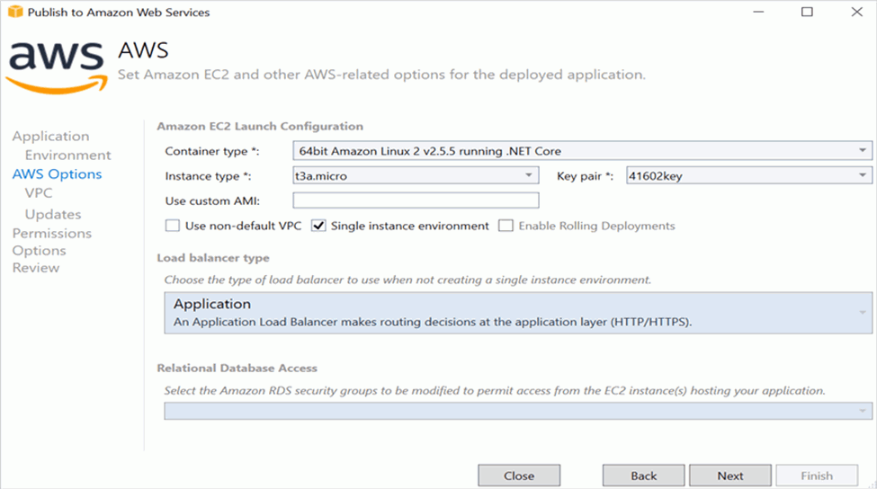
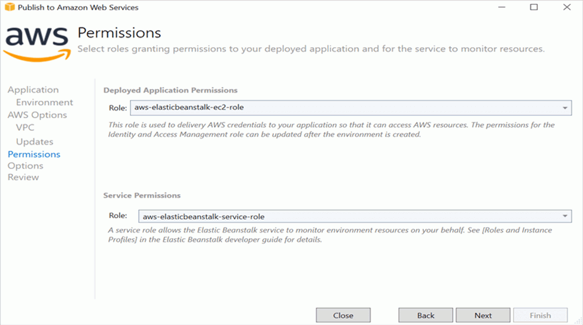

# Deploy a Blazor Server app to AWS Elastic Beanstalk (Linux)

This article describes how to add the Syncfusion® Blazor PDF Viewer component to a Blazor Server app and deploy the app to AWS Elastic Beanstalk (Linux). A fully functional sample is available in the [GitHub repository](https://github.com/SyncfusionExamples/blazor-pdf-viewer-examples/tree/master/Server%20Deployment/AWS/AWS_Elastic_Beanstalk/SfPdfViewerApp).

## Prerequisites

* [System requirements for Blazor components](https://blazor.syncfusion.com/documentation/system-requirements)

## Create a new Blazor App in Visual Studio

Create a new Blazor Server app and name it **PDFViewerGettingStarted**.

N> The PDF Viewer component is supported on .NET 8.0 and later.

## Install Blazor PDF Viewer NuGet package in Blazor Server App

Add the following NuGet packages to the Blazor Server app.

* [Syncfusion.Blazor.SfPdfViewer](https://www.nuget.org/packages/Syncfusion.Blazor.SfPdfViewer) 
* [Syncfusion.Blazor.Themes](https://www.nuget.org/packages/Syncfusion.Blazor.Themes)

## Register Syncfusion&reg; Blazor Service

* In the **~/_Imports.razor** file, add the following namespaces:




@using Syncfusion.Blazor;
@using Syncfusion.Blazor.SfPdfViewer;




* Register the Syncfusion&reg; Blazor Service in the **~/Program.cs** file.




using Microsoft.AspNetCore.Components;
using Microsoft.AspNetCore.Components.Web;
using Syncfusion.Blazor;

var builder = WebApplication.CreateBuilder(args);

// Add services to the container.
builder.Services.AddRazorPages();
builder.Services.AddServerSideBlazor().AddHubOptions(o => { o.MaximumReceiveMessageSize = 102400000; });

// Add Syncfusion Blazor service to the container.
builder.Services.AddSyncfusionBlazor();

var app = builder.Build();




## Adding stylesheet and script

Add the following stylesheet and script to the head section of the **~/Pages/_Host.cshtml** file.




<head>
    <!-- Syncfusion Blazor PDF Viewer control's theme style sheet -->
    <link href="_content/Syncfusion.Blazor.Themes/bootstrap5.css" rel="stylesheet" />
</head>
<body>
    <!-- Syncfusion Blazor PDF Viewer control's scripts -->
    
</body>




## Adding Blazor PDF Viewer Component

Add the Syncfusion&reg; PDF Viewer (Next-Gen) component in the **~/Pages/Index.razor** file.




@page "/"

<SfPdfViewer2 DocumentPath="https://cdn.syncfusion.com/content/pdf/pdf-succinctly.pdf"
              Height="100%"
              Width="100%">
</SfPdfViewer2>




N> If the `DocumentPath` property is not set, the PDF Viewer renders without loading a PDF document. Users can use the **Open** option in the toolbar to browse and open a PDF as needed.

## Run the application

Run the application to display the PDF file in the Syncfusion&reg; Blazor PDF Viewer component in the browser.



## Steps to publish as AWS Elastic Beanstalk

1. Right-click the project and select Publish to AWS Elastic Beanstalk (Legacy).

2. Select the deployment target Create a new application environment, and then click Next.

3. Choose an environment name. The URL is assigned automatically—verify availability. If the URL is available, click Next; otherwise, change the URL and retry.

4. Select the instance type t3a.micro from the drop-down list, and then click Next.

5. Click Next to proceed.

6. Click Next.

7. Click Deploy to publish the application to AWS Elastic Beanstalk.

8. When the environment status changes from Updating to Environment is healthy, click the provided URL.

9. Open the URL to view the application. The specified PDF document is displayed in the PDF Viewer.

## See also

* [Getting started with the Blazor PDF Viewer in a Blazor Web app Server app](../getting-started/web-app)

* [Getting started with the Blazor PDF Viewer in a Blazor WebAssembly app](../getting-started/web-assembly-application)

* [Getting started with the Blazor PDF Viewer in WSL mode](./wsl-application)

* [Ways to add script references in a Blazor application](https://blazor.syncfusion.com/documentation/common/adding-script-references)
