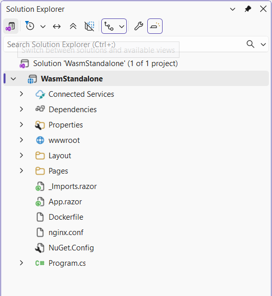
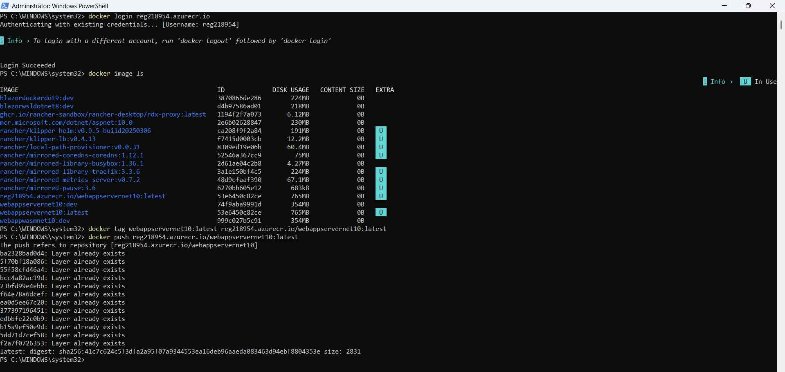
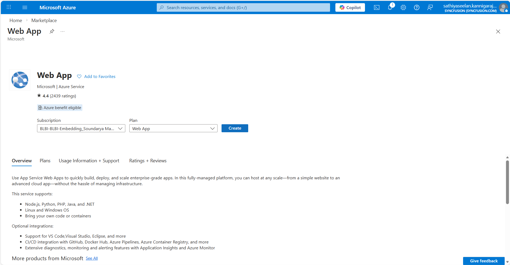
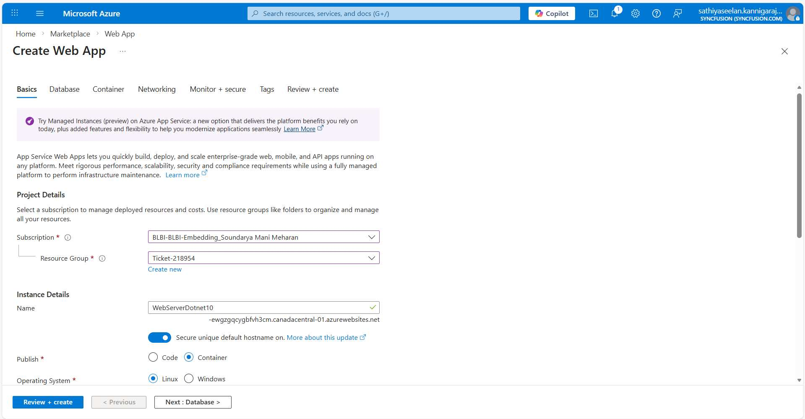
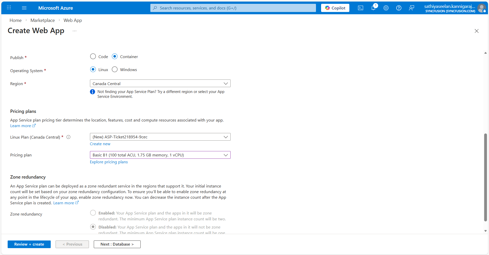
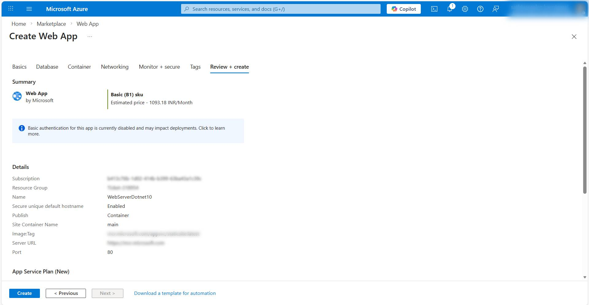
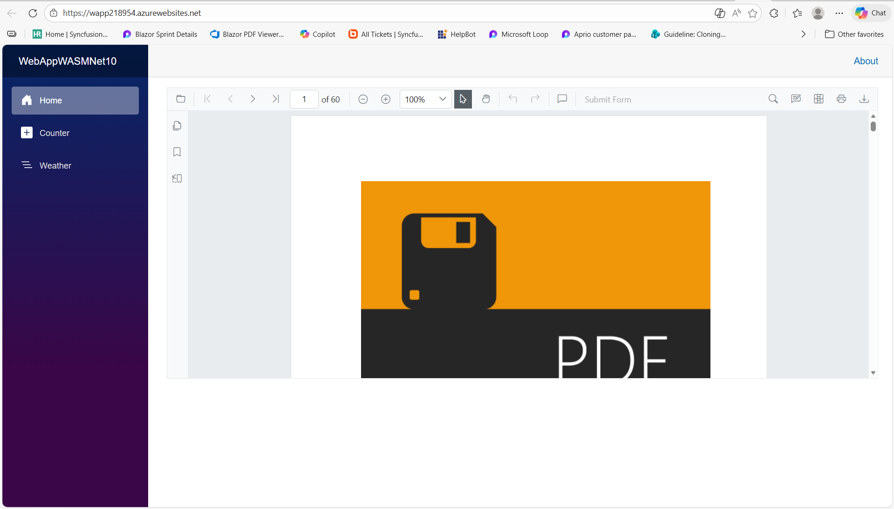

# Deploy SfPdfViewer to Azure Container (Linux)

This article shows how to containerize and deploy a Blazor PDF Viewer application (both Server and WebAssembly scenarios) to Azure using Azure Container Registry (ACR) and Azure App Service for Containers. It combines the application architecture and registration steps from the Blazor web app guide with practical containerization and Azure deployment steps.

## Prerequisites

* [System requirements for Blazor components](https://blazor.syncfusion.com/documentation/system-requirements)

* An Azure subscription and permission to create resource groups, ACR instances, and App Services.

## Create a simple SfPdfViewer sample

Follow the steps in the Blazor Server [getting started](https://help.syncfusion.com/document-processing/pdf/pdf-viewer/blazor/getting-started/web-app) guide for PDF Viewer to create a basic sample. This provides the required project setup and SfPdfViewer configuration.

## Docker Web app (recommended for Server and Web assembly)

Right‑click the project to add Docker support to the Windows application, and then apply the required configuration changes provided to ensure it functions correctly across environments.

Example `Dockerfile` for an Blazor Web Apps Server and Web assembly app:




FROM mcr.microsoft.com/dotnet/aspnet:10.0 AS base

# install System.Drawing native dependencies
RUN apt-get update && apt-get install -y --allow-unauthenticated libgdiplus libc6-dev libx11-dev
RUN ln -s libgdiplus.so gdiplus.dll

USER $APP_UID
WORKDIR /app
EXPOSE 8080
EXPOSE 8081


# This stage is used to build the service project
FROM mcr.microsoft.com/dotnet/sdk:10.0 AS build
ARG BUILD_CONFIGURATION=Release
WORKDIR /src
COPY ["YourServerApp/YourServerApp.csproj", "YourServerApp/"]
RUN dotnet restore "./YourServerApp/YourServerApp.csproj"
COPY . .
WORKDIR "/src/YourServerApp"
RUN dotnet build "./YourServerApp.csproj" -c $BUILD_CONFIGURATION -o /app/build

# This stage is used to publish the service project to be copied to the final stage
FROM build AS publish
ARG BUILD_CONFIGURATION=Release
RUN dotnet publish "./YourServerApp.csproj" -c $BUILD_CONFIGURATION -o /app/publish /p:UseAppHost=false

# This stage is used in production or when running from VS in regular mode (Default when not using the Debug configuration)
FROM base AS final
WORKDIR /app
COPY --from=publish /app/publish .
ENTRYPOINT ["dotnet", "YourServerApp.dll"]




FROM mcr.microsoft.com/dotnet/aspnet:10.0 AS base

# install System.Drawing native dependencies
RUN apt-get update && apt-get install -y --allow-unauthenticated libgdiplus libc6-dev libx11-dev
RUN ln -s libgdiplus.so gdiplus.dll

USER $APP_UID
WORKDIR /app
EXPOSE 8080
EXPOSE 8081

# This stage is used to build the service project
FROM mcr.microsoft.com/dotnet/sdk:10.0 AS build
# Install Python required for WASM tools
RUN apt-get update && apt-get install -y \
        python3 \
        python3-pip \
        python3-venv \
    && ln -s /usr/bin/python3 /usr/bin/python || true
# Install WASM tools
RUN dotnet workload install wasm-tools
ARG BUILD_CONFIGURATION=Release
WORKDIR /src
COPY ["YourServerApp/YourServerApp/YourServerApp.csproj", "YourServerApp/YourServerApp/"]
COPY ["YourServerApp/YourServerApp.Client/YourServerApp.Client.csproj", "YourServerApp/YourServerApp.Client/"]
RUN dotnet restore "./YourServerApp/YourServerApp/YourServerApp.csproj"
COPY . .
WORKDIR "/src/YourServerApp/YourServerApp"
RUN dotnet build "./YourServerApp.csproj" -c $BUILD_CONFIGURATION -o /app/build

# This stage is used to publish the service project to be copied to the final stage
FROM build AS publish
ARG BUILD_CONFIGURATION=Release
RUN dotnet publish "./YourServerApp.csproj" -c $BUILD_CONFIGURATION -o /app/publish /p:UseAppHost=false

# This stage is used in production or when running from VS in regular mode (Default when not using the Debug configuration)
FROM base AS final
WORKDIR /app
COPY --from=publish /app/publish .
ENTRYPOINT ["dotnet", "YourServerApp.dll"]



N>
* Replace `YourServerApp.dll` and `YourServerApp.csproj` with your actual assembly name. Also in the Web assembly make sure to add the docker code for to install the wasm-tools using the code `RUN dotnet workload install wasm-tools`

### Local build and run

Build and run the container locally to verify behavior:

```bash
docker build -t pdfviewerwebservice:latest .
docker run -d -p 6002:80 pdfviewerwebservice:latest
```

If you see script errors or documents fail to load, verify the container image contains the `libgdiplus` installed [see Dockerfile notes](https://github.com/dotnet/dotnet-docker/discussions/4938).

## Docker standalone WebAssembly app

If you have built a standalone WebAssembly sample, please add the Dockerfile and the necessary nginx configuration files to the project, and update the project’s .csproj entry inside the Dockerfile to match the correct assembly name.



Example `Dockerfile` for standalone WebAssembly:

```dockerfile
#See https://aka.ms/containerfastmode to understand how Visual Studio uses this Dockerfile to build your images for faster debugging.

FROM mcr.microsoft.com/dotnet/aspnet:10.0 AS base

# install System.Drawing native dependencies

RUN apt-get update && apt-get install -y --allow-unauthenticated libgdiplus libc6-dev libx11-dev

RUN ln -s libgdiplus.so gdiplus.dll
WORKDIR /app
EXPOSE 80
EXPOSE 443

FROM mcr.microsoft.com/dotnet/sdk:10.0 AS build
## Install Python required for WASM tools
RUN apt-get update && apt-get install -y \
        #python3 \
        #python3-pip \
        #python3-venv \
    #&& ln -s /usr/bin/python3 /usr/bin/python || true
## Install WASM tools
RUN dotnet workload install wasm-tools
WORKDIR /src
COPY ["NuGet.Config","/src/"]
COPY ["package", "/src/package"]

RUN dotnet nuget add source package
COPY ["WasmStandalone.csproj", "."]
RUN apt-get update && apt-get install -y emscripten
RUN dotnet restore "WasmStandalone.csproj" --configfile "NuGet.Config"
COPY . .
RUN dotnet build "WasmStandalone.csproj" -c Release -o /app/build

FROM build AS publish
RUN dotnet publish "WasmStandalone.csproj" -c Release -o /app/publish 

FROM nginx:alpine AS final
WORKDIR /usr/share/nginx/html
COPY --from=publish /app/publish/wwwroot .
COPY nginx.conf /etc/nginx/nginx.conf
```

Once the docker file was properly added into the Web assembly sample add the `Nuget` and the `nginx.conf` files with a empty folder named `package` into the main project folder of the Web assembly. [Get the files](https://github.com/SyncfusionExamples/blazor-pdf-viewer-examples/tree/master/Azure%20Container/Web%20Assembly/WasmStandalone)

N>
* Replace `YourServerApp.csproj` with your actual assembly name. Also make sure to add the docker code for to install the wasm-tools using the code `RUN dotnet workload install wasm-tools`

Then run locally:

```bash
docker build -t webassembly .
docker image ls
docker run -d -p 6003:80 pdfviewer-wasm:latest
# Open http://localhost:6003
```

## Push image to Azure Container Registry (ACR)

Follow these UI-driven steps in the Azure portal (or use the CLI steps below):

1. Create a Container Registry
    * In the Azure portal, click **Create a resource** → search for **Container Registry** → **Create**.
    * Fill in the basic details: **Registry name**, **Subscription**, **Resource group** (use **Create new** if needed), and **Location**.
    * Choose a **SKU** (Basic is fine for testing). Click **Review + create**, then **Create**.

2. Enable credentials
    * Open the newly created Container Registry resource.
    * Under **Settings**, select **Access keys**.
    * Toggle **Admin user** to **Enabled** and note the **Login server**, **Username**, and **Password** shown.

3. Tag and push your image from your build machine
    * Open PowerShell or a terminal on the machine where you built the Docker image.
    * Log in to the registry using the login server and admin credentials from the portal:

```bash
docker login <login-server>
# Enter username and password (from Access keys in the portal)

# Tag the image for your registry and push it:

docker tag pdfviewerwebservice:latest <login-server>/pdfviewerwebservice:latest
docker push <login-server>/pdfviewerwebservice:latest
```



## Create an App Service that runs your container

Follow these UI-focused steps in the Azure portal to create an App Service (Linux) and configure it to run your container image from ACR.

## Create an App Service that runs your container

Follow these UI-focused steps in the Azure portal to create an App Service (Linux) and configure it to run your container image from ACR.

1. Create the App Service
    * In the Azure portal click **Create a resource** → search **Web App** → **Create**.

    

    * Under **Basics**, set the **Subscription**, **Resource group** (use **Create new** if needed), and **Name** (this will form the app URL).

    

    * For **Publish**, choose **Docker Container**. For **Runtime stack** choose **Linux**.

    

    * Choose a hosting plan: click **Change size** and pick a plan (Basic/B1 or higher recommended for container workloads). Click **Review + create**, then **Create**.

    

2. Configure the container settings
    * Open the App Service you created, then go to **Deployment** → **Container settings** (or **Settings** → **Container settings** in some portal views).
    * For **Image source** select **Azure Container Registry**.
    * Select your **Subscription** and the **Registry** you created earlier.
    * Under **Image and tag**, select the repository (for example `pdf_viewer_web_service`) and the tag (for example `latest`).

    

N> troubleshooting <br />
* Check container logs and the image locally if the app fails to start. <br />
* Ensure the container listens on port 80 (or configure the App Service container port setting to match your container). <br />
* Ensure native dependencies (SkiaSharp, `libgdiplus`) are present in the image; missing native libs commonly cause rendering/script errors. <br />
* For static WASM images served by nginx, confirm wasm MIME types and caching are working.

## Using Rancher Desktop / Docker on Windows

* Rancher Desktop (with docker) can be used in place of Docker Desktop. If using Rancher Desktop, select the `docker` runtime so standard `docker` commands behave as expected.
* If you encounter WSL or Rancher errors during installation, consult Rancher Desktop docs and community threads; a common issue and workaround is documented in the internal notes.

## Additional guidance

* If your project uses SkiaSharp.Views.Blazor on the server or client, double-check native runtime requirements and test rendering in the container.
* For Server interactive scenarios, register Syncfusion services and ensure SignalR message size settings match large-file processing requirements (see Getting Started examples).
* For WebAssembly interactive render modes, ensure `wasm-tools` workload is available when building locally or in CI: `dotnet workload install wasm-tools`.



N> [View the Blazor Web apps Sample](https://github.com/SyncfusionExamples/blazor-pdf-viewer-examples/tree/master/Azure%20Container).

## See also

- [Getting started with SfPdfViewer in a Blazor Web App](../getting-started/web-app)
