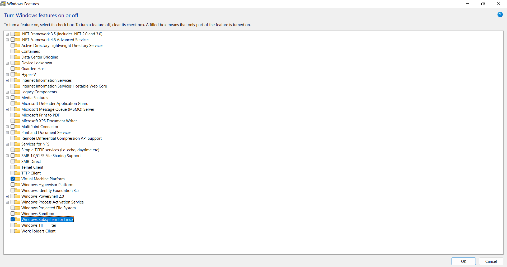
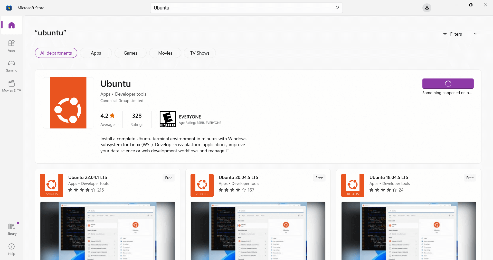
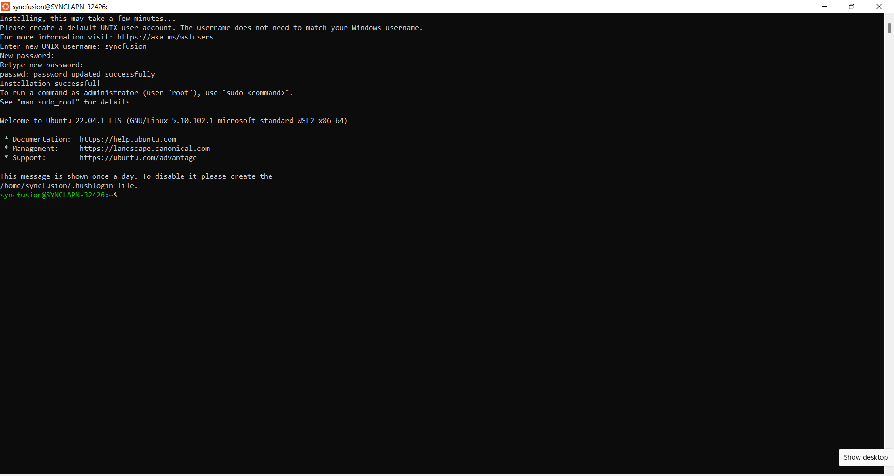
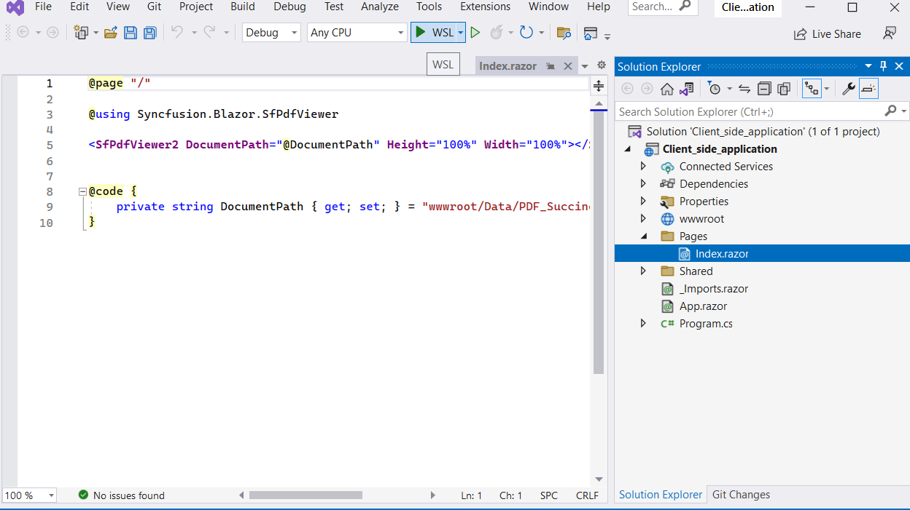
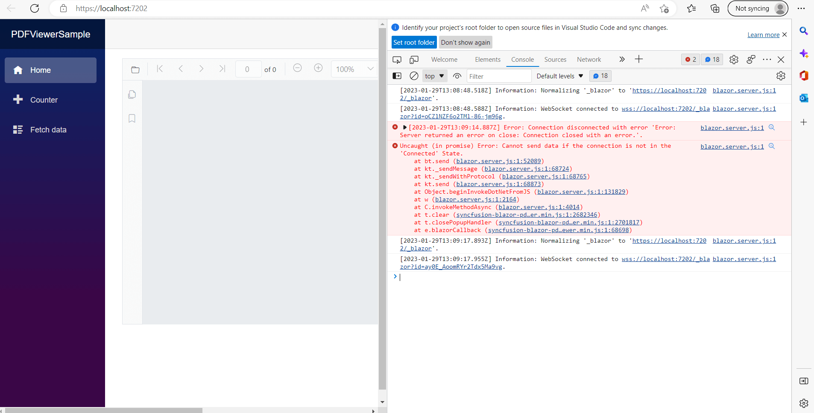

# Getting started with the Blazor PDF Viewer in WSL mode

Use the following steps to run the Syncfusion<sup style="font-size:70%">&reg;</sup> Blazor PDF Viewer (Next-Gen) component in WSL (Windows Subsystem for Linux) mode:

**Step 1:** Enable Windows Subsystem for Linux and Virtual Machine Platform.



To enable Windows Subsystem for Linux (WSL) and Virtual Machine Platform on Windows:

Open the Start menu and search for `Control Panel`. Select `Programs`, then choose `Turn Windows features on or off`. Select `Windows Subsystem for Linux` and `Virtual Machine Platform`. Click `OK` and restart the computer.

After restart, install a Linux distribution such as Ubuntu from the Microsoft Store and run Linux commands directly in Windows.

**Step 2:** Install Ubuntu



To install Ubuntu from the Microsoft Store:

Open the Microsoft Store and search for Ubuntu. Select Ubuntu, then choose Get to download and install. After installation, select Launch to start Ubuntu. This installs Ubuntu as a WSL distribution, enabling a Linux environment in Windows without a separate virtual machine.

On first launch, create a new Ubuntu user by providing a username and password.



**Step 3:** Install the .NET SDK for WSL by running the following commands one by one.

```
    wget https://packages.microsoft.com/config/ubuntu/22.10/packages-microsoft-prod.deb -O packages-microsoft-prod.deb

    sudo dpkg -i packages-microsoft-prod.deb

    rm packages-microsoft-prod.deb

    sudo apt-get update && \
    sudo apt-get install -y dotnet-sdk-7.0

```

Run dotnet --info. The output should resemble the following:


If the expected result is not shown, run the following commands:

```
    sudo apt remove dotnet*
    sudo apt remove aspnetcore*
    sudo apt remove netstandard*
    sudo apt-get remove dotnet-host
    sudo apt autoremove
    sudo apt autoremove -y dotnet-sdk-7.0
    sudo apt-get update
    dotnet
    sudo apt-get install -y dotnet-sdk-7.0
    dotnet
    dotnet --info
```
**Step 4:** Run the server or WebAssembly sample in WSL mode; the Blazor PDF Viewer component should load.



N> If any issues occur while running in WSL mode, use the following instructions to resolve them.

If the sample does not load the PDF file and an exception is thrown:



In the Ubuntu terminal, run the following commands one by one to install the required Blazor PDF Viewer dependencies for Linux:

```
    sudo apt-get install libfontconfig1
    sudo apt-get update && apt-get install -y --allow-unauthenticated libgdiplus libc6-dev libx11-dev
    sudo apt-get update
    sudo apt install libgdiplus

```

Close the project, reopen it, and run it in WSL mode. It should run properly.


## See also

* [Getting started with the Blazor PDF Viewer in a Blazor Web app Server app](../getting-started/web-app)

* [Getting started with the Blazor PDF Viewer in a Blazor WebAssembly app](../getting-started/web-assembly-application)

* [Getting started with the Blazor PDF Viewer in AWS Beanstalk mode](./aws-beanstalk-deployment)
