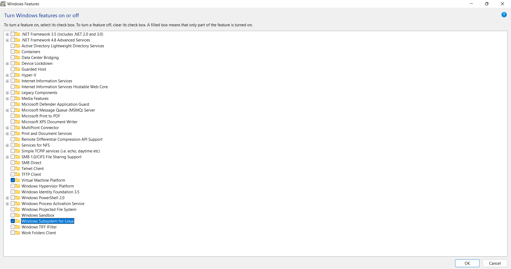
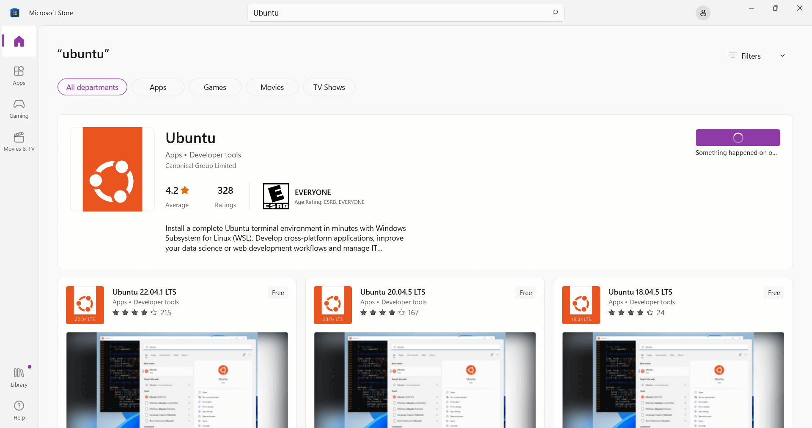
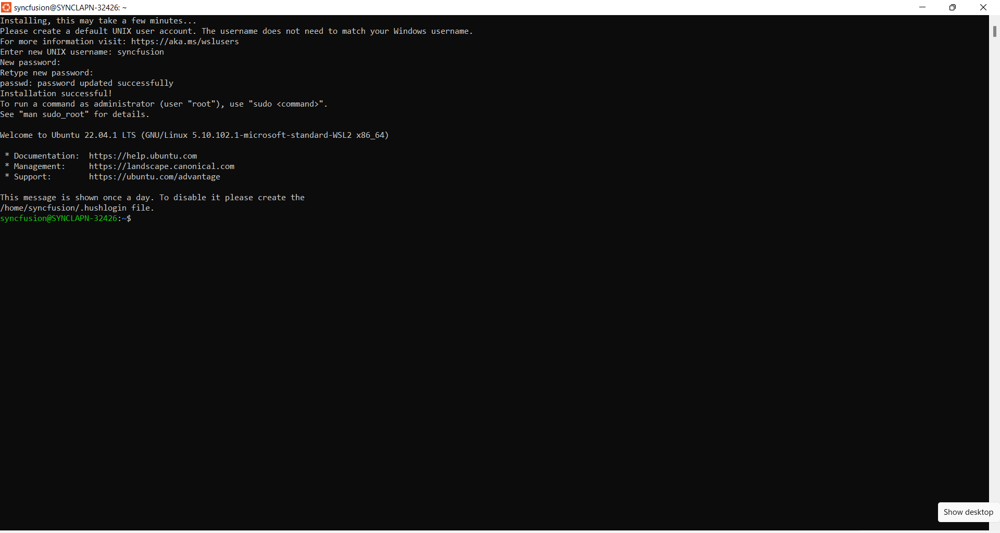
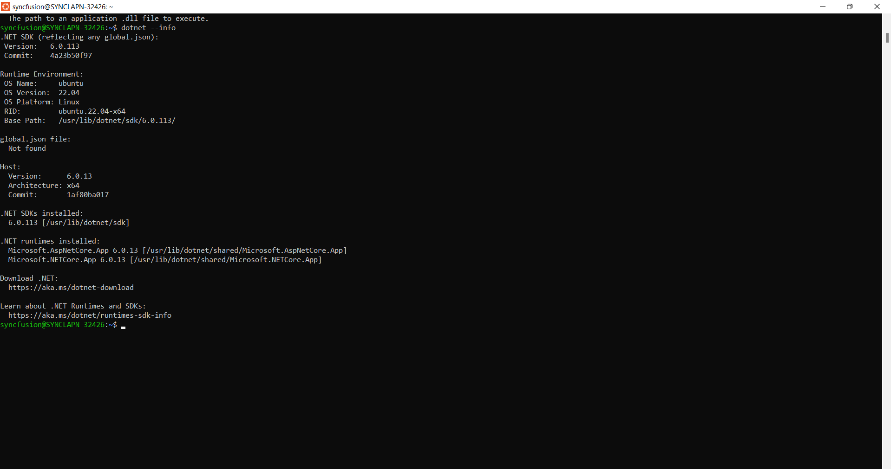
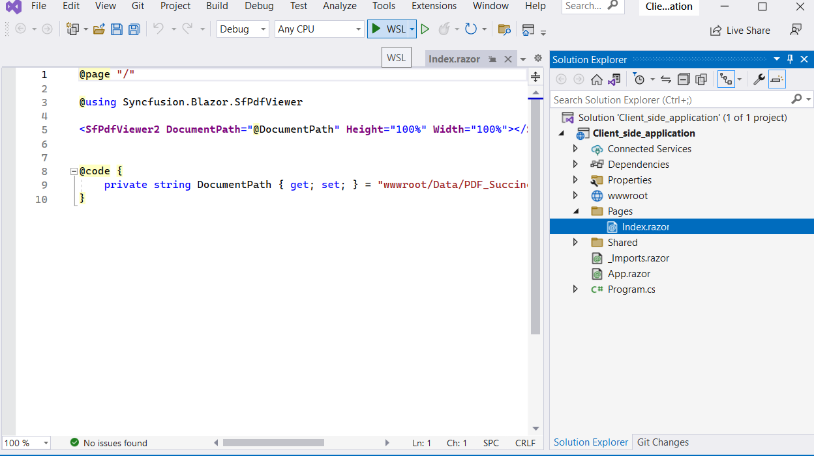
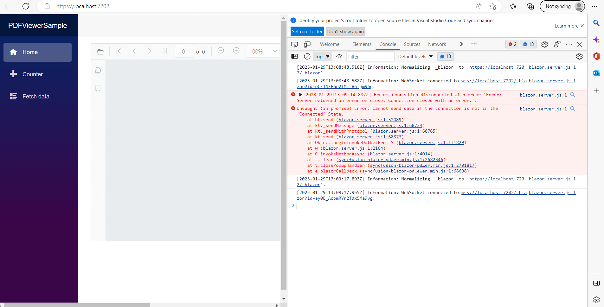
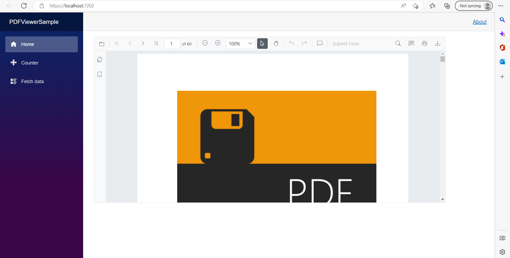

# Getting started with the Blazor PDF Viewer in WSL mode

Follow these steps to set up Windows Subsystem for Linux (WSL), install the .NET SDK, and run the [Blazor PDF Viewer (Next-Gen)](../getting-started/server-side-application) component in WSL mode.

## Prerequisites

* Windows 10 version 2004+ (build 19041) or Windows 11.
* Administrator rights on Windows (required to enable WSL features).
* A Linux distribution supported by Blazor PDF Viewer: Ubuntu 22.04 LTS or Ubuntu 24.04 LTS.
* The Blazor PDF Viewer (Next-Gen) NuGet package installed in your project, and a valid Syncfusion license key. For setup, see [Getting started with the Blazor PDF Viewer in a Blazor Web app Server app](../getting-started/server-side-application) or [Getting started with the Blazor PDF Viewer in a Blazor WebAssembly app](../getting-started/web-assembly-application).

## Step 1: Enable Windows Subsystem for Linux and Virtual Machine Platform

To enable Windows Subsystem for Linux (WSL) and the Virtual Machine Platform on Windows:

1. Open the Start menu and search for `Control Panel`. Select `Programs and Features`, then choose `Turn Windows features on or off`.
2. Select `Windows Subsystem for Linux` and `Virtual Machine Platform`. Click `OK` and restart the computer.
3. After restart, open a PowerShell prompt as Administrator and run the following command to set WSL 2 as the default architecture:

```bash
    wsl --set-default-version 2
```

The Windows Features dialog should show the WSL and Virtual Machine Platform options enabled:



For more details, see the official Microsoft guide: [Install WSL](https://learn.microsoft.com/en-us/windows/wsl/install).

## Step 2: Install Ubuntu

To install Ubuntu from the Microsoft Store:

1. Open the Microsoft Store and search for `Ubuntu`. Select the latest LTS release (22.04 or 24.04).
2. Choose `Get` to download and install, then select `Launch` to start Ubuntu.
3. On first launch, create a new Ubuntu user by providing a username and password.
4. From a Windows PowerShell prompt, set Ubuntu as the default WSL distribution:

```bash
    wsl -s Ubuntu
```





## Step 3: Install the .NET SDK inside WSL

Open the Ubuntu terminal and run the following commands one by one to add the Microsoft package feed and install the .NET SDK on Ubuntu 22.04:

```bash
    wget https://packages.microsoft.com/config/ubuntu/22.04/packages-microsoft-prod.deb -O packages-microsoft-prod.deb
    sudo dpkg -i packages-microsoft-prod.deb
    rm packages-microsoft-prod.deb
    sudo apt-get update && \
    sudo apt-get install -y dotnet-sdk-8.0
```

For Ubuntu 24.04, replace `22.04` in the `wget` URL with `24.04`. To target .NET 9 instead, replace `dotnet-sdk-8.0` with `dotnet-sdk-9.0`.

Verify the installation:

```bash
    dotnet --info
```

The output should resemble the following:



### Troubleshooting installation

If `dotnet --info` does not list the installed SDK, remove any conflicting packages and reinstall:

```bash
    sudo apt remove dotnet*
    sudo apt remove aspnetcore*
    sudo apt remove netstandard*
    sudo apt-get remove dotnet-host
    sudo apt autoremove
    sudo apt-get update
    sudo apt-get install -y dotnet-sdk-8.0
    dotnet --info
```

## Step 4: Create the Blazor PDF Viewer project and run it in WSL

> NOTE: Replace the project name `BlazorPdfViewerApp` with the name of your actual sample or solution.

From the Ubuntu terminal, create a new Blazor app, add the Syncfusion NuGet feed, and restore the dependencies:

```bash
    dotnet new blazorserver -n BlazorPdfViewerApp
    cd BlazorPdfViewerApp
    dotnet add package Syncfusion.Blazor.PdfViewerServer
    dotnet restore
```

Open the project in Visual Studio Code from inside WSL (run `code .` from the Ubuntu terminal) so the integrated terminal and debugger attach to the Linux context. Build and run the project:

```bash
    dotnet run
```

The Blazor PDF Viewer component should load in the browser:



N> If any issues occur while running in WSL mode, use the following instructions to resolve them.

If the sample does not load the PDF file and an exception is thrown:



In the Ubuntu terminal, run the following commands one by one to install the required Blazor PDF Viewer dependencies for Linux:

```bash
    sudo apt-get install libfontconfig1
    sudo apt-get update && apt-get install -y --allow-unauthenticated libgdiplus libc6-dev libx11-dev
    sudo apt-get update
    sudo apt install libgdiplus
```

Close the project, reopen it, and run it in WSL mode. It should run properly.



## See also

* [Getting started with the Blazor PDF Viewer in a Blazor Web app Server app](../getting-started/server-side-application)
* [Getting started with the Blazor PDF Viewer in a Blazor WebAssembly app](../getting-started/web-assembly-application)
* [Getting started with the Blazor PDF Viewer in Docker](./docker-deployment)
