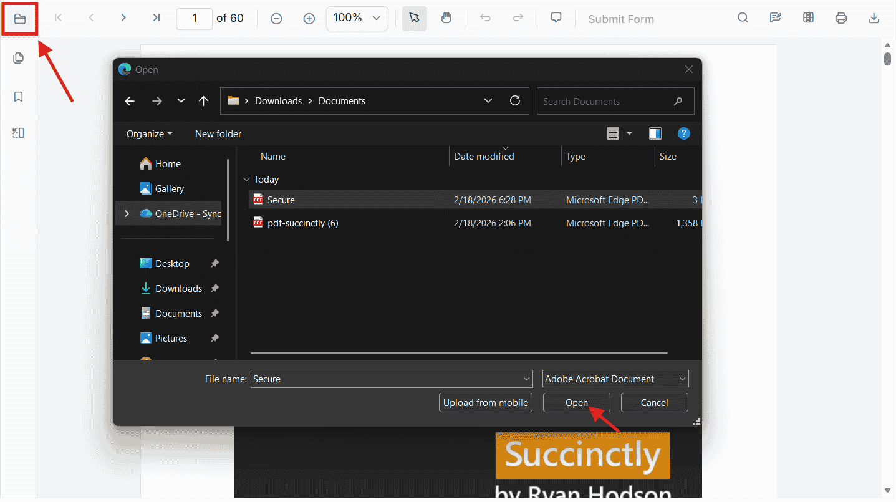
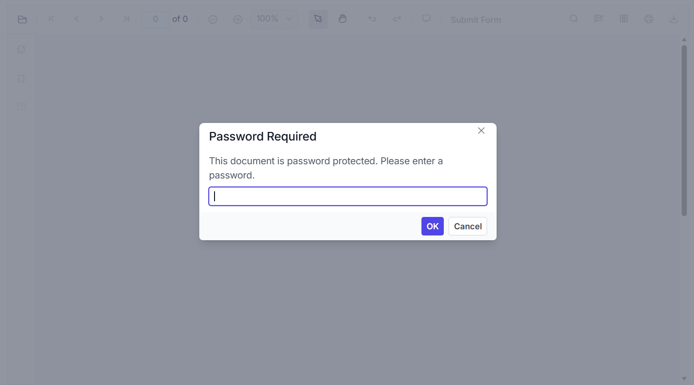

# Load a Password-Protected PDF in Blazor

This article explains how to open password-protected PDF files in the Blazor PDF Viewer. The viewer supports both user-interactive loading (the built-in **Open File** dialog) and programmatic loading using APIs.

## Opening a Password-Protected PDF Using the **Open File** Dialog

When the user clicks the built-in **Open File** button in the PDF Viewer toolbar and selects a password-protected PDF:

- The viewer detects that the document is encrypted on the server side



- A **password input popup** is automatically displayed



- The user enters the password
- The document is decrypted and loaded

No additional configuration or code is required. This approach works for all password-protected PDFs opened locally by the user.

## Opening a Password-Protected PDF Programmatically

Use the programmatic APIs when the password is known in advance or when the document is hosted on a server. The viewer supports both the `LoadAsync` overloads and the `DocumentPath` property.

### Load the Document Using `LoadAsync`

The [`LoadAsync`](https://help.syncfusion.com/cr/blazor/Syncfusion.Blazor.SfPdfViewer.PdfViewerBase.html#Syncfusion_Blazor_SfPdfViewer_PdfViewerBase_LoadAsync_System_Byte___System_String_) method accepts a password parameter. The two supported overloads are:

- `LoadAsync(byte[] bytes, string password = null)` — pass the PDF as a byte array
- `LoadAsync(string document, string password = null)` — pass a URL or server-relative path

**Example (byte array):**

```cs
@using Syncfusion.Blazor
@using Syncfusion.Blazor.Buttons
@using Syncfusion.Blazor.SfPdfViewer

<SfButton @onclick="Clicked">Load Document</SfButton>
<SfPdfViewer2 Height="100%" Width="100%" @ref="Viewer">
</SfPdfViewer2>

@code {
    private SfPdfViewer2 Viewer;

    private async Task Clicked()
    {
        await Viewer.LoadAsync("wwwroot/pdf-succinctly-password-protected.pdf", "password");
    }
}
```

N> The password parameter is consumed for the current load operation only and is not cached across re-renders. If the document is reloaded, supply the password again.

**Outcomes**

| Password state | Result |
|---|---|
| Correct | The PDF loads immediately |
| Incorrect | The viewer displays the incorrect password popup |
| Null or empty | The password popup is shown automatically |

N> Handle incorrect-password events through the [`DocumentLoadFailed`](https://help.syncfusion.com/cr/blazor/Syncfusion.Blazor.SfPdfViewer.PdfViewerEvents.html#Syncfusion_Blazor_SfPdfViewer_PdfViewerEvents_DocumentLoadFailed) event to surface custom error messages.

### Loading a Password-Protected Document via `DocumentPath`

When the [`DocumentPath`](https://help.syncfusion.com/cr/blazor/Syncfusion.Blazor.SfPdfViewer.PdfViewerBase.html#Syncfusion_Blazor_SfPdfViewer_PdfViewerBase_DocumentPath) property points to a password-protected PDF, the viewer detects the encryption and prompts the user for the password automatically.

```cs
@using Syncfusion.Blazor
@using Syncfusion.Blazor.SfPdfViewer

<SfPdfViewer2 DocumentPath="@DocumentPath"
              Height="100%"
              Width="100%">
</SfPdfViewer2>

@code {
    // URL for the password-protected sample document
    private string DocumentPath { get; set; } = "https://cdn.syncfusion.com/content/pdf/pdf-succinctly-password-protected.pdf";
}
```

N> Do not pass the password as a query string inside `DocumentPath`.

The viewer will:

- Detect encryption on the server
- Show the **password popup automatically**
- Allow the user to enter the correct password
- Decrypt and load the PDF


## See also

- [Load Large PDF Files](./load-large-pdf)
- [Getting started with SfPdfViewer in a Blazor Web App](../getting-started/web-app)
