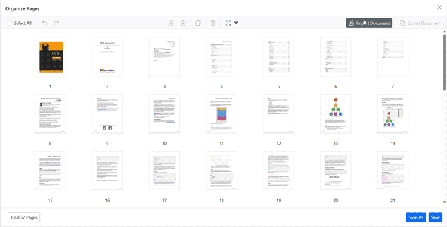
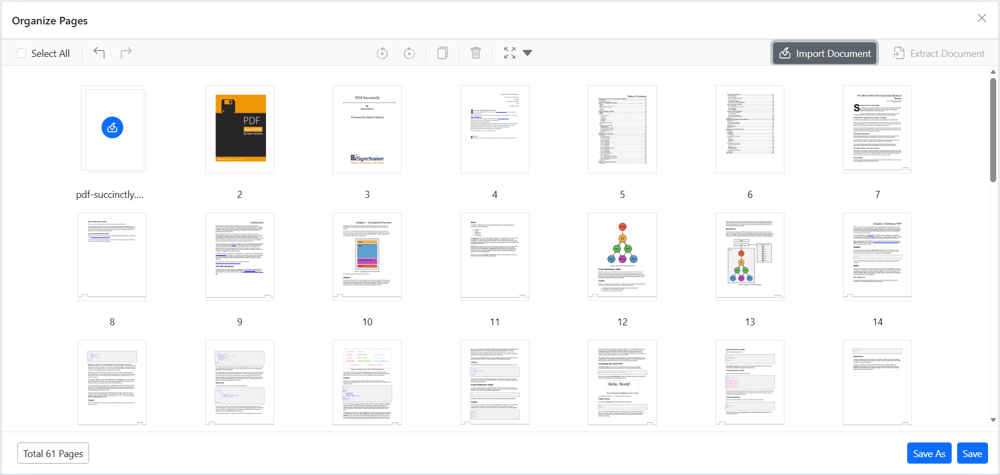
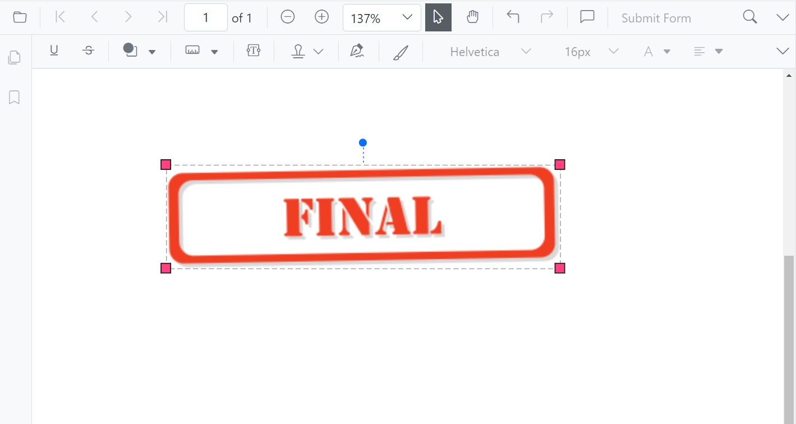

# Pre-process PDF Document Before Displaying in Blazor PDF Viewer

This section explains why preprocessing is useful, what operations you can perform using the Syncfusion<sup style="font-size:70%">&reg;</sup> PDF Library and Blazor PDF Viewer, and how to load the processed document in the Blazor PDF Viewer.

## Why Preprocessing Is Needed
Preprocessing a PDF before sending it to the viewer helps you:
- **Reduce file size**: Compresses content to improve load time.
- **Merge multiple documents**: Combine several PDFs into a single file.
- **Extract only required pages**: Drop unused pages for faster loading.
- **Flatten form fields and annotations**: Improves rendering performance and prevents further editing.
- **Apply branding elements**: Such as watermarks or stamps.

Each enhancement maps directly to a measurable improvement in load time, rendering speed, or document control.

## Merge PDF Documents
### UI-Level Merging
You can visually merge pages in the **Organize Pages** UI inside the Blazor PDF Viewer. Users can import another PDF, insert its pages into the current file, reorder pages, or delete unwanted pages.



For more details, refer to [UI Interactions - Import Pages](https://help.syncfusion.com/document-processing/pdf/pdf-viewer/blazor/organize-pages/ui-interactions#import-pages).

### Programmatically Merge PDFs
Using the Blazor PDF Viewer, you can merge documents before loading them into the viewer.

For more details, refer to [Programmatic Support - Import Pages](https://help.syncfusion.com/document-processing/pdf/pdf-viewer/blazor/organize-pages/programmatic-support#import-pages).

N> You can then load the merged PDF into the viewer using a file path, stream, or byte array.

## Extract Pages
### UI-Level Extraction
Using the Viewer's **Organize Pages** window, users can select and extract required pages and download them separately.



For more details, refer to [UI Interactions - Extract Pages](https://help.syncfusion.com/document-processing/pdf/pdf-viewer/blazor/organize-pages/ui-interactions#extract-pages).

### Programmatically Extract Pages
Using the Viewer's **Organize Pages** window, users can select and extract required pages and download them separately programmatically.

For more details, refer to [Programmatic Support - Export Pages](https://help.syncfusion.com/document-processing/pdf/pdf-viewer/blazor/organize-pages/programmatic-support#export-pages).

## Flatten Form Fields & Annotations
### Why Flattening Helps
- Prevents users from editing form fields
- Improves rendering speed
- Ensures consistent appearance across all devices

### Flatten on Load

Use the following code-snippet when you want uploaded PDFs to be flattened before they are loaded into the viewer.

```csharp
@page "/"
@using Syncfusion.Blazor
@using Syncfusion.Blazor.SfPdfViewer
@using Syncfusion.Pdf
@using Syncfusion.Pdf.Parsing

<SfPdfViewer2 Height="600px" Width="100%" @ref="Viewer"><PdfViewerEvents Created="OnCreated"></PdfViewerEvents></SfPdfViewer2>
@code {
    private SfPdfViewer2? Viewer;
    async Task OnCreated()
    {
        if (Viewer is null) return;
        PdfLoadedDocument loadedDocument = new PdfLoadedDocument("wwwroot/Annotations.pdf");

        if (loadedDocument.Form !=null)
        {
            // Flatten form fields            
            loadedDocument.Form.Flatten = true;
        }

        // Flatten annotations        
        foreach (PdfLoadedPage page in loadedDocument.Pages)
        {
            page.Annotations.Flatten = true;
        }

        // Save flattened PDF to byte[]        
        byte[] flattenedBytes;
        using (MemoryStream stream = new MemoryStream())
        {
            loadedDocument.Save(stream);
            flattenedBytes = stream.ToArray();
        }
        loadedDocument.Close(true);
        // Reload flattened document into viewer        
        await Viewer.LoadAsync(flattenedBytes);
    }
}
```

## Add Watermark or Stamp
### UI-Level Stamps
The Blazor PDF Viewer toolbar allows users to:
- Add [standard stamps](https://help.syncfusion.com/document-processing/pdf/pdf-viewer/blazor/annotation/stamp-annotation#add-stamp-annotations-to-the-pdf-document)
- Insert [custom image stamps](https://help.syncfusion.com/document-processing/pdf/pdf-viewer/blazor/annotation/stamp-annotation#add-a-custom-stamp)



### Programmatically Add a Watermark

The following example loads an existing PDF, draws a watermark image on every page using `PdfGraphics`, and then reloads the result into the viewer. The image is loaded from a file in `wwwroot` and converted to a `byte[]` — the recommended approach over hard-coding base64.

```csharp
@page "/"
@using Syncfusion.Blazor
@using Syncfusion.Blazor.SfPdfViewer
@using Syncfusion.Pdf
@using Syncfusion.Pdf.Graphics
@using Syncfusion.Pdf.Parsing
@inject IWebHostEnvironment Env

<SfPdfViewer2 Height="100%" Width="100%" @ref="Viewer">
    <PdfViewerEvents Created="LoadPdf"></PdfViewerEvents>
</SfPdfViewer2>

@code {
    private SfPdfViewer2 Viewer;

    // Dummy watermark image base64 (replace with actual value)
    private string WatermarkImageBase64 = "/9j/4AAQSkZJRgABAQAAAQA..";

    private async Task LoadPdf()
    {
        string pdfPath = Path.Combine(Env.WebRootPath, "pdf-succinctly.pdf");

        using FileStream inputStream = new FileStream(pdfPath, FileMode.Open, FileAccess.Read);
        PdfLoadedDocument loadedDocument = new PdfLoadedDocument(inputStream);

        byte[] imageBytes = Convert.FromBase64String(WatermarkImageBase64);
        using MemoryStream imageStream = new MemoryStream(imageBytes);
        PdfImage image = PdfImage.FromStream(imageStream);

        foreach (PdfPageBase page in loadedDocument.Pages)
        {
            PdfGraphics graphics = page.Graphics;
            float pageWidth = page.Size.Width;
            float pageHeight = page.Size.Height;

            float desiredWidth = pageWidth / 2;
            float desiredHeight = image.Height * (desiredWidth / image.Width);
            float x = (pageWidth - desiredWidth) / 2;
            float y = (pageHeight - desiredHeight) / 2;

            graphics.SetTransparency(0.25f);
            graphics.DrawImage(image, x, y, desiredWidth, desiredHeight);
        }

        using MemoryStream outputStream = new MemoryStream();
        loadedDocument.Save(outputStream);
        loadedDocument.Close(true);

        await Viewer.LoadAsync(outputStream.ToArray());
    }
}
```

## How-To Guide: Load the Preprocessed PDF in the Viewer

You can load the processed PDF using a remote URL, stream, or byte array and base64 Data.

### Load From Remote URL

Refer to the Blazor PDF Viewer documentation for loading PDF from Remote URL. For more details, visit [Load PDF Document from Remote URL](https://help.syncfusion.com/document-processing/pdf/pdf-viewer/blazor/opening-pdf-file#opening-a-pdf-from-remote-url).

https://help.syncfusion.com/document-processing/pdf/pdf-viewer/blazor/opening-pdf-file#opening-a-pdf-from-remote-url

### Load Using Stream or Byte Array

Refer to the Blazor PDF Viewer documentation for loading PDF from stream or byte array. For more details, visit [Load PDF Document from Stream](https://help.syncfusion.com/document-processing/pdf/pdf-viewer/blazor/opening-pdf-file#opening-a-pdf-from-stream).

### Load Using base64 Data

Refer to the Blazor PDF Viewer documentation for loading PDF from base64 data. For more details, visit [Load PDF Document from base64 Data](https://help.syncfusion.com/document-processing/pdf/pdf-viewer/blazor/opening-pdf-file#opening-a-pdf-from-base64-data).

## Additional Performance Tips

- **Render Multiple Pages While Scrolling:** Improve performance by rendering multiple pages during scrolling. For more details, refer to [How to render N pages while scrolling](https://help.syncfusion.com/document-processing/pdf/pdf-viewer/blazor/faqs/how-to-render-n-pages-scrolling).
- **Improve Performance Using CDN:** Enhance viewer performance using a Content Delivery Network. For more details, refer to [How to improve performance using CDN](https://help.syncfusion.com/document-processing/pdf/pdf-viewer/blazor/faqs/how-to-improve-performance-using-cdn).

## See also

- [Load Large PDF Files](./load-large-pdf)
- [Load a Password-Protected PDF](./load-password-pdf)
- [Getting started with SfPdfViewer in a Blazor Web App](../getting-started/web-app)
