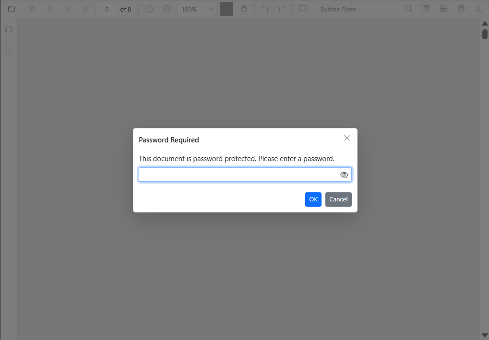
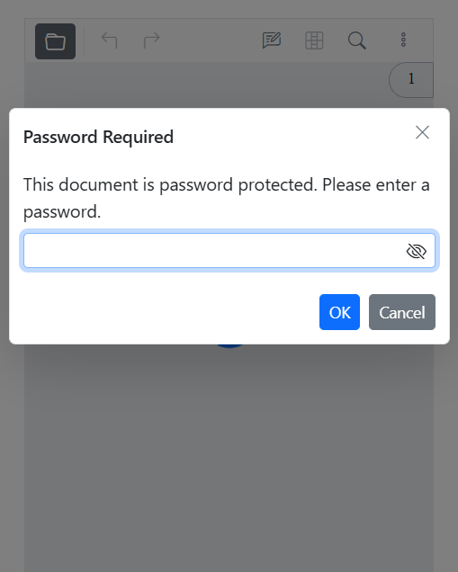
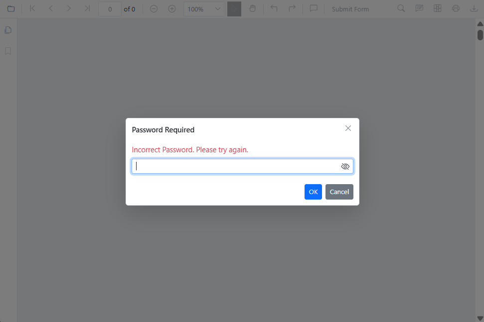
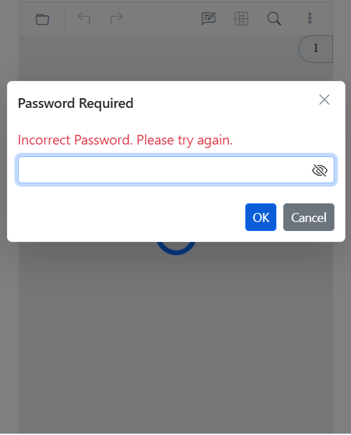

# Password-protected documents

Some PDFs require a password to open. When such a document is loaded in the viewer, the following behavior applies:

- A password prompt appears if the document requires an password.

The viewer displays a password prompt UI when a protected document is opened.

Desktop password prompt:



Mobile password prompt:



- If the correct password is provided, the document loads and becomes viewable per the document’s permissions.
- If the password is incorrect, the viewer shows an error and continues to prompt until a valid password is entered or the operation is canceled.

Invalid password error in desktop:



Invalid password error in Mobile:



- If the operation is canceled, the document is not loaded.

## Load the password-protected document programmatically

Use the [LoadAsync method](https://help.syncfusion.com/cr/blazor/Syncfusion.Blazor.SfPdfViewer.PdfViewerBase.html) to load a PDF from a file path, URL, or base64 data at runtime. Pass the password as the second parameter.

```cshtml

@using Syncfusion.Blazor.SfPdfViewer
@using Syncfusion.Blazor.Buttons

<SfButton @onclick="clicked">Load Document</SfButton>
<SfPdfViewer2 Height="100%" Width="100%" @ref="Viewer">
</SfPdfViewer2>

@code{
    SfPdfViewer2 Viewer;

    public async void clicked()
    {
        await Viewer.LoadAsync("wwwroot/pdf-succinctly-password-protected.pdf", "password");
    }
}

```

[View sample in GitHub](https://github.com/SyncfusionExamples/blazor-pdf-viewer-examples/tree/master/Load%20and%20Save/Load%20the%20Security%20Document).

## See Also

* [Permission-protected documents](./permission)