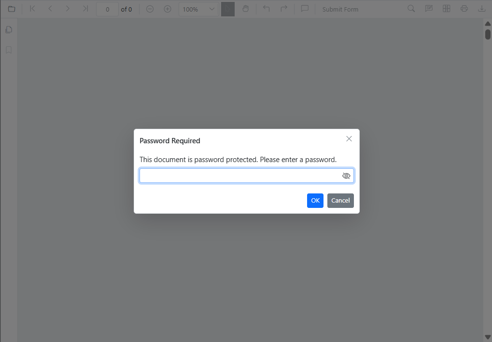
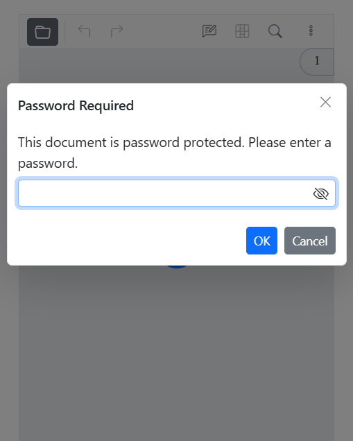
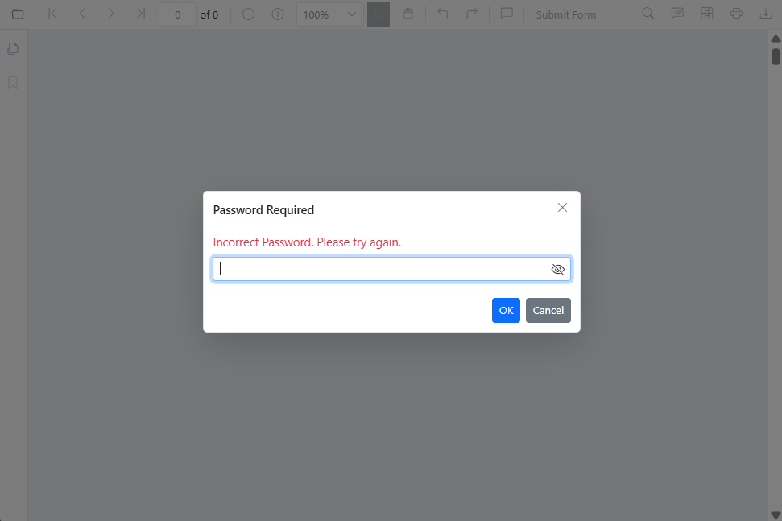
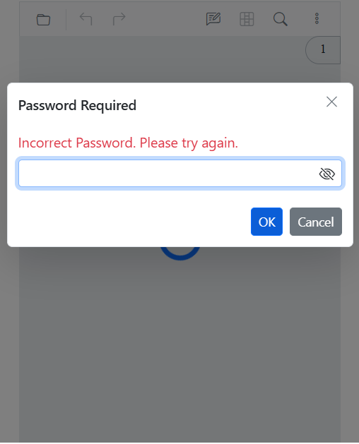

# Password-protected documents

Some PDFs require a password to open. When a protected document is loaded, the viewer displays a password prompt automatically.

**Desktop password prompt:**



**Mobile password prompt:**



The viewer handles the prompt as follows:

- If the correct password is provided, the document loads and becomes viewable according to the document's permissions.
- If the password is incorrect, the viewer shows an error and continues to prompt until a valid password is entered or the operation is canceled.

**Invalid password error in desktop:**



**Invalid password error in mobile:**



- If the operation is canceled, the document is not loaded.

## Detect load errors

Handle incorrect-password events through the [`DocumentLoadFailed`](https://help.syncfusion.com/cr/blazor/Syncfusion.Blazor.SfPdfViewer.PdfViewerEvents.html#Syncfusion_Blazor_SfPdfViewer_PdfViewerEvents_DocumentLoadFailed) event to surface custom error messages.

## Supported permissions

When the document loads successfully, the viewer respects the permissions embedded in the PDF. Common restrictions include:

- Printing allowed or disallowed
- Content copying
- Page editing
- Commenting and annotations

The viewer cannot bypass or elevate document permissions. For the full list of owner-controlled permissions, see [Permission-protected documents](./permission).

## Load the password-protected document programmatically

Use the [`LoadAsync`](https://help.syncfusion.com/cr/blazor/Syncfusion.Blazor.SfPdfViewer.PdfViewerBase.html#Syncfusion_Blazor_SfPdfViewer_PdfViewerBase_LoadAsync_System_Byte___System_String_) method to load a PDF from a file path, URL, or base64 data at runtime. The two supported overloads are:

- `LoadAsync(byte[] bytes, string password = null)` — pass the PDF as a byte array
- `LoadAsync(string document, string password = null)` — pass a URL or server-relative path

The password parameter is consumed for the current load operation only and is not cached across re-renders. If the document is reloaded, supply the password again.

```csharp
@page "/password-protected"
@using Syncfusion.Blazor.SfPdfViewer
@using Syncfusion.Blazor.Buttons

<SfButton @onclick="Clicked">Load Document</SfButton>
<SfPdfViewer2 Height="100%" Width="100%" @ref="Viewer">
</SfPdfViewer2>

@code {
    private SfPdfViewer2? Viewer;

    private async Task Clicked()
    {
        if (Viewer is null)
        {
            return;
        }

        await Viewer.LoadAsync("wwwroot/pdf-succinctly-password-protected.pdf", "password");
    }
}
```

N> The sample uses a `wwwroot/` path, which is appropriate for Blazor WebAssembly. For Blazor Server, load the file from a server-accessible location (for example, pass a byte array returned from an API) and use the `byte[]` overload.

**Outcomes**

| Password state | Result |
|---|---|
| Correct | The PDF loads immediately |
| Incorrect | The viewer displays the incorrect password popup |
| Null or empty | The password popup is shown automatically |

[View sample in GitHub](https://github.com/SyncfusionExamples/blazor-pdf-viewer-examples/tree/master/Load%20and%20Save/Load%20the%20Security%20Document).

## See also

* [Permission-protected documents](./permission)
* [Load a Password-Protected PDF in Blazor](../document-handling/load-password-pdf)
