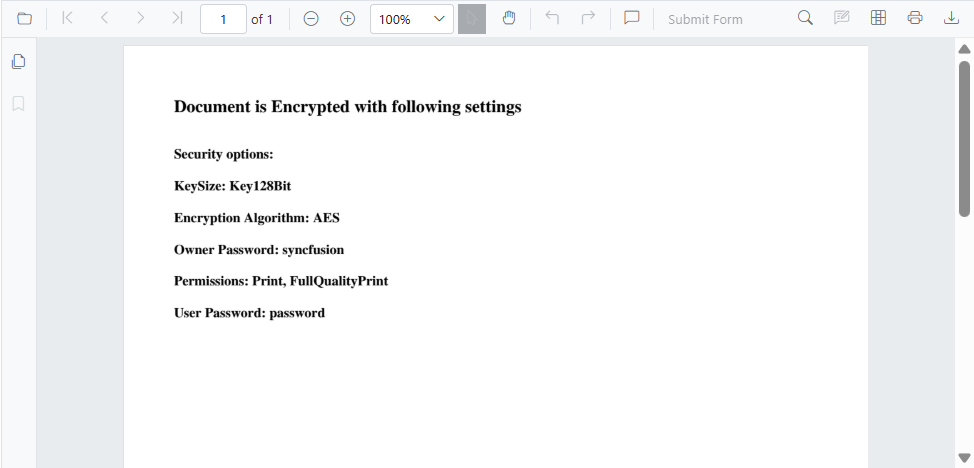

# Permission-restricted documents (Owner password and permissions)

PDFs can be secured with an owner password and a set of permissions that restrict operations after the file is opened. Common restrictions include:

- Printing (allowed or disallowed)
- Copying content
- Editing pages
- Commenting and annotations

The viewer respects these permission flags and disables restricted actions in its UI. It cannot bypass or elevate document permissions. For example, when printing is disallowed, the print action is disabled; when copying is restricted, text selection is limited or copy commands are disabled.

**UI when a permission-restricted document is loaded:**



## Load the permission-protected document programmatically

Use the [`LoadAsync`](https://help.syncfusion.com/cr/blazor/Syncfusion.Blazor.SfPdfViewer.PdfViewerBase.html#Syncfusion_Blazor_SfPdfViewer_PdfViewerBase_LoadAsync_System_Byte___System_String_) method to load a PDF from a file path, URL, or base64 data at runtime. The supported overloads are:

- `LoadAsync(byte[] bytes, string password = null)` — load the PDF as a byte array
- `LoadAsync(string document, string password = null)` — load a URL or server-relative path
- `LoadAsync(Stream stream, string password = null)` — load a PDF Document from the stream.

```csharp
@page "/permission-protected"
@using Syncfusion.Blazor.SfPdfViewer
@using Syncfusion.Blazor.Buttons

<div style="height:600px;width:100%">
    <SfButton @onclick="Clicked">Load Document</SfButton>
    <SfPdfViewer2 Height="100%" Width="100%" @ref="Viewer">
    </SfPdfViewer2>
</div>

@code {
    private SfPdfViewer2? Viewer;

    private async Task Clicked()
    {
        if (Viewer is null)
        {
            return;
        }

        await Viewer.LoadAsync("wwwroot/permission-protected.pdf");
    }
}
```

N> [View sample in GitHub](https://github.com/SyncfusionExamples/blazor-pdf-viewer-examples/tree/master/Load%20and%20Save/Load%20the%20Security%20Document).

## See also

* [Password-protected documents](./password-protected)
* [Getting started with SfPdfViewer2](../getting-started/web-app)
* [SfPdfViewer2 API reference](https://help.syncfusion.com/cr/blazor/Syncfusion.Blazor.SfPdfViewer.PdfViewerBase.html)