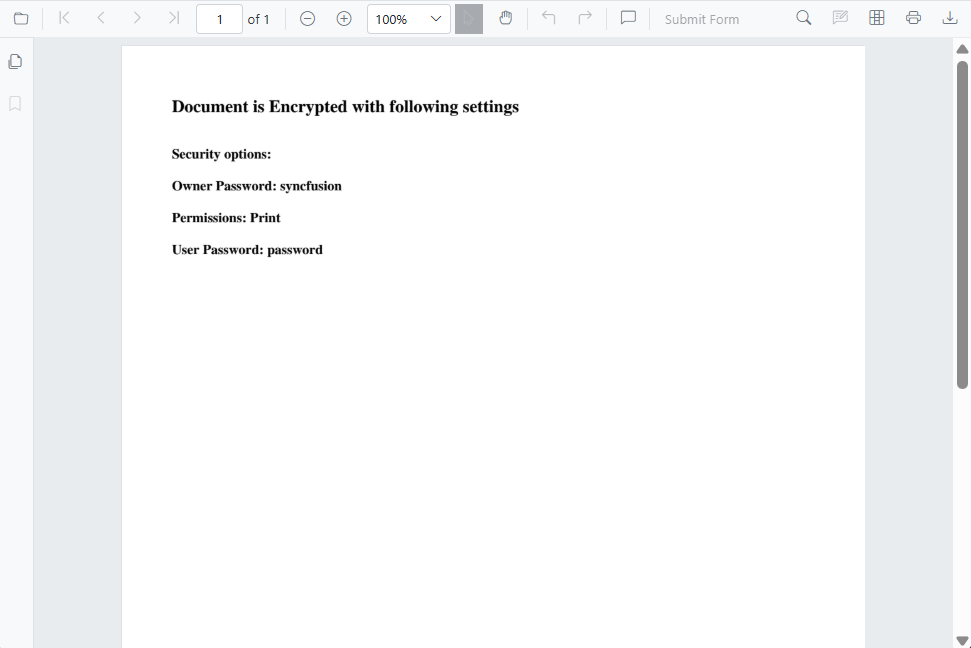

# Permission-restricted documents (Owner password and permissions)

PDFs can be secured with an owner password and a set of permissions that restrict operations even after opening the file. Examples include:

- Printing: allowed or disallowed
- Content copying
- Page editing
- Commenting and annotations

The viewer respects these permission flags and disables restricted actions in its UI. It cannot bypass or elevate document permissions. For example, when printing is disallowed, the print action is not available; when copying is restricted, text selection may be limited or copy commands disabled.

**UI when a permission-restricted document is loaded:**



## Load the permission-protected document programmatically

Use the [LoadAsync method](https://help.syncfusion.com/cr/blazor/Syncfusion.Blazor.SfPdfViewer.PdfViewerBase.html) to load a PDF from a file path, URL, or base64 data at runtime. Provide the password parameter only if the PDF also has an open/user password.

```cshtml

@using Syncfusion.Blazor.SfPdfViewer
@using Syncfusion.Blazor.Buttons

<SfButton @onclick="clicked">Load Document</SfButton>
<SfPdfViewer2 Height="100%" Width="100%" @ref="Viewer">
</SfPdfViewer2>

@code{
    SfPdfViewer2 Viewer;

    public async void clicked()
    {
        await Viewer.LoadAsync("wwwroot/permission-protected.pdf", "password");
    }
}

```

[View sample in GitHub](https://github.com/SyncfusionExamples/blazor-pdf-viewer-examples/tree/master/Load%20and%20Save/Load%20the%20Security%20Document).

## See Also

* [Password-protected documents](./password-protected)