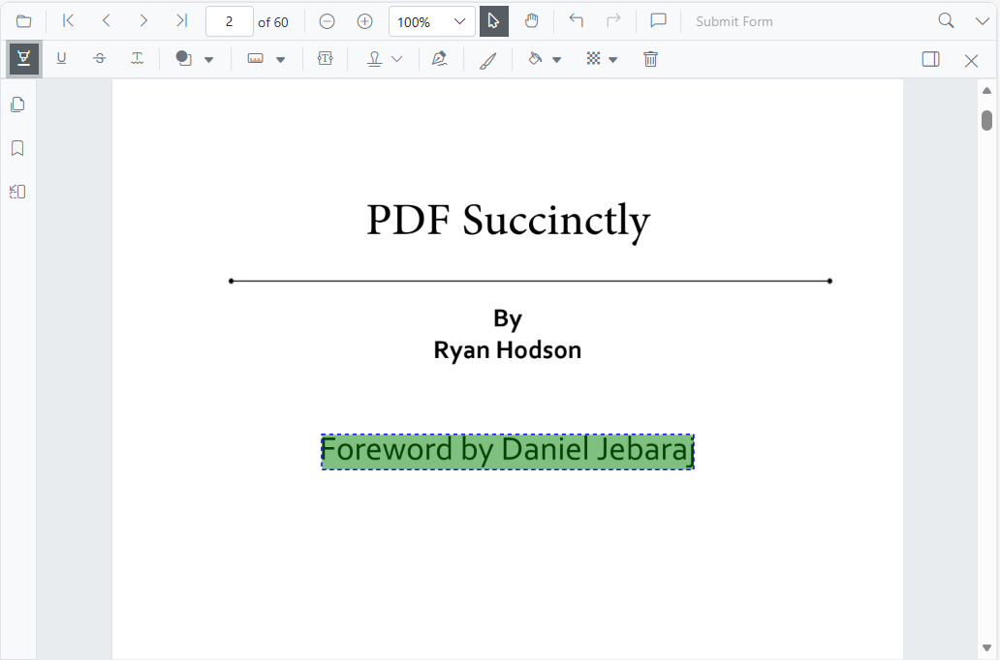

# Change the highlight color of the text in Blazor SfPdfViewer Component

Use the `Color` property of [PdfViewerHighlightSettings](https://help.syncfusion.com/cr/blazor/Syncfusion.Blazor.SfPdfViewer.PdfViewerHighlightSettings.html) to set the default highlight color for text markup highlights. This applies only to Highlight annotations; other text-markup types (such as Underline or Strikethrough) use their own settings.

The following example shows how to set the highlight color.

```cshtml
@using Syncfusion.Blazor.Buttons
@using Syncfusion.Blazor.SfPdfViewer

<!--Render simple PDF Viewer with customized highlight options-->
<SfPdfViewer2 @ref="PDFViewer"
              DocumentPath="@DocumentPath">
    <PdfViewerHighlightSettings Color="@highlightColor">
    </PdfViewerHighlightSettings>
</SfPdfViewer2>

@code{
    SfPdfViewer2 PDFViewer;
    //Sets the PDF document path for initial loading.
    private string DocumentPath { get; set; } = "Data/PDF_Succinctly.pdf";

    //Defines the color for text markup annotations like highlight.
    private string highlightColor = "Green";

}
```



[View the sample on GitHub](https://github.com/SyncfusionExamples/blazor-pdf-viewer-examples/tree/master/Annotations/Text%20Markup/Customize%20highlight%20annotation).