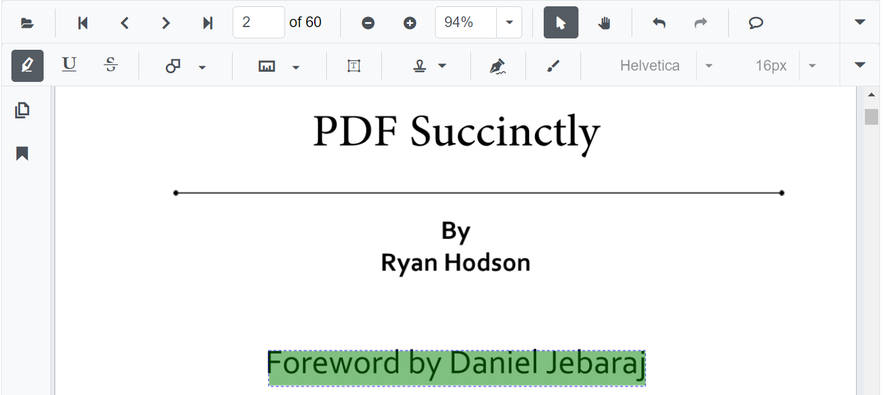

# Change the highlight color of the text in Blazor SfPdfViewer Component

Use the `Color` property of [PdfViewerHighlightSettings](https://help.syncfusion.com/cr/blazor/Syncfusion.Blazor.SfPdfViewer.PdfViewerHighlightSettings.html) to set the default highlight color for text markup annotations. This property applies only to Highlight annotations; other text-markup types, such as [Underline](https://help.syncfusion.com/cr/blazor/Syncfusion.Blazor.SfPdfViewer.PdfViewerUnderlineSettings.html) and [Strikethrough](https://help.syncfusion.com/cr/blazor/Syncfusion.Blazor.SfPdfViewer.PdfViewerStrikethroughSettings.html), use their own settings.

The following example shows how to set the highlight color.

```cshtml
@using Syncfusion.Blazor.SfPdfViewer

<!--Render simple PDF Viewer with customized highlight options-->
<SfPdfViewer2 @ref="PDFViewer"
              DocumentPath="@DocumentPath">
    <PdfViewerHighlightSettings Color="@highlightColor">
    </PdfViewerHighlightSettings>
</SfPdfViewer2>

@code {
    // Reference to the PDF Viewer instance.
    private SfPdfViewer2 PDFViewer;

    // Sets the PDF document path for initial loading.
    private string DocumentPath { get; set; } = "Data/PDF_Succinctly.pdf";

    // Defines the color for text markup annotations like highlight.
    private string highlightColor = "Green";
}
```



> [View the sample on GitHub](https://github.com/SyncfusionExamples/blazor-pdf-viewer-examples/tree/master/Annotations/Text%20Markup/Customize%20highlight%20annotation)

## Supported properties

In addition to `Color`, [PdfViewerHighlightSettings](https://help.syncfusion.com/cr/blazor/Syncfusion.Blazor.SfPdfViewer.PdfViewerHighlightSettings.html) exposes additional properties such as `Opacity`, `IsLocked`, `Author`, `Subject`, and `ModifiedDate`. Refer to the [PdfViewerHighlightSettings API reference](https://help.syncfusion.com/cr/blazor/Syncfusion.Blazor.SfPdfViewer.PdfViewerHighlightSettings.html) for the full list.

The value assigned to `Color` also sets the default selection in the highlight tool's color picker in the toolbar.
N> Highlight annotations rendered using the default color set by `PdfViewerHighlightSettings.Color`.

## See also

- [Highlight Annotation](../annotation/text-markup/highlight-annotation)
- [Customize Annotation](../annotation/customize-annotation)
