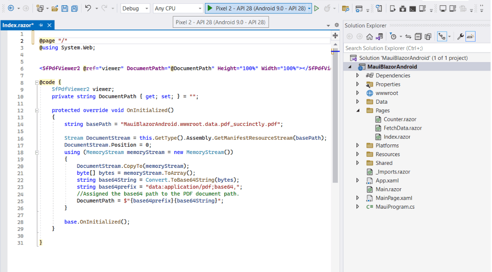
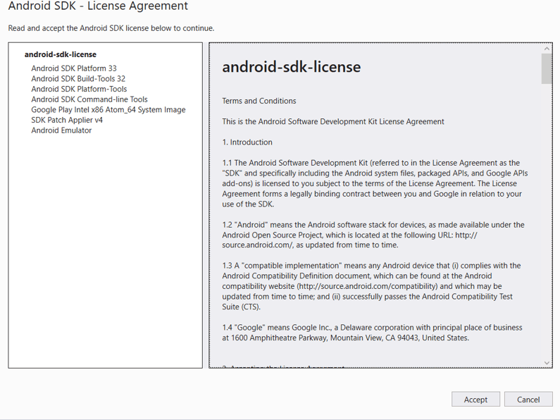
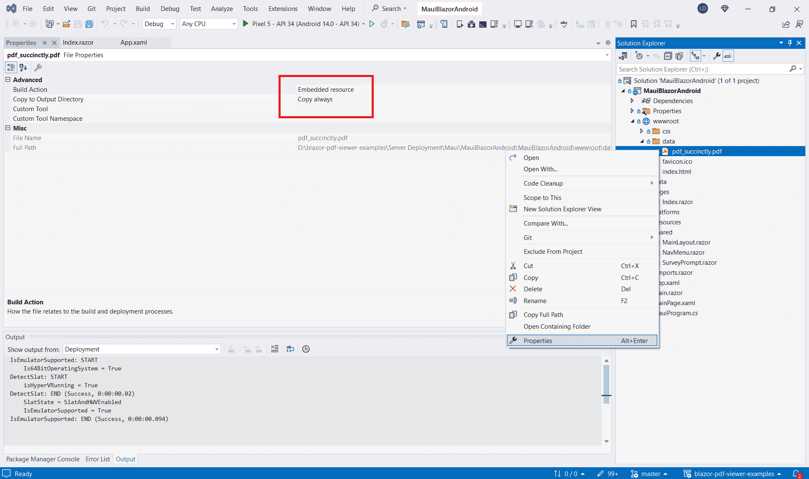
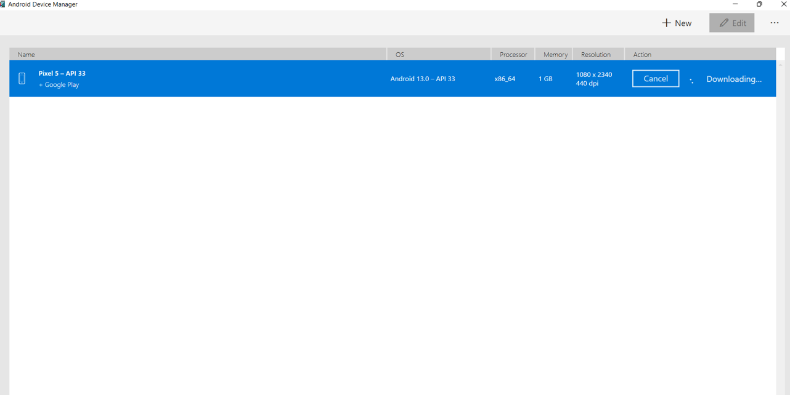
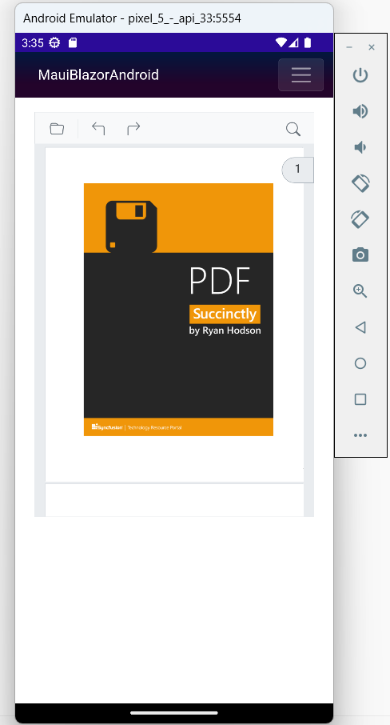

# Render a PDF from an embedded resource in a MAUI Android app 

This article describes how to render the PDF Viewer from an embedded resource in a .NET MAUI Android app using the Android emulator.

To create the .NET MAUI project, see Create a [MAUI app](https://help.syncfusion.com/document-processing/pdf/pdf-viewer/blazor/getting-started/deploy-maui-windows)

## Add the PDF Viewer component

Add the Syncfusion Blazor PDF Viewer component in the **~/Pages/Index.razor** file.




@page "/"

<SfPdfViewer2 @ref="viewer" DocumentPath="@DocumentPath" Height="100%" Width="100%"></SfPdfViewer2>

@code {
    SfPdfViewer2 viewer;
    private string DocumentPath { get; set; } = "";

    protected override void OnInitialized()
    {
        string basePath = "MauiBlazorAndroid.wwwroot.data.pdf_succinctly.pdf";
        Stream DocumentStream = this.GetType().Assembly.GetManifestResourceStream(basePath);
        DocumentStream.Position = 0;
        using (MemoryStream memoryStream = new MemoryStream())
        {
            DocumentStream.CopyTo(memoryStream);
            byte[] bytes = memoryStream.ToArray();
            string base64String = Convert.ToBase64String(bytes);
            string base64prefix = "data:application/pdf;base64,";
            //Assigned the base64 path to the PDF document path.
            DocumentPath = $"{base64prefix}{base64String}";
        }
        base.OnInitialized();
    }
}




N> In a Blazor .NET MAUI Android app, pass the [DocumentPath](https://help.syncfusion.com/cr/blazor/Syncfusion.Blazor.SfPdfViewer.PdfViewerBase.html#Syncfusion_Blazor_SfPdfViewer_PdfViewerBase_DocumentPath) as a Base64 data URL. This ensures the viewer can retrieve and render the PDF correctly.

## Run on the Android emulator

To run the PDF Viewer in a Blazor .NET MAUI Android app using the Android emulator, follow these steps:

**Step 1** Install the required dependencies, SDKs, and tools for .NET MAUI Android on Windows. Ensure the Android SDK licenses are accepted. If errors occur during installation, follow the prompts to resolve them.

**Step 2** In Solution Explorer, right-click **~wwwroot/data/pdf_succinctly.pdf**, choose `Properties`, set Build Action to `Embedded Resource`, and set Copy to Output Directory to `Copy always`.

**Step 3** Install and launch Android Device Manager. In Android SDK Manager, on the `SDK Tools` tab, select `Android Device Manager` and click `Apply` or `OK`. This enables creating and managing Android Virtual Devices (AVD) for testing.

**Step 4** Ensure the Android emulator is running. In Android Device Manager, create or select an AVD and start the emulator.

Finally, run the project with the emulator. The PDF Viewer component renders in the Blazor .NET MAUI Android app.

N> For emulator issues, see Troubleshooting Android Emulator: https://learn.microsoft.com/en-us/dotnet/maui/android/emulator/troubleshooting

N> [View sample on GitHub](https://github.com/SyncfusionExamples/blazor-pdf-viewer-examples/tree/master/Getting%20Started/Blazor%20Hybrid%20-%20.NET%20MAUI/MauiBlazorAndroid).

## See also

* [Supported features: Desktop vs mobile](../overview#supported-features-desktop-vs-mobile).

* [Render a PDF document from a URL in the MAUI app](../getting-started/maui-blazor-app).
