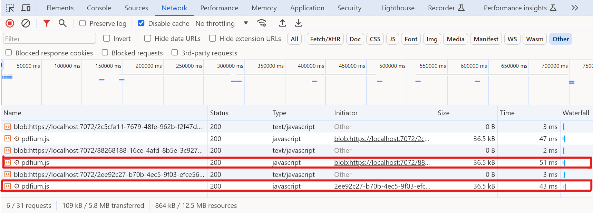
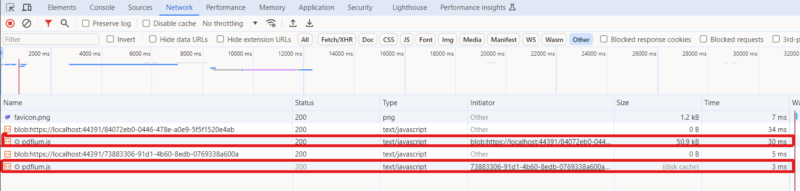

# Improve performance using a CDN in the Blazor SfPdfViewer

Referencing scripts from the application's hosted or NuGet location can add network overhead and slow initial rendering. To reduce latency, reference the scripts from a content delivery network (CDN). The browser will download the assets once and then reuse them from cache on subsequent loads (unless the version changes).

Improve load performance by injecting the following CDN links in **Components/App.razor**.

Use version-pinned URLs and update them when upgrading the package.

```html

<head>
    <!-- Syncfusion Blazor PDF Viewer control's theme style sheet -->
    <link href="https://cdn.syncfusion.com/blazor/31.1.21/styles/bootstrap5.css" rel="stylesheet" />
</head>
<body>    
    <!-- Syncfusion Blazor PDF Viewer control's scripts -->
    <script src="https://cdn.syncfusion.com/blazor/31.1.21/syncfusion-blazor-sfpdfviewer.min.js" type="text/javascript"></script>
</body>

```

The viewer depends on pdfium.js (and its companion pdfium.wasm). When scripts are referenced from NuGet or a hosted path, these files download from that location on first use. The following image shows the network behavior in this case.



When referencing scripts from a **CDN**, assets are fetched from the CDN on first load and then served from the browser cache on subsequent loads, improving perceived performance. The image below illustrates this behavior.


