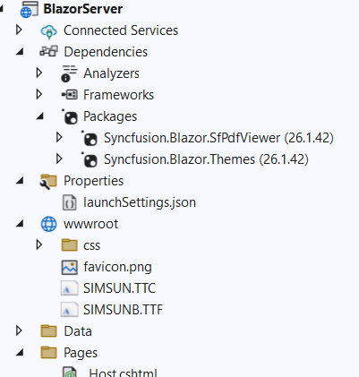

# Load custom fonts in the Blazor SfPdfViewer

The Blazor SfPdfViewer uses Pdfium to extract text and render pages as images. Pdfium includes a limited set of built-in fonts. Use [CustomFonts](https://help.syncfusion.com/cr/blazor/Syncfusion.Blazor.SfPdfViewer.PdfViewerBase.html#Syncfusion_Blazor_SfPdfViewer_PdfViewerBase_CustomFonts) to supply additional fonts when the required fonts are not available.

To use CustomFonts, follow these steps:

1. Add the font files (TTF, TTC, or OTF) to the `wwwroot` folder so they are available as static assets at runtime.
   
2. Reference the exact paths to these font files in the customFonts list. Ensure the paths resolve correctly when the app is running.



The following example shows how to load custom fonts into the PDF Viewer.

```cshtml

<SfPdfViewer2 DocumentPath="https://cdn.syncfusion.com/content/pdf/pdf-succinctly.pdf"
              Height="100%"
              Width="100%" CustomFonts="@customFonts">
</SfPdfViewer2>
 

@code {

    public List<string> customFonts = new List<string> { "wwwroot/SIMSUN.TTC", "wwwroot/SIMSUNB.TTF"}

}
    
```
The following example shows how to load a custom font using a CDN link.

```cshtml

<SfPdfViewer2 DocumentPath="https://cdn.syncfusion.com/content/pdf/pdf-succinctly.pdf"
              Height="100%"
              Width="100%" CustomFonts="@customFonts">
</SfPdfViewer2>
 

@code {

     public List<string> customFonts = new List<string> { "https://cdn.jsdelivr.net/npm/arial-geo-bold@1.0.0/fonts/arial-geo-bold-webfont.ttf" };

}
    
```
[View the custom fonts sample on GitHub](https://github.com/SyncfusionExamples/blazor-pdf-viewer-examples/tree/master/Load%20and%20Save/Load%20custom%20fonts%20in%20PDF%20document).
