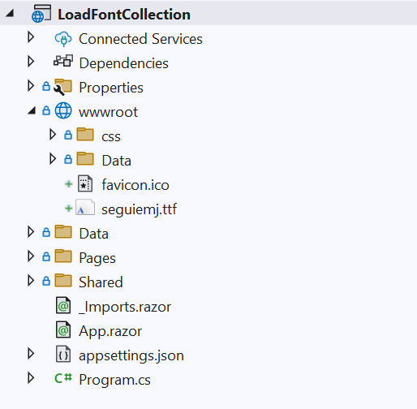

# Load a font collection in Blazor SfPdfViewer Component

In addition to loading a single custom font, the Blazor SfPdfViewer supports adding multiple fonts to the [FallbackFontCollection](https://help.syncfusion.com/cr/blazor/Syncfusion.Blazor.SfPdfViewer.PdfViewerBase.html#Syncfusion_Blazor_SfPdfViewer_PdfViewerBase_FallbackFontCollection). This is useful when a PDF uses various fonts that are not embedded in the document or are not available by default. Configuring multiple fallback fonts helps preserve text shaping, special characters, and visual fidelity.

To use FallbackFontCollection, follow these steps:

1. Add the required font files (for example, TTF/TTC/OTF) to the `wwwroot` folder so they are available as static assets at runtime.



The following example shows how to add fonts to the fallback collection at runtime.

```cshtml
@using Syncfusion.Blazor.SfPdfViewer
@using System.IO

<SfPdfViewer2 @ref="Viewer"
              DocumentPath="https://cdn.syncfusion.com/content/pdf/pdf-succinctly.pdf"
              Height="100%"
              Width="100%">
    <PdfViewerEvents Created="@Created"></PdfViewerEvents>
</SfPdfViewer2>

@code {
    private SfPdfViewer2 Viewer;

    private void Created()
    {
        Stream font = new MemoryStream(File.ReadAllBytes("wwwroot/seguiemj.ttf"));
        Viewer.FallbackFontCollection.Add("seguiemj", font);
    }
}
```
[View sample in GitHub](https://github.com/SyncfusionExamples/blazor-pdf-viewer-examples/tree/master/Load%20and%20Save/Load%20font%20collection%20in%20PDF%20document).

## See also

* [Processing Large Files Without Increasing Maximum Message Size in SfPdfViewer Component](./how-to-processing-large-files-without-increasing-maximum-message-size)
* [SfPdfViewer getting started (Web App)](../getting-started/web-app)
* [Events in SfPdfViewer Component](../events)
