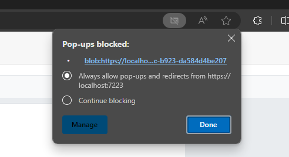

# Print large PDF documents in Blazor SfPdfViewer

This article shows how to implement a client-side printing approach for large PDFs in the Syncfusion Blazor SfPdfViewer component using JavaScript interop.

### Implement a print handler
Add a custom print toolbar item to the primary toolbar, then handle its click to retrieve the loaded PDF as a byte array and invoke a JavaScript function to print the PDF on the client-side.

```cshtml
private async Task ClickAction(ClickEventArgs Item)
{
    if (Item.Item.Id == "print" && Viewer != null)
    {
        //get the byte array of loaded PDF
        byte[] bytes = await Viewer.GetDocumentAsync();

        //send the byte array to client
        await JSRuntime.InvokeVoidAsync("printPDF", bytes);
    }
}

```

### Add the JavaScript function
Add a `printPDF` function to a JavaScript file that converts the byte array into a Blob and generates a Blob URL for the loaded PDF. Reference the script in the app so it loads before use (for example, in wwwroot/js/site.js and referenced from index.html for WebAssembly, or _Host.cshtml for Server). The Blob URL can then be used to open the PDF in a new tab or trigger the print dialog.

```javascript
// Convert the byte array to a Blob object
const blob = new Blob([byteArray], { type: 'application/pdf' });
// Generate a Blob URL for the loaded PDF
const blobUrl = URL.createObjectURL(blob);
```
Open the Blob URL in a new browser window or tab, then call window.print() to display the browser's print dialog.

```javascript
// Open the Blob URL in a new window or tab
const printWindow = window.open(blobUrl, '_blank');
// open the print window of browser
const tryPrint = () => {
    printWindow.focus();
    printWindow.print();
};
```

N> Ensure that the browser allows pop-ups for the site, because this approach opens the PDF in a new window or tab. Printing typically requires a user gesture (such as clicking a button), and behavior may vary by browser.


[View the large document printing sample on GitHub](https://github.com/SyncfusionExamples/blazor-pdf-viewer-examples/tree/master/Print/Print%20Large%20page%20document).

## See also

* [Primary Toolbar Customization in SfPdfViewer](../toolbar-customization/primary-toolbar)