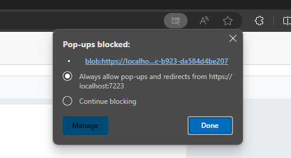

# Print large-page documents in Blazor SfPdfViewer

This article shows how to print large PDFs in the Blazor SfPdfViewer component. A custom toolbar action retrieves the loaded PDF as a byte array and uses JavaScript interop to open it in a new tab and trigger the browser's print dialog.

### Implement a print handler
Add a custom print toolbar item to the primary toolbar, then handle its click to retrieve the loaded PDF as a byte array and invoke a JavaScript function to print the PDF on the client-side.

```csharp
private async Task ClickAction(ClickEventArgs Item)
{
    if (Item.Item.Id == "print" && Viewer != null)
    {
        // Get the byte array of the loaded PDF.
        byte[] bytes = await Viewer.GetDocumentAsync();

        // Pass the byte array to the JavaScript printPDF function.
        await JSRuntime.InvokeVoidAsync("printPDF", bytes);
    }
}
```

### Add the JavaScript function
Add a `printPDF` function to a JavaScript file. Reference the script in the app so it loads before use (for example, in `wwwroot/js/site.js` and referenced from `index.html` for WebAssembly, or `_Host.cshtml` for Server).

#### Create the Blob URL
Convert the byte array into a Blob and generate a Blob URL for the loaded PDF.

```javascript
// Convert the byte array to a Blob object
const blob = new Blob([byteArray], { type: 'application/pdf' });
// Generate a Blob URL for the loaded PDF
const blobUrl = URL.createObjectURL(blob);
```

#### Open the PDF and trigger the print dialog
Open the Blob URL in a new browser window or tab, then call `window.print()` to display the browser's print dialog.

```javascript
// Open the Blob URL in a new window or tab
const printWindow = window.open(blobUrl, '_blank');
// Open the browser's print dialog
const tryPrint = () => {
    printWindow.focus();
    printWindow.print();
};
```

N> Ensure that the browser allows pop-ups for the site, because this approach opens the PDF in a new window or tab. Printing typically requires a user gesture (such as clicking a button), and behavior may vary by browser.


[View the large document printing sample on GitHub](https://github.com/SyncfusionExamples/blazor-pdf-viewer-examples/tree/master/Print/Print%20Large%20page%20document).

## See also

* [Primary Toolbar Customization in SfPdfViewer](../toolbar/primary-toolbar)
