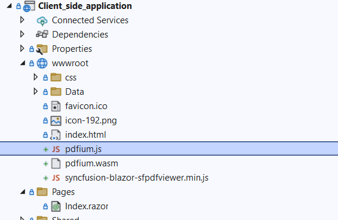

# Reference SfPdfViewer scripts in a Blazor application

* Use a CDN to include the scripts quickly without local files. For setup details, see the [CDN reference](https://blazor.syncfusion.com/documentation/common/adding-script-references#cdn-reference)

* Reference scripts from the NuGet package via static web assets. [Learn more](https://blazor.syncfusion.com/documentation/common/adding-script-references#static-web-assets)

* For custom bundles, use the [Custom Resource Generator](https://blazor.syncfusion.com/documentation/common/custom-resource-generator) to include only required modules. When referencing scripts externally, also deploy [pdfium.js](https://github.com/SyncfusionExamples/blazor-pdf-viewer-examples/blob/master/Common/Pdfium%20files/pdfium.js) and [pdfium.wasm](https://github.com/SyncfusionExamples/blazor-pdf-viewer-examples/blob/master/Common/Pdfium%20files/pdfium.wasm) in the app and ensure paths are correct.

To reference the scripts and Pdfium files in a Blazor application, see the following image.
