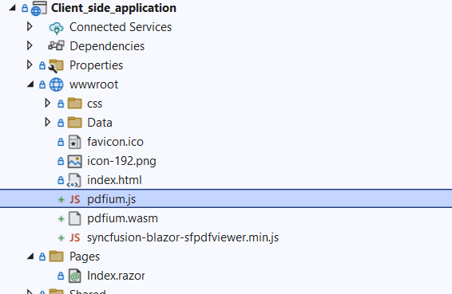

# Reference SfPdfViewer scripts in a Blazor application

## CDN Usage

Use a CDN to include the scripts quickly without local files. For setup details, see the [CDN reference](https://blazor.syncfusion.com/documentation/common/adding-script-references#cdn-reference).

## NuGet static web assets

Reference scripts from the NuGet package via static web assets. For more details, see [static web assets](https://blazor.syncfusion.com/documentation/common/adding-script-references#static-web-assets).

## Custom Resource Generator

To create a custom bundle, use the [Custom Resource Generator](https://blazor.syncfusion.com/documentation/common/custom-resource-generator) to include only the required modules. When referencing scripts externally, also deploy [pdfium.js](https://github.com/SyncfusionExamples/blazor-pdf-viewer-examples/blob/master/Common/Pdfium%20files/pdfium.js) and [pdfium.wasm](https://github.com/SyncfusionExamples/blazor-pdf-viewer-examples/blob/master/Common/Pdfium%20files/pdfium.wasm) in the app and ensure paths are correct.

## See also

* [How to load Microsoft Office files in Blazor SfPdfViewer Component](./how-to-load-office-files)
* [How to unload the PDF document from Viewer](./how-to-unload-the-pdf-document-from-viewer)
* [How to show or hide the Component dynamically](./how-to-show-or-hide-sfpdfviewer-dynamically)
