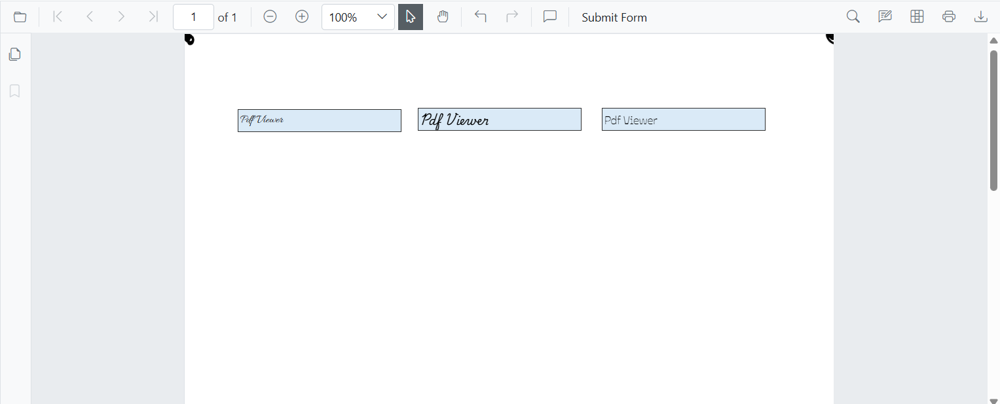

# Custom Font Support for Form Fields

The Blazor SfPdfViewer supports loading, using, and saving custom fonts for form fields (TextBox, ListBox, DropDown) via the [FallbackFontCollection](https://help.syncfusion.com/cr/blazor/Syncfusion.Blazor.SfPdfViewer.PdfViewerBase.html#Syncfusion_Blazor_SfPdfViewer_PdfViewerBase_FallbackFontCollection) and `FontFamilies` properties.

## Integrating Custom Font Collections into Form Fields in SfPdfViewer

To ensure correct rendering and saving of form fields that use custom fonts (especially when fonts are not installed on the host system), set the `FallbackFontCollection` property and load the TTF files the application can access. Add those font family names to the `FontFamilies` (string[]) property so the fonts appear in the Font Family dropdown in the property dialog. Ensure TTF files are available at the configured path (for example, `wwwroot/Data`) and that font licenses permit distribution with the application.

```cshtml
@page "/"

<SfPdfViewer2 @ref="pdfViewer" Height="100%" Width="100%" DocumentPath="@DocumentPath" FontFamilies="@FontFamilies">
    <PdfViewerEvents Created="@Created"></PdfViewerEvents>
</SfPdfViewer2>

@code {
    SfPdfViewer2? pdfViewer;

    // Use the FontFamilies property to add custom font families to the Font Family dropdown in the annotation toolbar
    internal string[] FontFamilies { get; set; } = { "Helvetica", "Courier", "Symbol", "Times New Roman", "Allura", "Playwrite CA", "Ojuju" };

    private string DocumentPath { get; set; } = "https://cdn.syncfusion.com/content/pdf/form-designer.pdf";

    public void Created()
    {
        // Use FallbackFontCollection to save the custom font
        // Maps the font family name to its corresponding TTF file as a memory stream
        pdfViewer!.FallbackFontCollection.Add("Allura", new MemoryStream(System.IO.File.ReadAllBytes("wwwroot/Data/Allura-Regular.ttf")));
        pdfViewer!.FallbackFontCollection.Add("Playwrite CA", new MemoryStream(System.IO.File.ReadAllBytes("wwwroot/Data/PlaywriteCA-Regular.ttf")));
        pdfViewer!.FallbackFontCollection.Add("Ojuju", new MemoryStream(System.IO.File.ReadAllBytes("wwwroot/Data/Ojuju-Regular.ttf")));
    }
}
```


[View sample in GitHub](https://github.com/SyncfusionExamples/blazor-pdf-viewer-examples/tree/master/Common/Custom%20Font%20Support%20For%20FormFields).

N> If a form field (TextBox, ListBox, DropDown) using a custom font contains text larger than the field’s bounds, the downloaded PDF may render differently in some browsers or third‑party viewers. The Syncfusion SfPdfViewer renders these fields correctly. To avoid rendering issues, use a font size that fits the field, enlarge the field prior to saving, or adjust layout before downloading.

## Custom Font Support for Signature Fields

The Blazor SfPdfViewer allows loading, editing, and saving custom fonts for signature fields by using the [FallbackFontCollection](https://help.syncfusion.com/cr/blazor/Syncfusion.Blazor.SfPdfViewer.PdfViewerBase.html#Syncfusion_Blazor_SfPdfViewer_PdfViewerBase_FallbackFontCollection) and [SignatureFonts](https://help.syncfusion.com/cr/blazor/Syncfusion.Blazor.SfPdfViewer.PdfViewerSignatureDialogSettings.html#Syncfusion_Blazor_SfPdfViewer_PdfViewerSignatureDialogSettings_SignatureFonts) properties.

### Integrating Custom Font Collections into Signature Fields in SfPdfViewer

To ensure correct rendering and saving of signatures that use custom fonts (especially when those fonts are not installed on the host system), set the `FallbackFontCollection` property and load the TTF files the application can access. Add the font family names to the `SignatureFonts` (string[]) property so they appear in the signature dialog. Verify that the font files are reachable at the configured path (for example, `wwwroot/Data`) and that licensing allows distribution.

```cshtml
@page "/"

<SfPdfViewer2 @ref="Viewer" DocumentPath="@DocumentPath" Height="100%" Width="100%">
    <PdfViewerEvents Created="@Created"></PdfViewerEvents>
    <PdfViewerSignatureDialogSettings SignatureFonts="signatureFonts" />
</SfPdfViewer2>

@code {
    SfPdfViewer2? Viewer;

    private string DocumentPath { get; set; } = "wwwroot/Data/With_Four_Signature_Fields.pdf";

    // Use the FontFamilies property to add custom font families to the Font Family dropdown in the annotation toolbar
    public string[] signatureFonts = { "Allura", "Tangerine", "Sacramento", "Inspiration" };

    public void Created()
    {
        // Use FallbackFontCollection to save the custom font
        // Maps the font family name to its corresponding TTF file as a memory stream
        pdfViewer!.FallbackFontCollection.Add("Allura", new MemoryStream(System.IO.File.ReadAllBytes("wwwroot/Data/Allura-Regular.ttf")));
        pdfViewer!.FallbackFontCollection.Add("Tangerine", new MemoryStream(System.IO.File.ReadAllBytes("wwwroot/Data/Tangerine-Regular.ttf")));
        pdfViewer!.FallbackFontCollection.Add("Sacramento", new MemoryStream(System.IO.File.ReadAllBytes("wwwroot/Data/Sacramento-Regular.ttf")));
        pdfViewer!.FallbackFontCollection.Add("Inspiration", new MemoryStream(System.IO.File.ReadAllBytes("wwwroot/Data/Inspiration-Regular.ttf")));
    }
}
```


[View sample in GitHub](https://github.com/SyncfusionExamples/blazor-pdf-viewer-examples/tree/master/Common/Custom%20Font%20Support%20For%20Signature%20Field).

When using Google Fonts or other externally hosted fonts with the PDF Viewer, load the fonts in the application to ensure consistent rendering. This is required because FreeText annotations render directly onto the canvas and need the fonts available in the hosting environment.

The following example illustrates how to load custom fonts in FreeText annotations using fonts from Google Fonts or other external sources.

```cshtml
<script>
    window.addEventListener('DOMContentLoaded', () => {
        var fontFamily = ["Allura, Tangerine, Sacramento, Inspiration"];
        for (var fontIndex=0; fontIndex<fontFamily.length; fontIndex++)
        {
            document.fonts.load(`16px ${fontFamily[fontIndex]}`).then(() => {
                console.log(`Font "${fontFamily[fontIndex]}" loaded successfully.`);
            }).catch(err => {
                console.error(`Failed to load font "${font}":`, err);
            });
        }
    });
</script>
```

N> If external fonts are not loaded in the environment, importing and rendering FreeText annotations that reference those fonts may show minor differences. This typically occurs only with fonts referenced from web-based sources.

[View sample in GitHub](https://github.com/SyncfusionExamples/blazor-pdf-viewer-examples/tree/master/Annotations/FreeText/Load%20Custom%20Font%20From%20External%20Links).

## See also

* [Load Custom Fonts in PDF Viewer](../faqs/how-to-load-custom-font-pdfium)
