# To open the form designer toolbar

This topic explains how to design and manage PDF form fields in mobile view using the Blazor `SfPdfViewer`.

**Prerequisites**
- Form Designer must be enabled for the viewer instance.
- Use a supported mobile browser.

To open the form designer toolbar, tap the **Form Designer** option in the primary toolbar. The form designer toolbar opens at the bottom of the viewer.

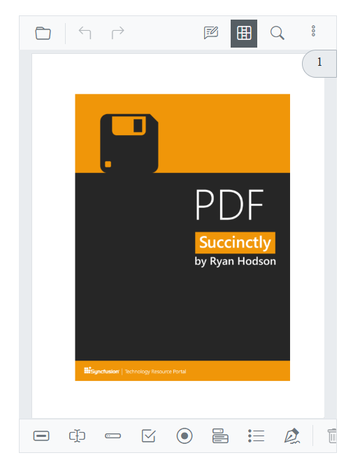

## Add a text box

Tap the **Text Box** icon in the toolbar, then tap anywhere in the viewer to place a text box form field.

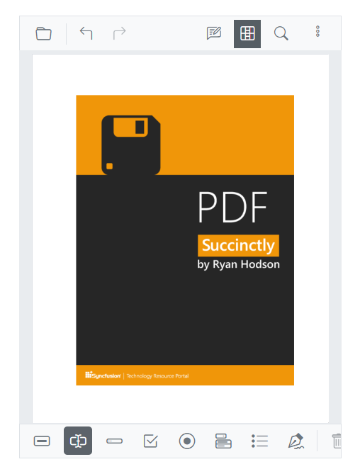

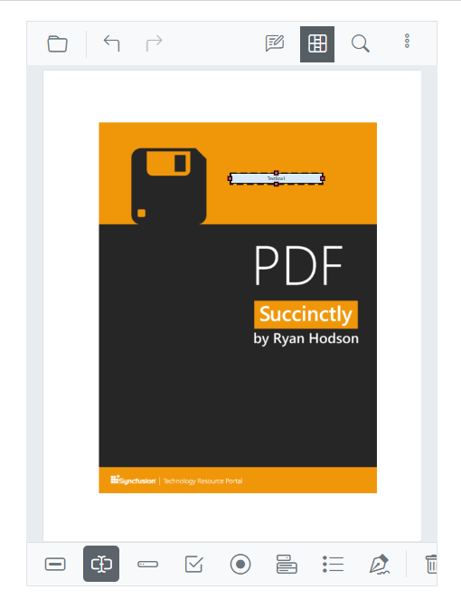

## Add a password box

Tap the **Password Box** icon in the toolbar, then tap anywhere in the viewer to place a password box.

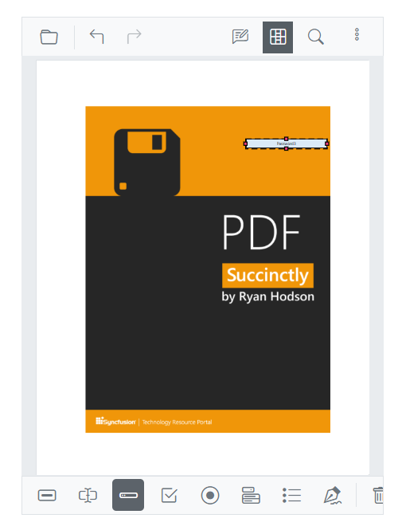

## Add a check box

Tap the **Check Box** icon in the toolbar, then tap anywhere in the viewer to place a check box.

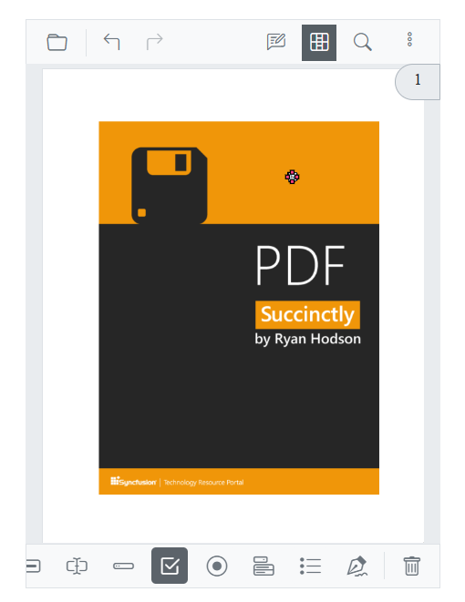

## Add a radio button

Tap the **Radio Button** icon in the toolbar, then tap anywhere in the viewer to place a radio button.

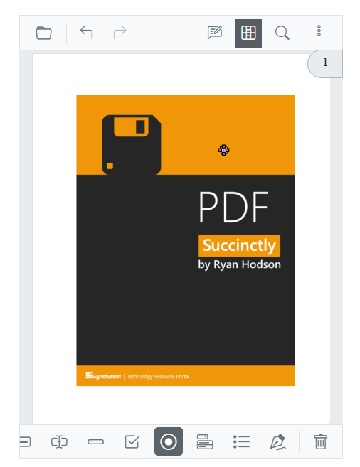

## Add a list box

Tap the **List Box** icon in the toolbar, then tap anywhere in the viewer to place a list box.

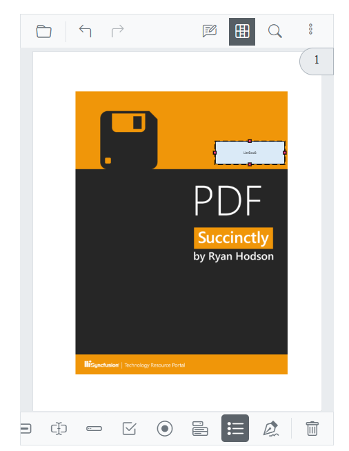

## Add a dropdown field

Tap the **Dropdown** icon in the toolbar, then tap anywhere in the viewer to place a dropdown field.

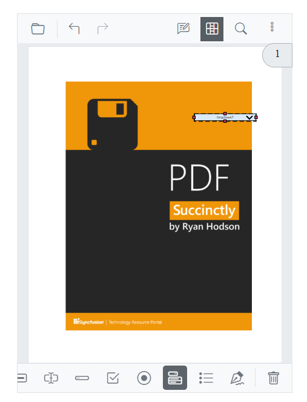

## Add a signature field

Tap the **Signature Field** icon in the toolbar, then tap anywhere in the viewer to place a signature field.

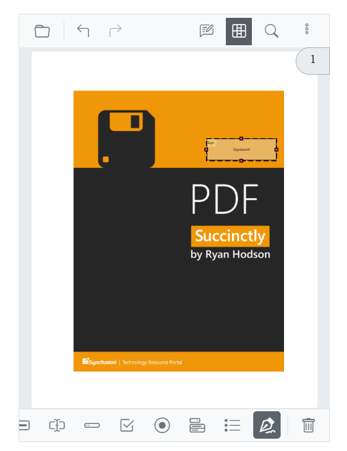

## Add a button

Tap the **Button** icon in the toolbar, then tap anywhere in the viewer to place a button.

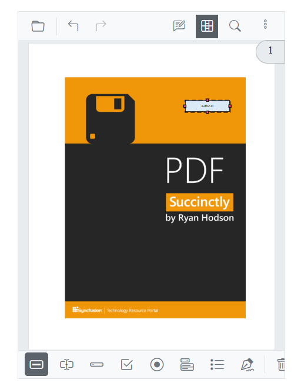

## Modify form field properties

Configure form field properties as required. To edit a field on mobile, select the field while the form designer toolbar is open to display the properties dialog, then update the needed options:

- **Name**: Unique identifier for the form field.
- **Tooltip**: Text displayed as a tooltip for the field.
- **Value**: Default value assigned during design.
- **Visibility**: Display behavior — Visible, Visible but does not print, Hidden, or Hidden but printable.
- **Read-only**: Prevents users from editing the field.
- **Required**: Marks the field as mandatory.
- **Appearance**: Visual settings such as background color, border color and style, font family, and font size.

Tap Save to apply changes to the selected form field. On mobile, drag the field or its resize handles to reposition or resize; minimum field sizes may apply, and snapping occurs within page bounds where supported.

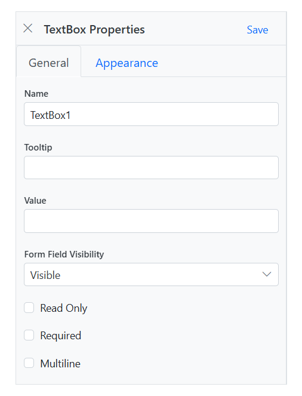

## Delete a form field

To delete a form field, select it. The Delete icon appears in the form designer toolbar; tap it to remove the field from the PDF. Alternatively, press the Delete key after selecting the form field.

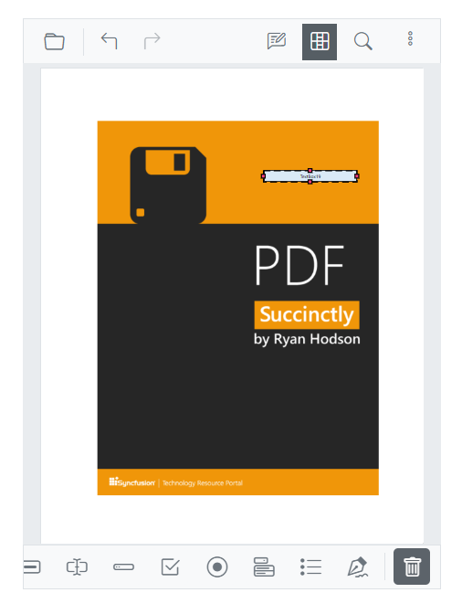

## See also

* [Mobile Toolbar](../toolbar-customization/mobile-toolbar)
* [Annotations in Mobile View](../annotation/annotations-in-mobile-view)
* [Form designer overview](../form-designer/overview)
* [UI interactions](../form-designer/ui-interactions)
* [Create form fields programmatically](../form-designer/create-programmatically)
