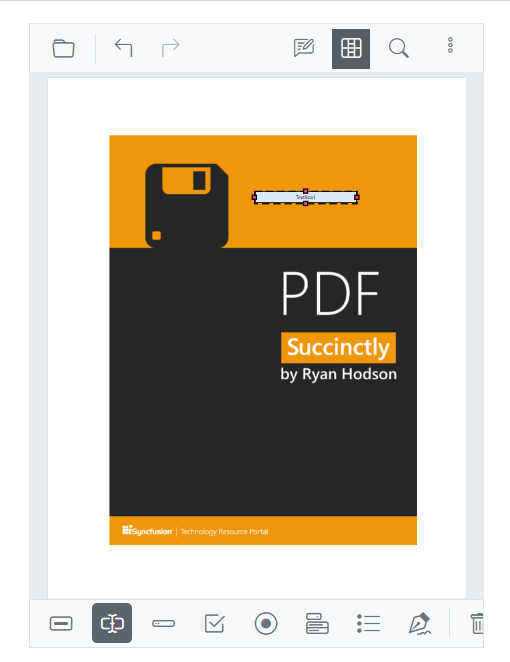
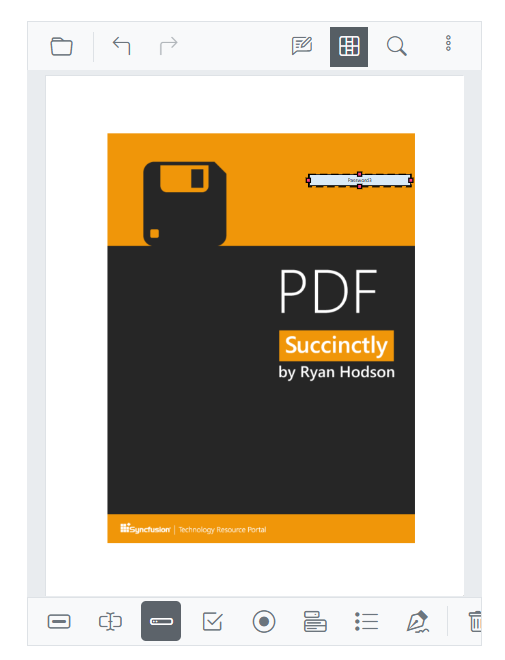
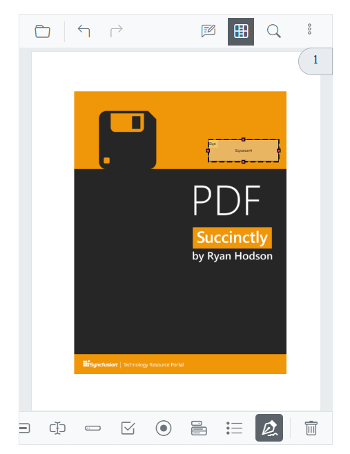
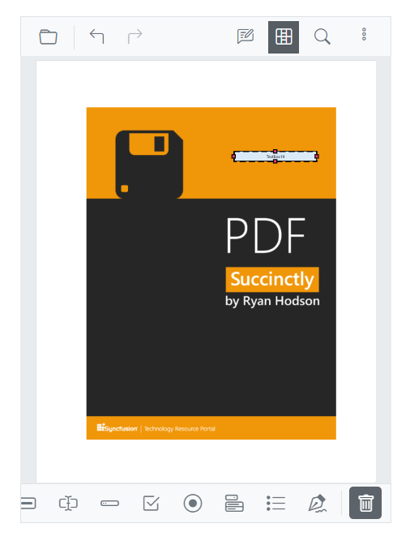

# To open the form designer toolbar

This topic explains how to design and manage PDF form fields in mobile view using the Blazor SfPdfViewer.

Prerequisites:
- Form designer must be enabled for the viewer instance.
- Use a supported mobile browser.

To open the form designer toolbar, tap the **Form Designer** option in the primary toolbar on mobile. The form designer toolbar opens at the bottom of the viewer.

## To add text box

Tap the **Text Box** icon in the toolbar, then tap anywhere in the viewer to place the text box form field.

## To add password box

Tap the **Password Box** icon in the toolbar, then tap anywhere in the viewer to place the password box.

## To add check box

Tap the **Check Box** icon in the toolbar, then tap anywhere in the viewer to place the check box.

## To add radio button

Tap the **Radio Button** icon in the toolbar, then tap anywhere in the viewer to place the radio button.

## To add list box

Tap the **List Box** icon in the toolbar, then tap anywhere in the viewer to place the list box.

## To add signature field

Tap the **Signature Field** icon in the toolbar, then tap anywhere in the viewer to place the signature field.

## To add button

Tap the **Button** icon in the toolbar, then tap anywhere in the viewer to place the button.

## Modify Form Field Properties

Form field properties can be configured as needed. To edit a field on mobile, select the form field while the form designer toolbar is open to display the properties dialog, then adjust the required options:

- **Name**: Unique identifier for the form field.
- **Tooltip value**: Text shown as a tooltip for the field.
- **Value**: Default value assigned during design.
- **Form field visibility**: Display behavior — Visible, Visible but doesn’t print, Hidden, or Hidden but printable.
- **Read-only**: Prevents users from editing the field.
- **Required**: Marks the field as mandatory for input.
- **Appearance**: Visual settings such as background color, border color and style, and font family and size.

Tap Save to apply the changes to the selected form field. On mobile, drag the field or its resize handles to reposition or resize; minimum field sizes may apply, and snapping occurs within page bounds where supported.

## Delete Form Field

To delete a form field, select the field to remove. The Delete icon appears in the form designer toolbar; tap it to remove the field from the PDF. Alternatively, press the Delete key after selecting the form field.

## See also

* [Mobile Toolbar](../mobile-toolbar)
* [Annotations in Mobile View](../annotation/annotations-in-mobile-view)
* [Form designer overview](../form-designer/overview)
* [UI interactions](../form-designer/ui-interactions)
* [Form designer events](../form-designer/events)
* [Create form fields programmatically](../form-designer/create-programmatically)
