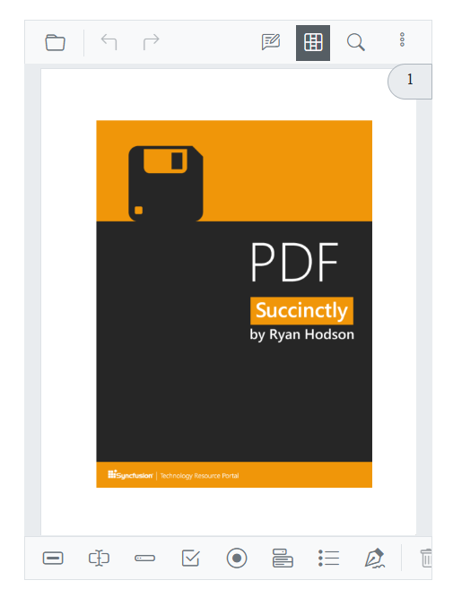
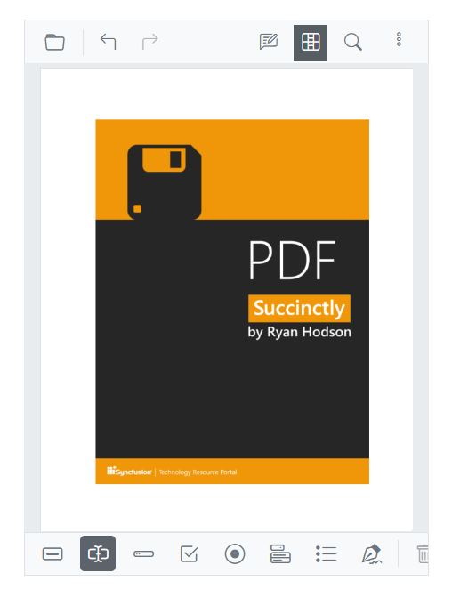
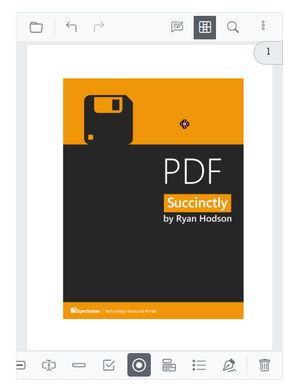
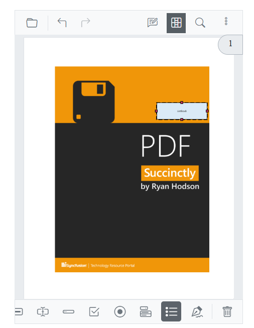

# To open the form designer toolbar

To open the form designer toolbar, click on the **Form Designer** option in the mobile primary toolbar. The mobile form designer toolbar will open at the bottom of the viewer.

## To add text box

Click the **Text Box** icon in the toolbar.

Click anywhere in the viewer to add the text box form field.

## To add password box

Click the **Password Box** icon in the toolbar. Then click anywhere on the viewer to add the Password Box.

## To add check box

Click the **Check Box** icon in the toolbar. Then click anywhere on the viewer to add the Check Box.

## To add radio button

Click the **Radio Button** icon in the toolbar. Then click anywhere on the viewer to add the Radio Button.

## To add list box

Click the **List Box** icon in the toolbar. Then click anywhere on the viewer to add the List Box.

## To add signature field

Click the **Signature Field** icon in the toolbar, then click anywhere on the viewer to add the Signature Field.

## To add button

Click the **Button** icon in the toolbar. Then click anywhere on the viewer to add the Button.

## Modify Form Field Properties

You can adjust the properties of any form field as needed. To make changes, double-click on the form field while the form designer toolbar is open. This will display a properties dialog where you can customize various settings, including:

- **Name**: The unique identifier for the form field.
- **Tooltip value**: Insert or modify the text displayed when hovering over the field.
- **Value**: Assign a default value to the form field during design.
- **Form field visibility**: Choose the field's display behavior, such as visible, visible but not printable, hidden, or hidden yet printable.
- **Read Only**: Enable the read-only checkbox to prevent user edits.
- **Required**: Check the required box to make input mandatory for users.
- **Appearance**: Modify the visual elements like background color, border color, style, font type, and size.

After adjustments, click the Save button to apply the changes instantly to the form field.

## Delete Form Field

To delete a form field, first, select the form field you want to remove. The delete icon will appear in the form Desinger toolbar. Clicking on the delete icon will remove the form field from the PDF.

## See also

* [Mobile Toolbar](./formdesigner-in-mobile-view)
* [Annotations in Mobile View](./annotation/annotations-in-mobile-view)