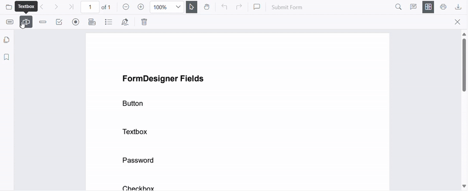
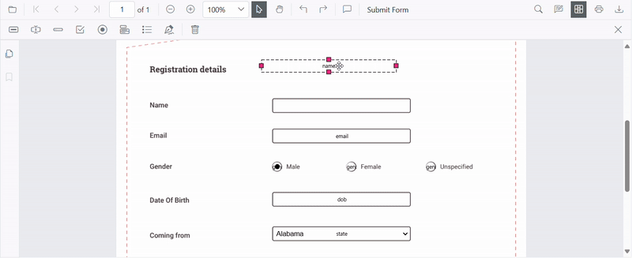
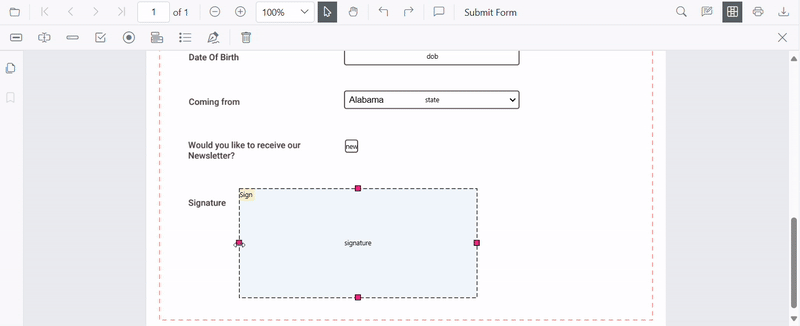
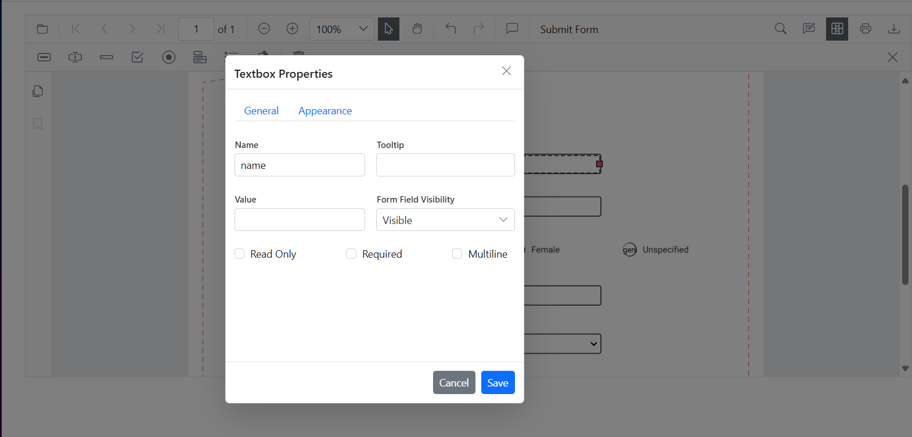
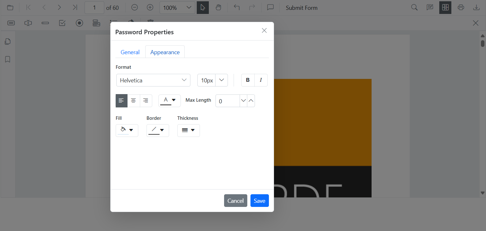
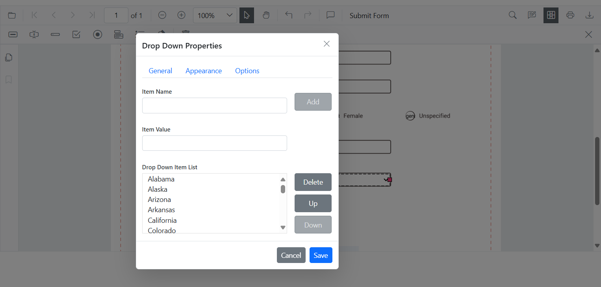
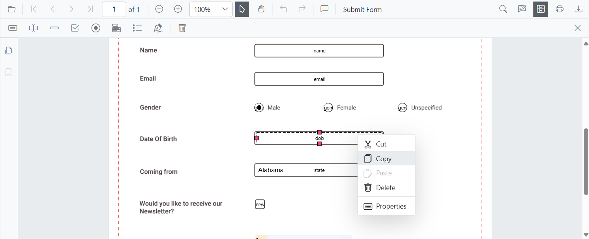
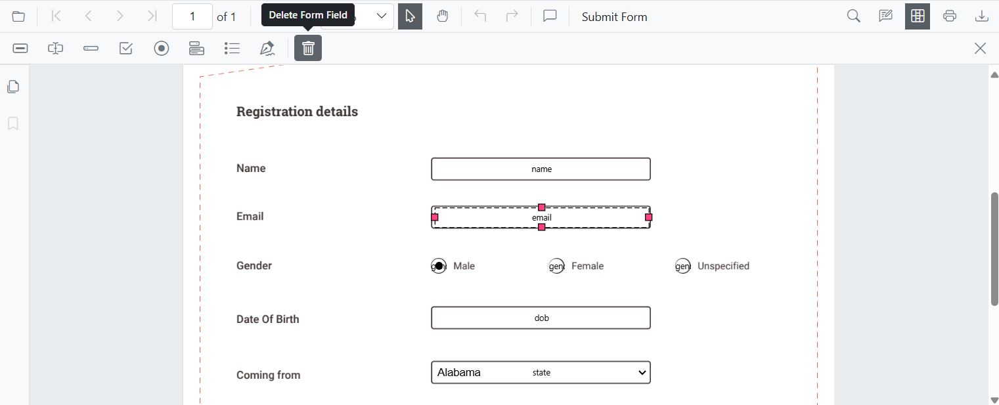

# Form Designer UI Interactions in Blazor PDF Viewer

The Form Designer in `SfPdfViewer` enables adding, editing, and manipulating form fields directly within a PDF document. It provides an intuitive interface for designing interactive forms efficiently.

## Form Field Interactions

### Adding Form Fields

Click the **Edit Form Fields** icon in the toolbar, select the desired field type, and place it on the PDF document.

N> Form fields can also be added programmatically in `SfPdfViewer` for advanced scenarios.
[See Add form fields programmatically](./create-programmatically).

### Dragging Form Fields

Drag form fields to reposition them anywhere within the document. Click and hold a form field to move it to the desired location; alignment guides help ensure precise placement before releasing the field.

### Resizing Form Fields

Resize form fields by dragging the resize handles at the edges or corners to fit the required dimensions within the document.

### Editing or Updating Form Fields

Edit form fields using the Form Field Properties panel. Open the panel by selecting the Properties option from the context menu that appears when right-clicking a form field.

The Form Field Properties panel consists of three tabs that provide customization options. Available options may vary by field type.

N> Editing form fields can also be performed programmatically in `SfPdfViewer` for precise customization.
[See Edit form fields programmatically](./create-programmatically).

#### General Tab

* Modify the field name to assign a unique identifier.
* Add a tooltip to provide additional information about the field.
* Set or update the value of the field.
* Configure the field’s visibility settings.
* Enable or disable read-only mode to prevent user modifications.
* Mark the field as required to ensure completion before form submission.
* Enable multiline input for text fields to allow multiple lines of text.

#### Appearance Tab

* Customize the font family of the text.
* Apply bold or italic styles.
* Adjust the font size for better readability.
* Set the border color and fill color for visual distinction.
* Modify the border thickness to adjust the field’s outline.
* Align text using the alignment settings.
* Define the maximum length of text input.

#### Options Tab (For Dropdown and Listbox Fields)

* Add, modify, or remove selectable options for dropdowns and list boxes.
* Customize option lists to display the required choices for users.

### Form Field Operations

Manage form fields using copy, cut, paste, undo, and redo operations. Duplicate fields with Copy (Ctrl+C), move them with Cut (Ctrl+X), and insert them elsewhere with Paste (Ctrl+V).

Revert the last change with Undo (Ctrl+Z) or restore an undone action with Redo (Ctrl+Y) to streamline workflow adjustments.

### Deleting a Form Field

Remove form fields by selecting the desired field and clicking the Delete icon in the Form Designer toolbar or by choosing Delete from the context menu.

N> Form fields can also be deleted programmatically in `SfPdfViewer`.
[See Delete form fields programmatically](./create-programmatically).

## See also

* [Programmatic Support in Form Designer](./create-programmatically)
* [Events in Form Designer](./events)