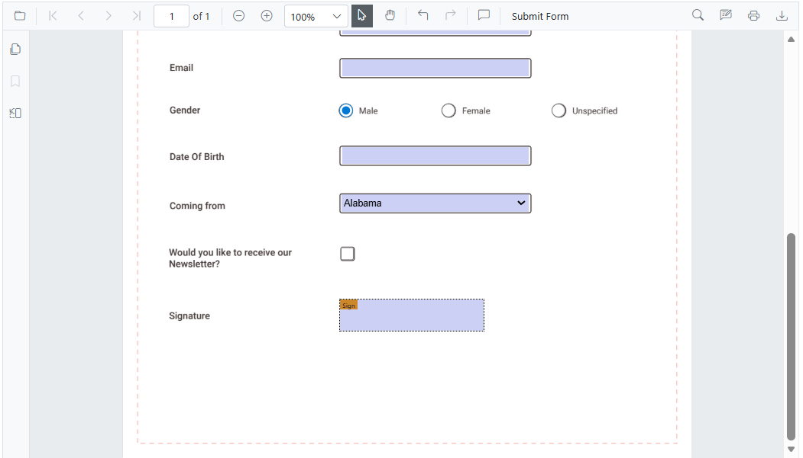
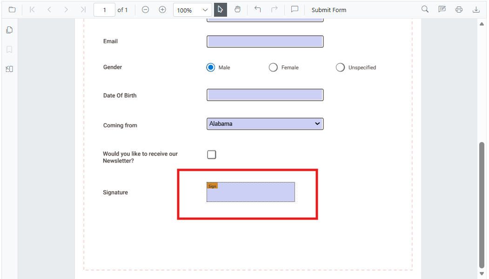
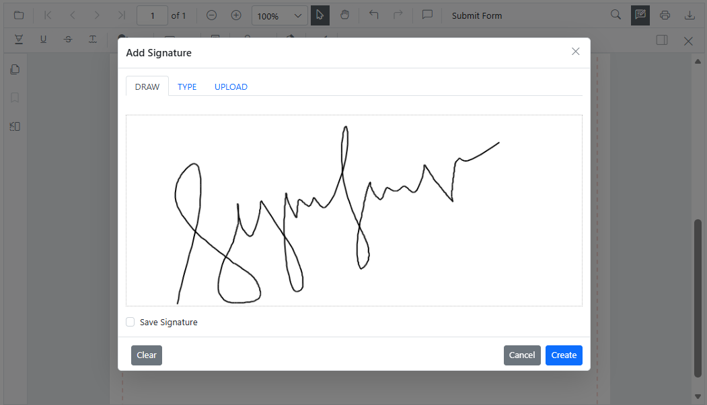
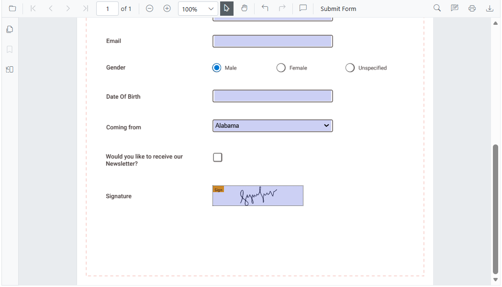
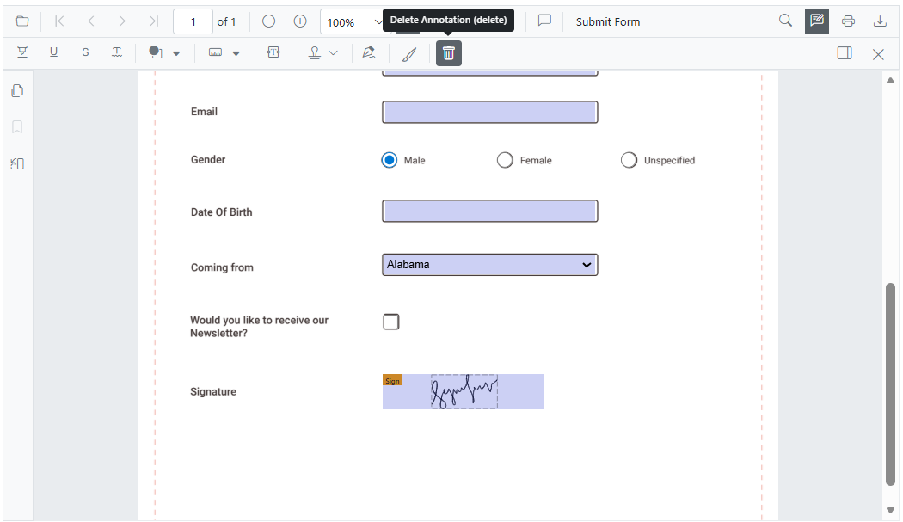

# Form filling in Blazor SfPdfViewer Component

The SfPdfViewer component displays existing form fields in a PDF document and enables filling and downloading filled data.

The form fields displayed in the SfPdfViewer are:

* Text box
* Password box
* Combo box
* Check box
* Radio button
* Signature field
* List box



## Disabling form fields

The SfPdfViewer control provides an option to disable interaction with form fields. Use the following configuration to disable form fields in the viewer.

```cshtml

@using Syncfusion.Blazor.SfPdfViewer

<SfPdfViewer2 Height="100%"
              Width="100%"
              DocumentPath="@DocumentPath"
              EnableFormFields=false />

@code{
    public string DocumentPath { get; set; } = "wwwroot/Data/FormFillingDocument.pdf";
}

```

## How to draw handwritten signature in the signature field

Add a handwritten signature to a Signature field by following these steps:

* Click the signature field in the PDF document to open the signature panel.



* Draw the signature in the signature panel.



* Click the **CREATE** button. The drawn signature is added to the signature field.



## Delete the signature inside the signature field

Delete a signature placed in a signature field by using the Delete option in the annotation toolbar.



## Export and import form fields

The SfPdfViewer control supports exporting and importing form field data in the following formats using the [ImportFormFieldsAsync](https://help.syncfusion.com/cr/blazor/Syncfusion.Blazor.SfPdfViewer.PdfViewerBase.html#Syncfusion_Blazor_SfPdfViewer_PdfViewerBase_ImportFormFieldsAsync_System_Collections_Generic_Dictionary_System_String_System_String__) and [ExportFormFieldsAsync](https://help.syncfusion.com/cr/blazor/Syncfusion.Blazor.SfPdfViewer.PdfViewerBase.html#Syncfusion_Blazor_SfPdfViewer_PdfViewerBase_ExportFormFieldsAsync_Syncfusion_Blazor_SfPdfViewer_FormFieldDataFormat_) methods:

* XML
* FDF
* XFDF
* JSON

N> Form field data is exported as a stream, and that stream can be imported back into the current PDF document.

### Export and import as XML

The following example exports the form fields as an XML data stream and imports that data from the stream into the current PDF document via button clicks.

```cshtml

@using Syncfusion.Blazor.SfPdfViewer
@using Syncfusion.Blazor.Buttons

<SfButton OnClick="@ExportAsStream">Export XML</SfButton>
<SfButton OnClick="@ImportFromStream">Import XML</SfButton>

<SfPdfViewer2 @ref=Viewer
              DocumentPath="@DocumentPath"
              Height="100%"
              Width="100%" />

@code 
{
    SfPdfViewer2 Viewer;
    public string DocumentPath { get; set; } = "wwwroot/Data/FormFillingDocument.pdf";
    Stream stream;

    // Event triggers on Export XML button click.
    public async void ExportAsStream()
    {
        // Export the form field data to an XML format stream.
        stream = await Viewer.ExportFormFieldsAsync(FormFieldDataFormat.Xml);
    }

    // Event triggers on Import XML button click.
    public async void ImportFromStream()
    {
        // Import the form field data from the XML format stream into the current PDF document.
        await Viewer.ImportFormFieldsAsync(stream, FormFieldDataFormat.Xml);
    }
}

```

### Export and import as FDF

The following example exports the form fields as an FDF data stream and imports that data from the stream into the current PDF document via button clicks.

```cshtml

@using Syncfusion.Blazor.SfPdfViewer
@using Syncfusion.Blazor.Buttons

<SfButton OnClick="@ExportAsStream">Export FDF</SfButton>
<SfButton OnClick="@ImportFromStream">Import FDF</SfButton>

<SfPdfViewer2 @ref=Viewer
              DocumentPath="@DocumentPath"
              Height="100%"
              Width="100%" />

@code
{
    SfPdfViewer2 Viewer;
    public string DocumentPath { get; set; } = "wwwroot/Data/FormFillingDocument.pdf";
    Stream stream;

    // Event triggers on Export FDF button click.
    public async void ExportAsStream()
    {
        // Export the form field data to an FDF format stream.
        stream = await Viewer.ExportFormFieldsAsync(FormFieldDataFormat.Fdf);
    }

    // Event triggers on Import FDF button click.
    public async void ImportFromStream()
    {
        // Import the form field data from the FDF format stream into the current PDF document.
        await Viewer.ImportFormFieldsAsync(stream, FormFieldDataFormat.Fdf);
    }
}

```

###  Export and import as XFDF

The following example exports the form fields as an XFDF data stream and imports that data from the stream into the current PDF document via button clicks.

```cshtml

@using Syncfusion.Blazor.Buttons
@using Syncfusion.Blazor.SfPdfViewer

<SfButton OnClick="@ExportAsStream">Export XFDF</SfButton>
<SfButton OnClick="@ImportFromStream">Import XFDF</SfButton>

<SfPdfViewer2 @ref=Viewer
              DocumentPath="@DocumentPath"
              Height="100%"
              Width="100%" />

@code
{
    SfPdfViewer2 Viewer;
    public string DocumentPath { get; set; } = "wwwroot/Data/FormFillingDocument.pdf";
    Stream stream;

    // Event triggers on Export XFDF button click.
    public async void ExportAsStream()
    {
        // Export the form field data to an XFDF format stream.
        stream = await Viewer.ExportFormFieldsAsync(FormFieldDataFormat.Xfdf);
    }

    // Event triggers on Import XFDF button click.
    public async void ImportFromStream()
    {
        // Import the form field data from the XFDF format stream into the current PDF document.
        await Viewer.ImportFormFieldsAsync(stream, FormFieldDataFormat.Xfdf);
    }
}

```

### Export and import as JSON

The following example exports the form fields as a JSON data stream and imports that data from the stream into the current PDF document via button clicks.

```cshtml

@using Syncfusion.Blazor.Buttons
@using Syncfusion.Blazor.SfPdfViewer

<SfButton OnClick="@ExportAsStream">Export JSON</SfButton>
<SfButton OnClick="@ImportFromStream">Import JSON</SfButton>

<SfPdfViewer2 @ref=Viewer
              DocumentPath="@DocumentPath"
              Height="100%"
              Width="100%" />

@code
{
    SfPdfViewer2 Viewer;
    public string DocumentPath { get; set; } = "wwwroot/Data/FormFillingDocument.pdf";
    Stream stream;

    // Event triggers on Export JSON button click.
    public async void ExportAsStream()
    {
        // Export the form field data to a JSON format stream.
        stream = await Viewer.ExportFormFieldsAsync(FormFieldDataFormat.Json);
    }

    // Event triggers on Import JSON button click.
    public async void ImportFromStream()
    {
        // Import the form field data from the JSON format stream into the current PDF document.
        await Viewer.ImportFormFieldsAsync(stream, FormFieldDataFormat.Json);
    }
}


```

### Export form fields as Json file

```cshtml

@using Syncfusion.Blazor.Buttons
@using Syncfusion.Blazor.SfPdfViewer

<SfButton OnClick="@OnExportFormFieldsClick">Export JSON</SfButton>

<SfPdfViewer2 Height="100%"
              Width="100%"
              DocumentPath="@DocumentPath"
              @ref="@Viewer" />

@code {
    SfPdfViewer2 Viewer;
    public string DocumentPath { get; set; } = "wwwroot/Data/FormFillingDocument.pdf";

    // Event triggers on Export JSON button click.
    public async void OnExportFormFieldsClick(MouseEventArgs args)
    {
        // Exports the form field data to a JSON file using the current document name.
        await Viewer.ExportFormFieldsAsync("");
    }
}

```

### Export and import as object

```cshtml

@using Syncfusion.Blazor.Buttons
@using Syncfusion.Blazor.SfPdfViewer;

<SfButton OnClick="@OnExportFormFieldsClick">Export Data</SfButton>
<SfButton OnClick="@OnImportFormFieldsClick">Import Data</SfButton>

<SfPdfViewer2 @ref="@Viewer"
              DocumentPath="@DocumentPath"
              Height="100%"
              Width="100%">
</SfPdfViewer2>

@code
{
    SfPdfViewer2 Viewer;
    public string DocumentPath { get; set; } = "wwwroot/Data/FormFillingDocument.pdf";
    Dictionary<string, string> dictionary;

    // Event triggers on Export Data button click.
    public async void OnExportFormFieldsClick(MouseEventArgs args)
    {
        // Export the form field data to a dictionary.
        dictionary = await Viewer.ExportFormFieldsAsObjectAsync();
    }

    // Event triggers on Import Data button click.
    public async void OnImportFormFieldsClick(MouseEventArgs args)
    {
        // Import the form field data from the dictionary into the current PDF document.
        await Viewer.ImportFormFieldsAsync(dictionary);
    }
}

```

## See also

* [Handwritten Signature in Blazor SfPdfViewer Component](./hand-written-signature)