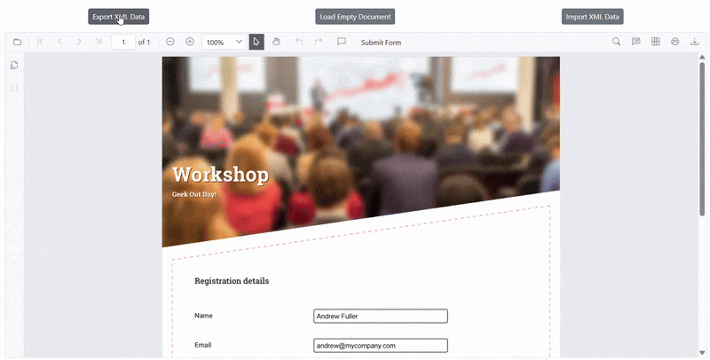
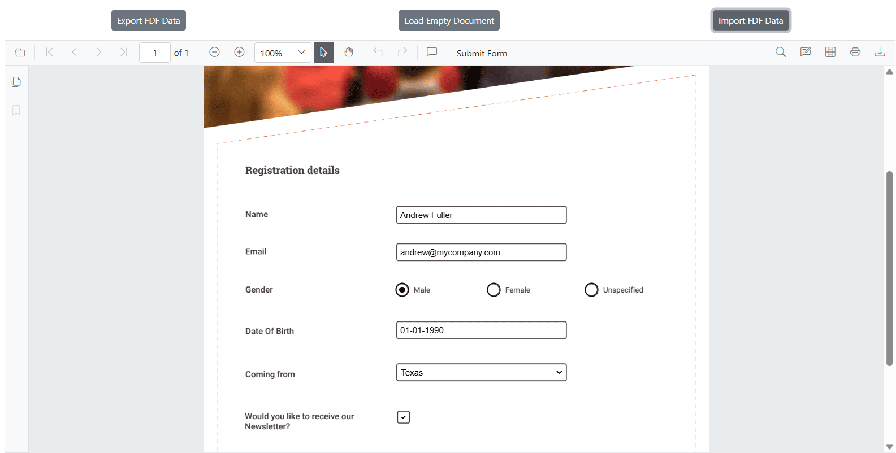
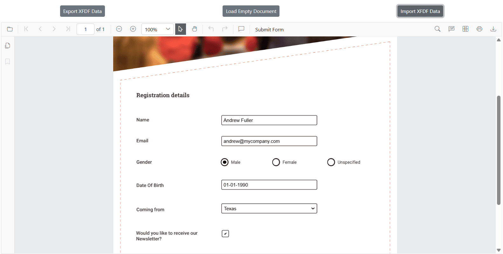
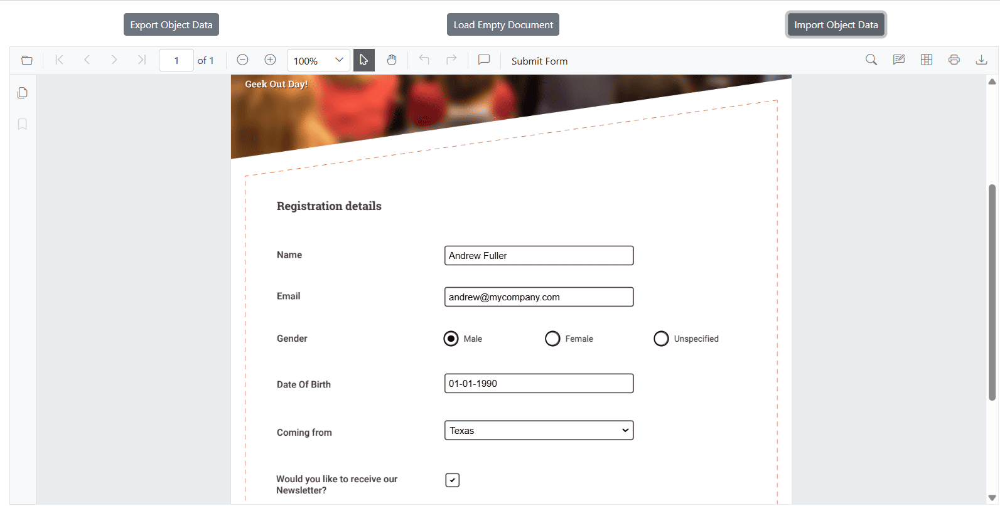
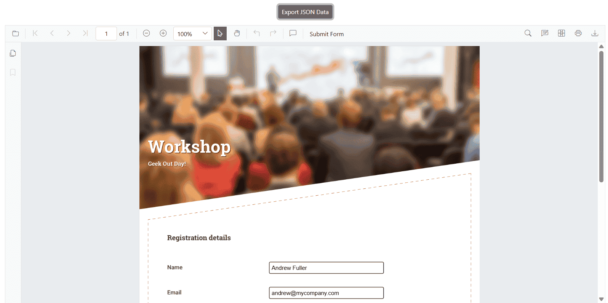
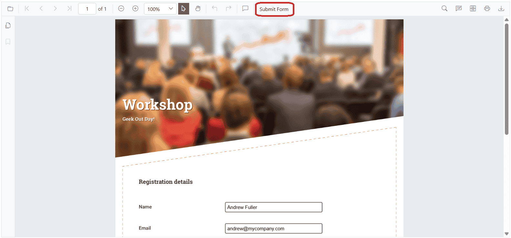

# Export and import form field data in Blazor SfPdfViewer

The `SfPdfViewer` control supports exporting and importing form field data in the following formats:

1. XML
2. FDF
3. XFDF
4. JSON
5. Object-based

The [ExportFormFieldsAsync](https://help.syncfusion.com/cr/blazor/Syncfusion.Blazor.SfPdfViewer.PdfViewerBase.html#Syncfusion_Blazor_SfPdfViewer_PdfViewerBase_ExportFormFieldsAsync_Syncfusion_Blazor_SfPdfViewer_FormFieldDataFormat_) and [ImportFormFieldsAsync](https://help.syncfusion.com/cr/blazor/Syncfusion.Blazor.SfPdfViewer.PdfViewerBase.html#Syncfusion_Blazor_SfPdfViewer_PdfViewerBase_ImportFormFieldsAsync_System_IO_Stream_Syncfusion_Blazor_SfPdfViewer_FormFieldDataFormat_) methods export or import form field data as a stream, which can be applied to another PDF document.

## Supported Export and Import Formats

### Export and import as XML

Exports form field data in XML format and allows importing the same data back into a PDF document.

N> Setting [FormFieldDataFormat](https://help.syncfusion.com/cr/blazor/Syncfusion.Blazor.SfPdfViewer.FormFieldDataFormat.html) to [Xml](https://help.syncfusion.com/cr/blazor/Syncfusion.Blazor.SfPdfViewer.FormFieldDataFormat.html#Syncfusion_Blazor_SfPdfViewer_FormFieldDataFormat_Xml) exports or imports form field data in XML format.

The following code shows how to export the form fields as an XML data stream and import that data from the stream into the current PDF document via a button click.



@using Syncfusion.Blazor.SfPdfViewer;
@using Syncfusion.Blazor.Buttons;

<SfButton OnClick="ExportFormFieldData">Export Data</SfButton>
<SfButton OnClick="ImportFormFieldData">Import Data</SfButton>

<SfPdfViewer2 @ref="PdfViewerInstance" DocumentPath="wwwroot/data/Form_Filling_Document_With_Data.pdf"
              Height="650px"
              Width="100%">
</SfPdfViewer2>

@code { 
    // Reference to the SfPdfViewer2 instance
    private SfPdfViewer2 PdfViewerInstance { get; set; }

    // Stream to store exported XML form field data
    Stream XMLStream = new MemoryStream();

    // List to store form field information
    List<FormFieldInfo> FormFields = new List<FormFieldInfo>();

    // Exports form field data from the PDF viewer to an XML stream
    private async Task ExportFormFieldData()
    {
        if (PdfViewerInstance != null)
        {
            // Retrieve form field information from the PDF viewer
            FormFields = await PdfViewerInstance.GetFormFieldsAsync();
            if (FormFields != null && FormFields.Count > 0)
            {
                // Export data to XML format
                XMLStream = await PdfViewerInstance.ExportFormFieldsAsync(FormFieldDataFormat.Xml);
            }
        }
    }

    // Imports form field data from the XML stream into the PDF viewer
    private async Task ImportFormFieldData()
    {
        if (PdfViewerInstance != null && XMLStream != null)
        {
            // Reset the stream position before importing
            XMLStream.Position = 0;
            // Import XML data into the viewer
            await PdfViewerInstance.ImportFormFieldsAsync(XMLStream, FormFieldDataFormat.Xml);
        }
    }
}



[View sample in GitHub](https://github.com/SyncfusionExamples/blazor-pdf-viewer-examples/blob/master/Form%20Designer/Components/Pages/XMLFormat.razor).

### Export and import as FDF

Exports form field data in Forms Data Format (FDF) and allows importing the same data back into a PDF document.

N> Setting [FormFieldDataFormat](https://help.syncfusion.com/cr/blazor/Syncfusion.Blazor.SfPdfViewer.FormFieldDataFormat.html) to [Fdf](https://help.syncfusion.com/cr/blazor/Syncfusion.Blazor.SfPdfViewer.FormFieldDataFormat.html#Syncfusion_Blazor_SfPdfViewer_FormFieldDataFormat_Fdf) exports or imports form field data in FDF format.

The following code demonstrates exporting form fields as FDF to a stream and importing the data back into the current PDF document through a button click.



@using Syncfusion.Blazor.SfPdfViewer;
@using Syncfusion.Blazor.Buttons;

<SfButton OnClick="ExportFormFieldData">Export Data</SfButton>
<SfButton OnClick="ImportFormFieldData">Import Data</SfButton>

<SfPdfViewer2 @ref="PdfViewerInstance" DocumentPath="wwwroot/data/Form_Filling_Document_With_Data.pdf"
              Height="650px"
              Width="100%">
</SfPdfViewer2>

@code { 
    // Reference to the SfPdfViewer2 instance
    private SfPdfViewer2 PdfViewerInstance { get; set; }

    // Stream to store exported form field data in FDF format
    Stream FDFStream = new MemoryStream();

    // List to store form field information
    List<FormFieldInfo> FormFields = new List<FormFieldInfo>();

    // Exports form field data from the PDF viewer in FDF format
    private async Task ExportFormFieldData()
    {
        if (PdfViewerInstance != null)
        {
            // Retrieve form field information from the PDF viewer
            FormFields = await PdfViewerInstance.GetFormFieldsAsync();
            if (FormFields != null && FormFields.Count > 0)
            {
                // Export form fields as FDF data
                FDFStream = await PdfViewerInstance.ExportFormFieldsAsync(FormFieldDataFormat.Fdf);
            }
        }
    }

    // Imports form field data from FDF format into the PDF viewer
    private async Task ImportFormFieldData()
    {
        if (PdfViewerInstance != null && FDFStream != null)
        {
            // Reset the stream position before importing
            FDFStream.Position = 0;
            // Import FDF data into the viewer
            await PdfViewerInstance.ImportFormFieldsAsync(FDFStream, FormFieldDataFormat.Fdf);
        }
    }
}



[View sample in GitHub](https://github.com/SyncfusionExamples/blazor-pdf-viewer-examples/blob/master/Form%20Designer/Components/Pages/FDFFormat.razor).

### Export and import as XFDF

Similar to FDF, but in XML-based format, XFDF ensures structured data handling for form fields.

N> Setting [FormFieldDataFormat](https://help.syncfusion.com/cr/blazor/Syncfusion.Blazor.SfPdfViewer.FormFieldDataFormat.html) to [Xfdf](https://help.syncfusion.com/cr/blazor/Syncfusion.Blazor.SfPdfViewer.FormFieldDataFormat.html#Syncfusion_Blazor_SfPdfViewer_FormFieldDataFormat_Xfdf) exports or imports form field data in XFDF format.

The following code shows how to export the form fields as an XFDF data stream and import that data from the stream into the current PDF document via a button click.



@using Syncfusion.Blazor.SfPdfViewer;
@using Syncfusion.Blazor.Buttons;

<SfButton OnClick="ExportFormFieldData">Export Data</SfButton>
<SfButton OnClick="ImportFormFieldData">Import Data</SfButton>

<SfPdfViewer2 @ref="PdfViewerInstance" DocumentPath="wwwroot/data/Form_Filling_Document_With_Data.pdf"
              Height="650px"
              Width="100%">
</SfPdfViewer2>

@code { 
    // Reference to the SfPdfViewer2 instance
    private SfPdfViewer2 PdfViewerInstance { get; set; }

    // Stream to store exported XFDF form field data
    Stream XFDFStream = new MemoryStream();

    // List to store form field information
    List<FormFieldInfo> FormFields = new List<FormFieldInfo>();

    // Exports form field data from the PDF viewer to an XFDF stream
    private async Task ExportFormFieldData()
    {
        if (PdfViewerInstance != null)
        {
            // Retrieve form field information from the PDF viewer
            FormFields = await PdfViewerInstance.GetFormFieldsAsync();
            if (FormFields != null && FormFields.Count > 0)
            {
                // Export data to XFDF format
                XFDFStream = await PdfViewerInstance.ExportFormFieldsAsync(FormFieldDataFormat.Xfdf);
            }
        }
    }
    // Imports form field data from the XFDF stream into the PDF viewer
    private async Task ImportFormFieldData()
    {
        if (PdfViewerInstance != null && XFDFStream != null)
        {
            // Reset the stream position before importing
            XFDFStream.Position = 0;
            // Import XFDF data into the viewer
            await PdfViewerInstance.ImportFormFieldsAsync(XFDFStream, FormFieldDataFormat.Xfdf);
        }
    }
}



[View sample in GitHub](https://github.com/SyncfusionExamples/blazor-pdf-viewer-examples/blob/master/Form%20Designer/Components/Pages/XFDFFormat.razor).

### Export and import as JSON

Exports form field data in JSON format, which can be easily read and imported back into the PDF Viewer.

N> Setting [FormFieldDataFormat](https://help.syncfusion.com/cr/blazor/Syncfusion.Blazor.SfPdfViewer.FormFieldDataFormat.html) to [Json](https://help.syncfusion.com/cr/blazor/Syncfusion.Blazor.SfPdfViewer.FormFieldDataFormat.html#Syncfusion_Blazor_SfPdfViewer_FormFieldDataFormat_Json) exports or imports form field data in JSON format.

The following code demonstrates exporting form fields as JSON to a stream and importing the data back into the current PDF document through a button click.



@using Syncfusion.Blazor.SfPdfViewer;
@using Syncfusion.Blazor.Buttons;

<SfButton OnClick="ExportFormFieldData">Export Data</SfButton>
<SfButton OnClick="ImportFormFieldData">Import Data</SfButton>

<SfPdfViewer2 @ref="PdfViewerInstance" DocumentPath="wwwroot/data/Form_Filling_Document_With_Data.pdf"
              Height="650px"
              Width="100%">
</SfPdfViewer2>

@code { 
    // Reference to the SfPdfViewer2 instance
    private SfPdfViewer2 PdfViewerInstance { get; set; }

    // Stream to store exported form field data in JSON format
    Stream JSONStream = new MemoryStream();

    // List to store form field information
    List<FormFieldInfo> FormFields = new List<FormFieldInfo>();

    // Exports form field data from the PDF viewer in JSON format
    private async Task ExportFormFieldData()
    {
        if (PdfViewerInstance != null)
        {
            // Retrieve form field information from the PDF viewer
            FormFields = await PdfViewerInstance.GetFormFieldsAsync();
            if (FormFields != null && FormFields.Count > 0)
            {
                // Export form fields as JSON data
                JSONStream = await PdfViewerInstance.ExportFormFieldsAsync(FormFieldDataFormat.Json);
            }
        }
    }

    // Imports form field data from JSON format into the PDF viewer
    private async Task ImportFormFieldData()
    {
        if (PdfViewerInstance != null && JSONStream != null)
        {
            // Reset the stream position before importing
            JSONStream.Position = 0;
            // Import JSON data into the viewer
            await PdfViewerInstance.ImportFormFieldsAsync(JSONStream, FormFieldDataFormat.Json);
        }
    }
}



[View sample in GitHub](https://github.com/SyncfusionExamples/blazor-pdf-viewer-examples/blob/master/Form%20Designer/Components/Pages/JSONFormat.razor).

### Export and import as an object

Form fields can be exported and imported as an object, which is useful for in-memory processing and quick data manipulation.

The [ExportFormFieldsAsObjectAsync](https://help.syncfusion.com/cr/blazor/Syncfusion.Blazor.SfPdfViewer.PdfViewerBase.html#Syncfusion_Blazor_SfPdfViewer_PdfViewerBase_ExportFormFieldsAsObjectAsync) and [ImportFormFieldsAsync](https://help.syncfusion.com/cr/blazor/Syncfusion.Blazor.SfPdfViewer.PdfViewerBase.html#Syncfusion_Blazor_SfPdfViewer_PdfViewerBase_ImportFormFieldsAsync_System_Collections_Generic_Dictionary_System_String_System_String__) methods allow you to export the form field data as an Object, which can later be used to import the saved data into another PDF document.

The following code shows how to export form fields as an object and import that data into the current PDF document via a button click.



@using Syncfusion.Blazor.SfPdfViewer;
@using Syncfusion.Blazor.Buttons;

<SfButton OnClick="ExportFormFieldData">Export Data</SfButton>
<SfButton OnClick="ImportFormFieldData">Import Data</SfButton>

<SfPdfViewer2 @ref="PdfViewerInstance" DocumentPath="wwwroot/data/Form_Filling_Document_With_Data.pdf"
              Height="650px"
              Width="100%">
</SfPdfViewer2>

@code { 
    // Reference to the SfPdfViewer2 instance
    private SfPdfViewer2 PdfViewerInstance { get; set; }

    // Dictionary to store exported form field data as key-value pairs
    Dictionary<string, string> FormFieldsObject = new Dictionary<string, string>();

    // List to store form field information
    List<FormFieldInfo> FormFields = new List<FormFieldInfo>();

    // Exports form field data from the PDF viewer as an object (key-value pairs)
    private async Task ExportFormFieldData()
    {
        if (PdfViewerInstance != null)
        {
            // Retrieve form field information
            FormFields = await PdfViewerInstance.GetFormFieldsAsync();
            if (FormFields != null && FormFields.Count > 0)
            {
                // Export form fields as an object
                FormFieldsObject = await PdfViewerInstance.ExportFormFieldsAsObjectAsync();
            }
        }
    }

    // Imports form field data from an object into the PDF viewer
    private async Task ImportFormFieldData()
    {
        if (PdfViewerInstance != null && FormFieldsObject != null && FormFieldsObject.Count > 0)
        {
            // Import object data into the viewer
            await PdfViewerInstance.ImportFormFieldsAsync(FormFieldsObject);
        }
    }
}



[View sample in GitHub](https://github.com/SyncfusionExamples/blazor-pdf-viewer-examples/blob/master/Form%20Designer/Components/Pages/ObjectFormat.razor).

### Export as JSON file

This method allows exporting the form field data and saving it as a JSON file, which can be stored or shared for future use.

N> If [ExportFormFieldsAsync](https://help.syncfusion.com/cr/blazor/Syncfusion.Blazor.SfPdfViewer.PdfViewerBase.html#Syncfusion_Blazor_SfPdfViewer_PdfViewerBase_ExportFormFieldsAsync_System_String_) is called with a string path (file name or path), the form field data is exported in JSON file format.



@using Syncfusion.Blazor.SfPdfViewer;
@using Syncfusion.Blazor.Buttons;

<SfButton OnClick="ExportFormFieldData">Export Data</SfButton>

<SfPdfViewer2 @ref="PdfViewerInstance" DocumentPath="wwwroot/data/Form_Filling_Document_With_Data.pdf"
              Height="650px"
              Width="100%">
</SfPdfViewer2>

@code {
    // Reference to the SfPdfViewer2 instance
    private SfPdfViewer2 PdfViewerInstance { get; set; }

    // Exports form field data from the PDF viewer into a JSON file
    private async Task ExportFormFieldData()
    {
        if (PdfViewerInstance != null)
        {
            // Exports form fields and saves them as a JSON file
            await PdfViewerInstance.ExportFormFieldsAsync("FormData.json");
        }
    }
}



[View sample in GitHub](https://github.com/SyncfusionExamples/blazor-pdf-viewer-examples/blob/master/Form%20Designer/Components/Pages/ExportJSONFile.razor).

Additionally, the component provides a built-in Submit button that exports form field data as a JSON file directly from the PDF document.

## See also

* [UI interactions in form Designer](./ui-interactions)
* [Programmatic Support in Form Designer](./create-programmatically)
* [Custom Fonts in Form Designer](./custom-font)
* [Events in Form Designer](./events)