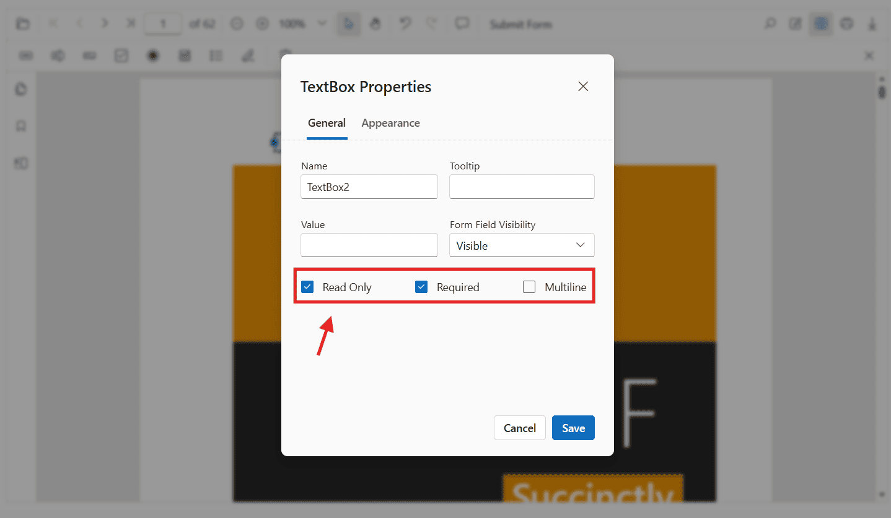

# PDF form field flags in Blazor SfPdfViewer

The Blazor `SfPdfViewer` allows you to control how users interact with form fields and how those fields behave during validation by applying form field flags. These flags define whether a form field can be modified and whether it is mandatory.

This topic covers:
- [Supported form field flags](#supported-pdf-form-field-flags)
- [How each constraint affects field behavior](#flag-behaviors)
- [How to apply flags using the UI](#apply-pdf-form-field-flags-using-the-ui)
- [How to apply or update flags programmatically](#apply-pdf-form-field-flags-programmatically)

## Supported PDF form field flags

The following flags are supported in the PDF Viewer:

- [IsReadOnly](#make-fields-read-only): Prevents users from modifying the form field in the UI while still allowing updates through APIs.

- [IsRequired](#mark-fields-as-required): Marks the form field as mandatory and includes it in form field validation.

## Flag behaviors

### Make fields read-only
Use the `IsReadOnly` property to prevent users from modifying a form field through the UI. This is useful for displaying pre-filled or calculated values that should not be changed by the user. To update the value programmatically, use [UpdateFormFieldsAsync()](https://help.syncfusion.com/cr/blazor/Syncfusion.Blazor.SfPdfViewer.PdfViewerBase.html#Syncfusion_Blazor_SfPdfViewer_PdfViewerBase_UpdateFormFieldsAsync_Syncfusion_Blazor_SfPdfViewer_FormField_).




@using Syncfusion.Blazor.SfPdfViewer

<!-- PDF Viewer component with reference binding and document loading -->
<SfPdfViewer2 @ref="@viewer" Height="100%" Width="100%" DocumentPath="@DocumentPath">
    <PdfViewerEvents DocumentLoaded="@OnDocumentLoaded"></PdfViewerEvents>
</SfPdfViewer2>

@code {
    // Reference to the PDF Viewer instance
    private SfPdfViewer2? viewer;

    // Path to the PDF document to be loaded in the viewer
    private string DocumentPath = "wwwroot/data/form-designer.pdf";

    // Method triggered when the document is loaded
    private async Task OnDocumentLoaded()
    {
        if (viewer == null) return;

        List<FormFieldInfo> formFields = new List<FormFieldInfo>
        {
            // Read-only Textbox
            new TextBoxField
            {
                Name = "EmployeeId",
                Bounds = new Bound { X = 146, Y = 229, Width = 150, Height = 24 },
                IsReadOnly = true,
                Value = "EMP-0001"
            },
            // Read-only Signature field
            new SignatureField
            {
                Name = "ApplicantSign",
                Bounds = new Bound { X = 57, Y = 923, Width = 200, Height = 43 },
                IsReadOnly = true,
                TooltipText = "Sign to accept the terms"
            }
        };

        await viewer.AddFormFieldsAsync(formFields);
    }
}



N> A read-only signature field will not accept a signature from the user.

### Mark fields as required
Use the `IsRequired` property to mark form fields as mandatory. To enforce this constraint, enable form field validation and validate fields before allowing actions such as printing or downloading.

- Enable validation using [EnableFormFieldsValidation](https://help.syncfusion.com/cr/blazor/Syncfusion.Blazor.SfPdfViewer.PdfViewerBase.html#Syncfusion_Blazor_SfPdfViewer_PdfViewerBase_EnableFormFieldsValidation).
- Validate fields with [ValidateFormFieldsAsync()](https://help.syncfusion.com/cr/blazor/Syncfusion.Blazor.SfPdfViewer.PdfViewerBase.html#Syncfusion_Blazor_SfPdfViewer_PdfViewerBase_ValidateFormFieldsAsync).

If required fields are empty, validation prevents the action that triggered it (for example, download or print).




@using Syncfusion.Blazor.SfPdfViewer

<!-- PDF Viewer component with reference binding and document loading -->
<SfPdfViewer2 @ref="@viewer" Height="100%" Width="100%" DocumentPath="@DocumentPath" EnableFormFieldsValidation="true">
    <PdfViewerEvents DocumentLoaded="@OnDocumentLoaded" ValidateFormFields="@OnValidateFormFields"></PdfViewerEvents>
</SfPdfViewer2>

@code {
    // Reference to the PDF Viewer instance
    private SfPdfViewer2? viewer;

    // Path to the PDF document to be loaded in the viewer
    private string DocumentPath = "wwwroot/data/form-designer.pdf";

    // Method triggered when the document is loaded
    private async Task OnDocumentLoaded()
    {
        if (viewer == null) return;

        List<FormFieldInfo> formFields = new List<FormFieldInfo>
        {
            new TextBoxField
            {
                Name = "Email",
                Bounds = new Bound { X = 146, Y = 260, Width = 220, Height = 24 },
                IsRequired = true,
                TooltipText = "Email is required"
            }
        };

        await viewer.AddFormFieldsAsync(formFields);
    }

    // Validation event handler
    private void OnValidateFormFields(ValidateFormFieldsArgs args)
    {
        Dictionary<string, object> unfilledFields = args.UnfilledFields;
        foreach (FormFieldInfo field in unfilledFields)
        {
            Console.WriteLine($"Field Name: {field.Key}, Default Value: {field.Value}");
            // Further processing of unfilled fields
        }
    }
}



## Steps for Apply PDF form field flags using the UI

1. Enable `Form Designer` mode in the `SfPdfViewer`.
2. Select an existing form field on the PDF page.
3. Right-click the field, open the context menu, and select Properties.
4. Configure the required constraint options.
5. Click OK to apply changes and close the properties popover.

Changes are reflected immediately in the viewer.

## Apply PDF form field flags programmatically

You can apply or modify form field flags in the following ways.

### Apply flags when creating fields
Pass the flag properties when creating form fields using [AddFormFieldsAsync()](https://help.syncfusion.com/cr/blazor/Syncfusion.Blazor.SfPdfViewer.PdfViewerBase.html#Syncfusion_Blazor_SfPdfViewer_PdfViewerBase_AddFormFieldsAsync_System_Collections_Generic_List_Syncfusion_Blazor_SfPdfViewer_FormFieldInfo__).




@using Syncfusion.Blazor.SfPdfViewer

<!-- PDF Viewer component with reference binding and document loading -->
<SfPdfViewer2 @ref="@viewer" Height="100%" Width="100%" DocumentPath="@DocumentPath">
    <PdfViewerEvents DocumentLoaded="@OnDocumentLoaded"></PdfViewerEvents>
</SfPdfViewer2>

@code {
    // Reference to the PDF Viewer instance
    private SfPdfViewer2? viewer;

    // Path to the PDF document to be loaded in the viewer
    private string DocumentPath = "wwwroot/data/form-designer.pdf";

    // Method triggered when the document is loaded
    private async Task OnDocumentLoaded()
    {
        if (viewer == null) return;

        List<FormFieldInfo> formFields = new List<FormFieldInfo>
        {
            // Read-only Textbox that is not required
            new TextBoxField
            {
                Name = "EmployeeId",
                Bounds = new Bound { X = 146, Y = 229, Width = 150, Height = 24 },
                IsReadOnly = true,
                IsRequired = false,
                Value = "EMP-0001"
            },
            // Required Signature field
            new SignatureField
            {
                Name = "ApplicantSign",
                Bounds = new Bound { X = 57, Y = 923, Width = 200, Height = 43 },
                IsReadOnly = false,
                IsRequired = true,
                TooltipText = "Sign to accept the terms"
            }
        };

        await viewer.AddFormFieldsAsync(formFields);
    }
}



### Update flags on existing fields programmatically
Use the [UpdateFormFieldsAsync()](https://help.syncfusion.com/cr/blazor/Syncfusion.Blazor.SfPdfViewer.PdfViewerBase.html#Syncfusion_Blazor_SfPdfViewer_PdfViewerBase_UpdateFormFieldsAsync_Syncfusion_Blazor_SfPdfViewer_FormField_) method to modify constraint values on existing form fields. Pass the updated field in a `List<FormFieldInfo>` to the method.




@using Syncfusion.Blazor.SfPdfViewer

<!-- PDF Viewer component with reference binding and document loading -->
<SfPdfViewer2 @ref="@viewer" Height="100%" Width="100%" DocumentPath="@DocumentPath">
    <PdfViewerEvents DocumentLoaded="@OnDocumentLoaded"></PdfViewerEvents>
</SfPdfViewer2>

@code {
    // Reference to the PDF Viewer instance
    private SfPdfViewer2? viewer;

    // Path to the PDF document to be loaded in the viewer
    private string DocumentPath = "wwwroot/data/form-designer.pdf";

    // Method triggered when the document is loaded
    private async Task OnDocumentLoaded()
    {
        if (viewer == null) return;

        // 1) Add a sample textbox
        List<FormFieldInfo> formFields = new List<FormFieldInfo>
        {
            new TextBoxField
            {
                Name = "Email",
                Bounds = new Bound { X = 146, Y = 260, Width = 220, Height = 24 }
            }
        };

        await viewer.AddFormFieldsAsync(formFields);

        // 2) Retrieve and update constraint flags
        List<FormFieldInfo> allFields = await viewer.GetFormFieldsAsync();
        FormFieldInfo? field = allFields.FirstOrDefault(f => f.Name == "Email");

        if (field is TextBoxField emailField)
        {
            emailField.IsReadOnly = false;
            emailField.IsRequired = true;
            emailField.TooltipText = "Enter a valid email";
            
            await viewer.UpdateFormFieldsAsync(new List<FormFieldInfo> { emailField });
        }
    }
}



N> For a hands-on reference with working code examples, explore the sample projects available on [GitHub](https://github.com/SyncfusionExamples/blazor-pdf-viewer-examples/tree/master/Form%20Designer/Components/Pages).

## See also

- [Form Designer overview](./overview)
- [Create form fields](./overview-create-forms)
- [Group form fields](./group-form-fields)
- [Add custom data to PDF form fields](./custom-data)  
