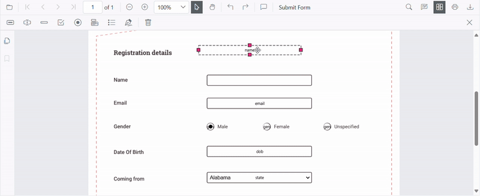
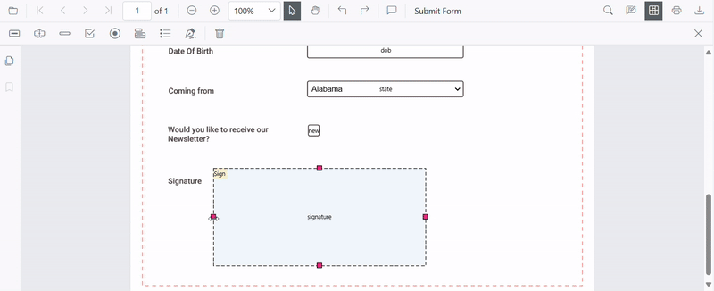
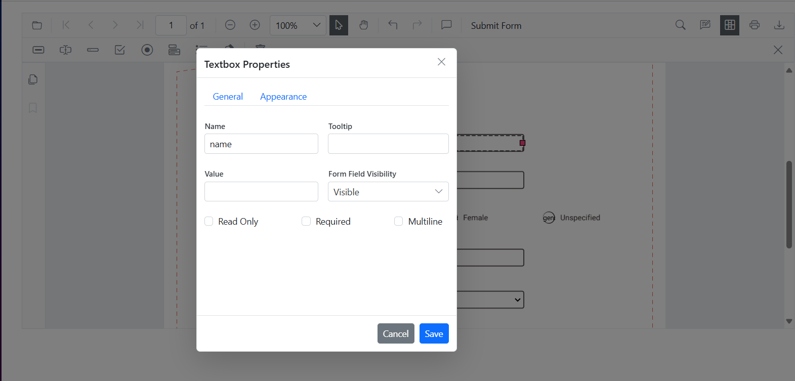

# Form Designer in Blazor SfPdfViewer

When **Form Designer mode** is enabled in the Blazor [SfPdfViewer](https://help.syncfusion.com/document-processing/pdf/pdf-viewer/blazor/overview), a default Form Designer user interface is displayed. This UI includes a built-in toolbar for adding form fields such as text boxes, password fields, check boxes, radio buttons, drop-down lists, list boxes, and signature and initial fields.

Using the Form Designer UI, users can place form fields on the PDF, move and resize them, configure field and widget properties, preview the designed form, and remove fields when required. The Form Designer toolbar can be shown or hidden and customized to control the available tools based on application requirements, enabling flexible and interactive form design directly within the viewer.

## Key Features

**Add Form Fields:**
The following form fields can be added to the PDF:

- [Text box](./manage-form-fields/create-form-fields#add-textbox)
- [Password Field](./manage-form-fields/create-form-fields#add-password)
- [Check box](./manage-form-fields/create-form-fields#add-checkbox)
- [Radio button](./manage-form-fields/create-form-fields#add-radiobutton)
- [Dropdown List](./manage-form-fields/create-form-fields#add-dropdown)
- [List box](./manage-form-fields/create-form-fields#add-listbox)
- [Signature field](./manage-form-fields/create-form-fields#add-signature-field)
- [Initial field](./manage-form-fields/create-form-fields#add-initial-field)

**Edit Form Fields:**
Form fields can be moved, resized, aligned, distributed, copied, pasted, and have changes undone or redone.

**Set Field Properties:**
Field properties such as name, value, font, color, border, alignment, visibility, tab order, and required or read-only state can be configured.

**Control Field Behavior:**
Field behavior can be controlled, including enabling or disabling read-only mode, showing or hiding fields, and determining whether fields appear when printing the document.

**Manage Form Fields:**
Form fields can be selected, grouped or ungrouped, reordered, and deleted as needed.

**Save and Print Forms:**
Designed form fields can be saved into the PDF document and printed with their appearances.

## Design forms with UI interaction

When [Form Designer mode](https://help.syncfusion.com/cr/blazor/Syncfusion.Blazor.SfPdfViewer.SfPdfViewer2.html#Syncfusion_Blazor_SfPdfViewer_SfPdfViewer2_EnableFormDesigner) is enabled, a default Form Designer user interface (UI) is displayed. This UI provides a built-in toolbar for adding common form fields such as text boxes, check boxes, radio buttons, drop-down lists, and signature fields. Users can place fields on the PDF, select them, move or resize them, and configure their properties using the available editing options. This enables interactive form creation directly within the viewer.

For more information about creating and editing form fields in the PDF Viewer, refer to the [Form Creation](./manage-form-fields/create-form-fields) in Blazor SfPdfViewer documentation.

### Enable Form Designer

Form design features are enabled by setting the [EnableFormDesigner](https://help.syncfusion.com/cr/blazor/Syncfusion.Blazor.SfPdfViewer.SfPdfViewer2.html#Syncfusion_Blazor_SfPdfViewer_SfPdfViewer2_EnableFormDesigner) property to `true`. This property controls whether the Form Designer option appears in the main toolbar.




@using Syncfusion.Blazor.SfPdfViewer

<SfPdfViewer2 
    DocumentPath="https://cdn.syncfusion.com/content/pdf/pdf-succinctly.pdf"
    EnableFormDesigner="true"
    Height="680px" 
    Width="100%">
</SfPdfViewer2>



### Form Designer Toolbar

The **Form Designer toolbar** appears at the top of the PDF Viewer and provides quick access to form field creation tools. It includes the frequently used field types listed in [Key Features](#key-features).

#### Show or hide the built-in Form Designer toolbar

The visibility of the Form Designer toolbar is controlled programmatically based on your application requirements. Refer to the toolbar customization documentation for detailed examples on showing or hiding the Form Designer toolbar at runtime.

- The Form Designer toolbar is shown when form design is required.
- The toolbar can be hidden to provide a cleaner viewing experience.

#### Customize the Built-in Form Designer Toolbar

The Form Designer toolbar can be customized by configuring toolbar items in the Blazor SfPdfViewer component. This customization helps limit the available tools and simplify the user interface.

For more information on toolbar customization, refer to the [toolbar customization](../toolbar-customization/form-designer-toolbar) documentation.

**Key Points**
- Only the toolbar items listed are included, in the exact order specified.
- Any toolbar items not listed remain hidden, resulting in a cleaner and more focused UI.

### Adding Form Fields

Each toolbar item in the Form Designer toolbar allows users to place the corresponding form field by selecting the tool and clicking on the desired location in the PDF document.

For more information about creating form fields in the PDF Viewer, refer to the [Form Creation in Blazor SfPdfViewer documentation](./manage-form-fields/create-form-fields#create-form-fields-using-the-form-designer-ui).

### Move, resize, and edit form fields

Fields can be moved, resized, and edited directly in the PDF Viewer using the Form Designer.

- Select a field and drag it to move it to the required position.

- Use the handles displayed on the field boundary to resize the field.

- Selecting a field opens the Form Field Properties panel, which allows modification of the form field and widget annotation properties. Changes are reflected immediately in the viewer and are saved when the properties panel is closed.

For more information, see [Editing Form Fields](./manage-form-fields/modify-form-fields).

### Edit form field properties

The **Properties** panel lets you customize the styles of form fields. Open the panel by selecting the **Properties** option in a field's context menu.

### Deleting Form Fields

A form field is removed by selecting it and either clicking the **Delete** option in the Form Designer toolbar or pressing the **Delete** key on the keyboard. The selected form field and its associated widget annotation are permanently removed from the page.

For more information, see [Deleting Form Fields](./manage-form-fields/remove-form-fields)

## See also

- [Filling PDF Forms](./form-filling)
- [Create](./manage-form-fields/create-form-fields), [edit](./manage-form-fields/modify-form-fields), [style](./manage-form-fields/style-form-fields) and [remove](./manage-form-fields/remove-form-fields) form fields
- [Grouping form fields](./group-form-fields)
- [Form Constrains](./form-constrain)
- [Custom Data](./custom-data)
- [Import](./import-export-form-fields/import-form-fields)/[Export Form Data](./import-export-form-fields/export-form-fields)
- [Form field events](./form-field-events)