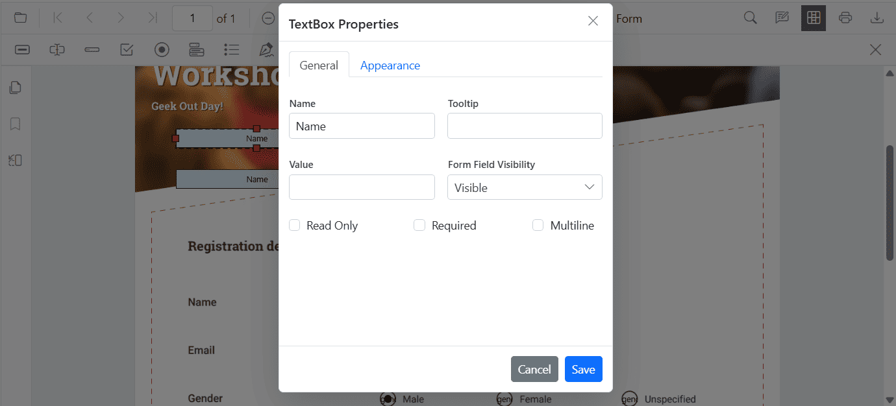
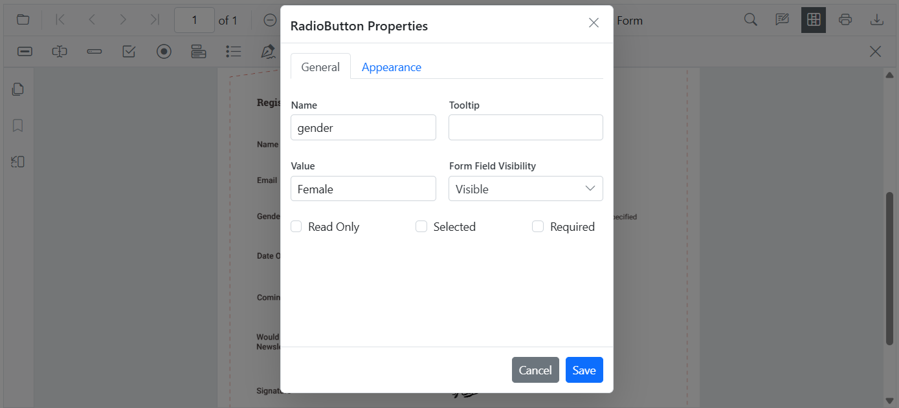

# Group form fields in Blazor SfPdfViewer

The Blazor `SfPdfViewer` allows grouping multiple form fields into a single logical field by assigning the same `Name` to them. Grouped form fields share their values and states automatically based on the field type. Use the Form Designer UI for manual grouping or the Form Designer APIs for programmatic grouping to keep related fields synchronized across the document.

- [Field behavior by type](#field-behavior-by-type)
- [Group form fields using the UI](#group-using-the-form-designer-ui)
- [Group form fields programmatically](#group-pdf-form-fields-programmatically)

## Field behavior by type

- **Textbox and Password**: Text entered in one widget appears in all widgets with the same name.  
- **CheckBox**: Checking one widget sets the checked state for all checkboxes with the same name.  
- **RadioButton**: Widgets with the same name form a radio group; only one option can be selected.  
- **ListBox and DropDown**: The selected value is shared across widgets with the same name.  
- **Signature field**: Applied signature/initial is mirrored across grouped widgets.

N> Form field grouping is controlled by the `Name` property. The position of each widget is determined by its `Bounds`; grouping is independent of location.

## Group using the Form Designer UI

**Steps**
1. Enable the [Form Designer toolbar](../toolbar/form-designer-toolbar).
2. Add the form fields you want to group.
3. Right-click a form field and open **Properties**, then set the **Name** value.
4. Repeat for each field in the group, assigning the same **Name** to all PDF form fields that belong to the group.
5. Apply the changes and verify that updates in one widget reflect in the others.
6. To ungroup, rename one of the widgets to a unique **Name**.

## Group PDF Form Fields Programmatically

You can group form fields by assigning the same **Name** through code using [`AddFormFieldsAsync()`](https://help.syncfusion.com/cr/blazor/Syncfusion.Blazor.SfPdfViewer.PdfViewerBase.html#Syncfusion_Blazor_SfPdfViewer_PdfViewerBase_AddFormFieldsAsync_System_Collections_Generic_List_Syncfusion_Blazor_SfPdfViewer_FormFieldInfo__).

### Example Scenarios
- Two textboxes named **EmployeeId** share the same value.
- A radio button group named **Gender** allows single selection.
- Two checkboxes named **Subscribe** share the checked state.




@using Syncfusion.Blazor.SfPdfViewer

<SfPdfViewer2 @ref="@viewer" Height="100%" Width="100%" DocumentPath="@DocumentPath">
    <PdfViewerEvents DocumentLoaded="@OnDocumentLoaded"></PdfViewerEvents>
</SfPdfViewer2>

@code {
    private SfPdfViewer2? viewer;
    private string DocumentPath = "wwwroot/data/form-designer.pdf";

    private async Task OnDocumentLoaded()
    {
        if (viewer == null) return;

        // Create grouped form fields with the same name
        List<FormFieldInfo> formFields = new List<FormFieldInfo>
        {
            // Textbox group: same name => mirrored value
            new TextBoxField
            {
                Name = "EmployeeId",
                Bounds = new Bound { X = 146, Y = 229, Width = 150, Height = 24 }
            },
            new TextBoxField
            {
                Name = "EmployeeId", // same name groups the two widgets
                Bounds = new Bound { X = 338, Y = 229, Width = 150, Height = 24 }
            },

            // Radio button group: same name => exclusive selection across the group
            new RadioButtonField
            {
                Name = "Gender",
                Bounds = new Bound { X = 148, Y = 289, Width = 18, Height = 18 },
                IsSelected = false
            },
            new RadioButtonField
            {
                Name = "Gender", // grouped with the first
                Bounds = new Bound { X = 292, Y = 289, Width = 18, Height = 18 },
                IsSelected = false
            },

            // CheckBox group: same name => mirrored checked state
            new CheckBoxField
            {
                Name = "Subscribe",
                Bounds = new Bound { X = 56, Y = 664, Width = 20, Height = 20 },
                IsChecked = false
            },
            new CheckBoxField
            {
                Name = "Subscribe", // grouped with the first
                Bounds = new Bound { X = 242, Y = 664, Width = 20, Height = 20 },
                IsChecked = false
            }
        };

        // Add the grouped form fields to the PDF document
        await viewer.AddFormFieldsAsync(formFields);
    }
}



N> For a hands-on reference with working code examples, explore the sample projects available on [GitHub](https://github.com/SyncfusionExamples/blazor-pdf-viewer-examples/tree/master/Form%20Designer/Components/Pages).

## See also

- [Form Designer overview](../overview)
- [Form Designer Toolbar](../toolbar/form-designer-toolbar)
- [Create form fields](./manage-form-fields/create-form-fields)
- [Modify form fields](./manage-form-fields/modify-form-fields)
- [Add custom data to form fields](./custom-data)