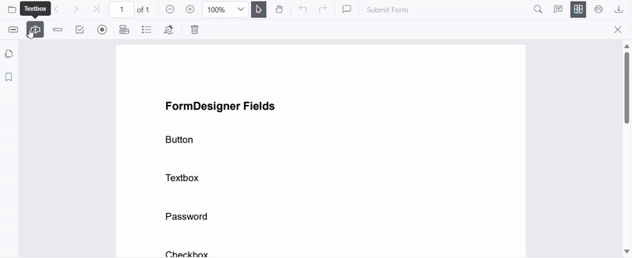
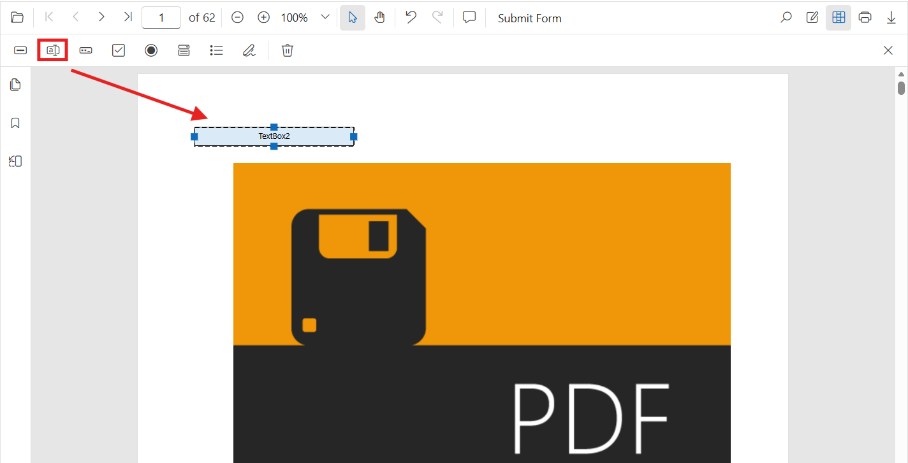
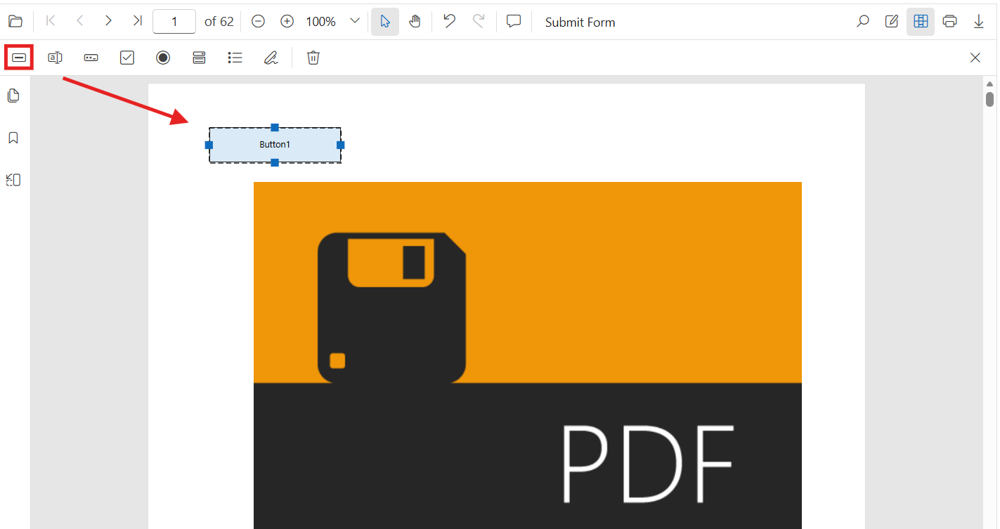
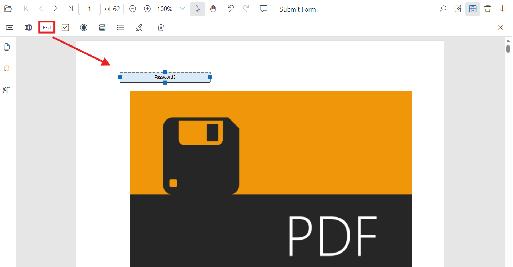
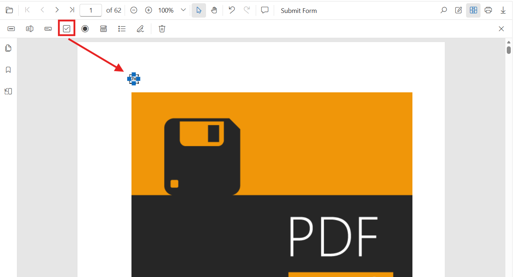
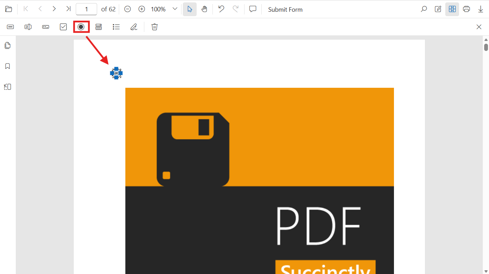
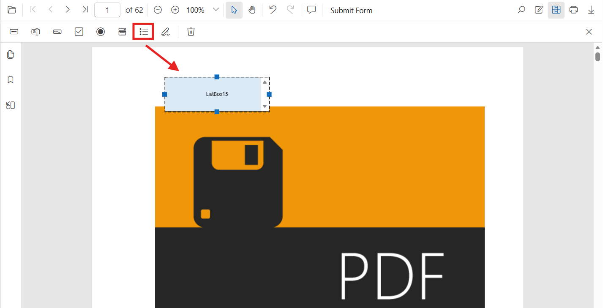
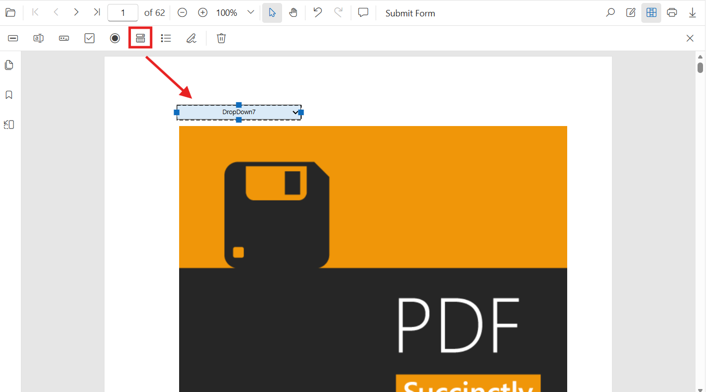
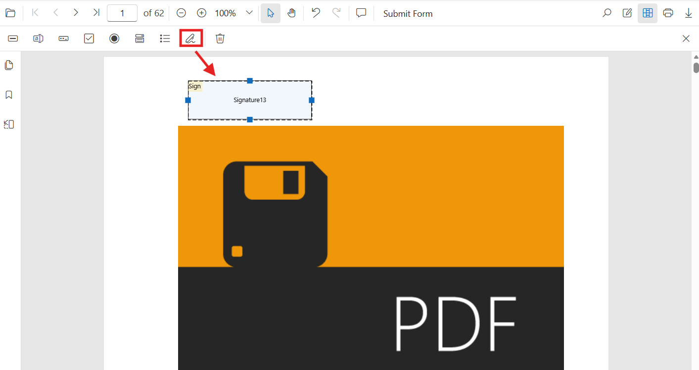

# Create PDF Form Fields in Blazor SfPdfViewer

Add new form fields visually with the Form Designer UI or programmatically using the Blazor SfPdfViewer API. This guide covers both methods and includes a runnable example and per‑field samples.

The guide covers the following:
- Add fields with the Form Designer UI
- Add and edit fields programmatically (API)
- Add common field types: Textbox, Password, CheckBox, RadioButton, ListBox, DropDown, Signature

### Create form fields using the Form Designer UI

- Enable the Form Designer mode in the PDF Viewer. See [Form Designer overview](../overview).
- Select a field type from the toolbar and click the PDF page to place it.
- Move or resize the field using the handles, and configure settings in the **Properties** panel.

### Create form fields programmatically

Use the [AddFormFieldsAsync](https://help.syncfusion.com/cr/blazor/Syncfusion.Blazor.SfPdfViewer.PdfViewerBase.html#Syncfusion_Blazor_SfPdfViewer_PdfViewerBase_AddFormFieldsAsync_System_Collections_Generic_List_Syncfusion_Blazor_SfPdfViewer_FormFieldInfo__) method inside the viewer's [`DocumentLoaded`](https://help.syncfusion.com/cr/blazor/Syncfusion.Blazor.SfPdfViewer.PdfViewerEvents.html#Syncfusion_Blazor_SfPdfViewer_PdfViewerEvents_DocumentLoaded) event handler or in response to user actions.

Use this approach to generate form fields dynamically based on data or application logic.




<!-- PDF Viewer component with reference binding and document loading -->
<SfPdfViewer2 @ref="@viewer" Height="100%" Width="100%" DocumentPath="@DocumentPath">
    <PdfViewerEvents DocumentLoaded="@AddFormFields"></PdfViewerEvents>
</SfPdfViewer2>

@code {
    // Reference to the PDF Viewer instance
    private SfPdfViewer2 viewer;
    
    // Path to the PDF document
    private string DocumentPath = "wwwroot/data/formDesigner_Empty.pdf";

    // Method triggered when the document is loaded
    private async Task AddFormFields()
    {
        // Define various form fields with their properties and positions
        List<FormFieldInfo> formFields = new List<FormFieldInfo>
        {
            new ButtonField { Name = "Button Field", Bounds = new Bound { X = 278, Y = 157, Width = 150, Height = 40 } },
            new TextBoxField { Name = "TextBox Field", Bounds = new Bound { X = 278, Y = 247, Width = 200, Height = 24 } },
            new PasswordField { Name = "Password Field", Bounds = new Bound { X = 278, Y = 323, Width = 200, Height = 24 } },
            new CheckBoxField { Name = "CheckBox Field1", IsChecked = false, Bounds = new Bound { X = 278, Y = 398, Width = 20, Height = 20 } },
            new CheckBoxField { Name = "CheckBox Field2", IsChecked = false, Bounds = new Bound { X = 386, Y = 398, Width = 20, Height = 20 } },
            new RadioButtonField { Name = "RadioButton", Value = "Value1", IsSelected = false, Bounds = new Bound { X = 278, Y = 470, Width = 20, Height = 20 } },
            new RadioButtonField { Name = "RadioButton", Value = "Value2", IsSelected = false, Bounds = new Bound { X = 386, Y = 470, Width = 20, Height = 20 } },
            new DropDownField { Name = "DropDown Field", Bounds = new Bound { X = 278, Y = 536, Width = 200, Height = 24 } },
            new ListBoxField { Name = "ListBox Field", Bounds = new Bound { X = 278, Y = 593, Width = 198, Height = 66 } },
            new SignatureField { Name = "Signature Field", Bounds = new Bound { X = 278, Y = 686, Width = 200, Height = 63 } }
        };
        
        // Add form fields asynchronously to the PDF Viewer
        await viewer.AddFormFieldsAsync(formFields);
    }
}



**Use programmatic creation when:**

- Building dynamic forms
- Pre-filling forms from databases
- Automating form creation workflows

## Field‑specific instructions

The following sections provide UI steps and the programmatic equivalent for each common field type. Each code sample is a complete per‑field example that can be reused unchanged.

### Textbox

**Add via UI**: Open the Form Designer toolbar, select **Textbox**, click on the page to place it, then configure its properties.

**Add Programmatically (API)**:




@using Syncfusion.Blazor.SfPdfViewer

<SfPdfViewer2 @ref="@viewer" Height="100%" Width="100%" DocumentPath="@DocumentPath">
    <PdfViewerEvents DocumentLoaded="@AddTextBox"></PdfViewerEvents>
</SfPdfViewer2>

@code {
    private SfPdfViewer2 viewer;
    private string DocumentPath = "wwwroot/data/form-filling-document.pdf";

    private async Task AddTextBox()
    {
        // Create a text box field with properties
        TextBoxField textBoxField = new TextBoxField()
        {
            Name = "FirstName",
            Bounds = new Bound() { X = 100, Y = 150, Width = 200, Height = 24 },
            IsRequired = true,
            TooltipText = "Enter your first name",
            MaxLength = 40
        };

        // Add the text box field to the PDF document
        await viewer.AddFormFieldsAsync(new List<FormFieldInfo> { textBoxField });
    }
}



### Button

**Add via UI**: Open the Form Designer toolbar, select **Button**, place it on the page, then configure its properties.

**Add Programmatically (API)**:




@using Syncfusion.Blazor.SfPdfViewer

<SfPdfViewer2 @ref="@viewer" Height="100%" Width="100%" DocumentPath="@DocumentPath">
    <PdfViewerEvents DocumentLoaded="@AddButtonField"></PdfViewerEvents>
</SfPdfViewer2>

@code {
    private SfPdfViewer2 viewer;
    private string DocumentPath = "wwwroot/data/form-filling-document.pdf";

    private async Task AddButtonField()
    {
        // Create a button field with properties
        ButtonField buttonField = new ButtonField()
        {
            Name = "SubmitButton",
            Bounds = new Bound() { X = 100, Y = 190, Width = 150, Height = 40 },
            TooltipText = "Click to submit the form"
        };

        // Add the button field to the PDF document
        await viewer.AddFormFieldsAsync(new List<FormFieldInfo> { buttonField });
    }
}



### Password

**Add via UI**: Open the Form Designer toolbar, select **Password**, place it on the page, then configure its properties.

**Add Programmatically (API)**:




@using Syncfusion.Blazor.SfPdfViewer

<SfPdfViewer2 @ref="@viewer" Height="100%" Width="100%" DocumentPath="@DocumentPath">
    <PdfViewerEvents DocumentLoaded="@AddPasswordField"></PdfViewerEvents>
</SfPdfViewer2>

@code {
    private SfPdfViewer2 viewer;
    private string DocumentPath = "wwwroot/data/form-filling-document.pdf";

    private async Task AddPasswordField()
    {
        // Create a password field with properties
        PasswordField passwordField = new PasswordField()
        {
            Name = "AccountPassword",
            Bounds = new Bound() { X = 100, Y = 190, Width = 200, Height = 24 },
            IsRequired = true,
            MaxLength = 32,
            TooltipText = "Enter a secure password"
        };

        // Add the password field to the PDF document
        await viewer.AddFormFieldsAsync(new List<FormFieldInfo> { passwordField });
    }
}



### CheckBox

**Add via UI**: Open the Form Designer toolbar, select **CheckBox**, click on the page to place it, then duplicate as needed for each option.

**Add Programmatically (API)**:




@using Syncfusion.Blazor.SfPdfViewer

<SfPdfViewer2 @ref="@viewer" Height="100%" Width="100%" DocumentPath="@DocumentPath">
    <PdfViewerEvents DocumentLoaded="@AddCheckBoxField"></PdfViewerEvents>
</SfPdfViewer2>

@code {
    private SfPdfViewer2 viewer;
    private string DocumentPath = "wwwroot/data/form-filling-document.pdf";

    private async Task AddCheckBoxField()
    {
        // Create a checkbox field with properties
        CheckBoxField checkBoxField = new CheckBoxField()
        {
            Name = "AgreeTerms",
            Bounds = new Bound() { X = 100, Y = 230, Width = 18, Height = 18 },
            IsChecked = false,
            TooltipText = "I agree to the terms"
        };

        // Add the checkbox field to the PDF document
        await viewer.AddFormFieldsAsync(new List<FormFieldInfo> { checkBoxField });
    }
}



### RadioButton

**Add via UI**: Open the Form Designer toolbar, select **RadioButton**, and place each option on the page using the same `name` to group them.

**Add Programmatically (API)**:




@using Syncfusion.Blazor.SfPdfViewer

<SfPdfViewer2 @ref="@viewer" Height="100%" Width="100%" DocumentPath="@DocumentPath">
    <PdfViewerEvents DocumentLoaded="@AddRadioButtonFields"></PdfViewerEvents>
</SfPdfViewer2>

@code {
    private SfPdfViewer2 viewer;
    private string DocumentPath = "wwwroot/data/form-filling-document.pdf";

    private async Task AddRadioButtonFields()
    {
        // Create radio button fields grouped by name 'Gender'
        RadioButtonField maleRadioButton = new RadioButtonField()
        {
            Name = "Gender",
            Value = "Male",
            Bounds = new Bound() { X = 100, Y = 270, Width = 16, Height = 16 }
        };

        RadioButtonField femaleRadioButton = new RadioButtonField()
        {
            Name = "Gender",
            Value = "Female",
            Bounds = new Bound() { X = 160, Y = 270, Width = 16, Height = 16 }
        };

        // Add the radio button fields to the PDF document
        await viewer.AddFormFieldsAsync(new List<FormFieldInfo> { maleRadioButton, femaleRadioButton });
    }
}



### ListBox

**Add via UI**: Open the Form Designer toolbar, select **ListBox**, place it on the page, then add items in the **Properties** panel.

**Add Programmatically (API)**:




@using Syncfusion.Blazor.SfPdfViewer

<SfPdfViewer2 @ref="@viewer" Height="100%" Width="100%" DocumentPath="@DocumentPath">
    <PdfViewerEvents DocumentLoaded="@AddListBoxField"></PdfViewerEvents>
</SfPdfViewer2>

@code {
    private SfPdfViewer2 viewer;
    private string DocumentPath = "wwwroot/data/form-filling-document.pdf";

    private async Task AddListBoxField()
    {
        // Create list items for the list box
        List<ListItem> items = new List<ListItem>()
        {
            new ListItem() { Name = "Item 1", Value = "item1" },
            new ListItem() { Name = "Item 2", Value = "item2" },
            new ListItem() { Name = "Item 3", Value = "item3" }
        };

        // Create a list box field with items
        ListBoxField listBoxField = new ListBoxField()
        {
            Name = "States",
            Bounds = new Bound() { X = 100, Y = 310, Width = 220, Height = 70 },
            Items = items
        };

        // Add the list box field to the PDF document
        await viewer.AddFormFieldsAsync(new List<FormFieldInfo> { listBoxField });
    }
}



### DropDown

**Add via UI**: Open the Form Designer toolbar, select **DropDown**, place it on the page, add items in the **Properties** panel, then set the default value.

**Add Programmatically (API)**:




@using Syncfusion.Blazor.SfPdfViewer

<SfPdfViewer2 @ref="@viewer" Height="100%" Width="100%" DocumentPath="@DocumentPath">
    <PdfViewerEvents DocumentLoaded="@AddDropDownField"></PdfViewerEvents>
</SfPdfViewer2>

@code {
    private SfPdfViewer2 viewer;
    private string DocumentPath = "wwwroot/data/form-filling-document.pdf";

    private async Task AddDropDownField()
    {
        // Create list items for the dropdown
        List<ListItem> options = new List<ListItem>()
        {
            new ListItem() { Name = "Item 1", Value = "item1" },
            new ListItem() { Name = "Item 2", Value = "item2" },
            new ListItem() { Name = "Item 3", Value = "item3" }
        };

        // Create a dropdown field with items
        DropDownField dropDownField = new DropDownField()
        {
            Name = "Country",
            Bounds = new Bound() { X = 560, Y = 320, Width = 150, Height = 24 },
            Items = options
        };

        // Add the dropdown field to the PDF document
        await viewer.AddFormFieldsAsync(new List<FormFieldInfo> { dropDownField });
    }
}



### Signature Field

**Add via UI**: Open the Form Designer toolbar, select **Signature Field**, place it where signing is required, then configure the indicator text, thickness, tooltip, and **IsRequired** in the **Properties** panel.

**Add Programmatically (API)**:




@using Syncfusion.Blazor.SfPdfViewer

<SfPdfViewer2 @ref="@viewer" Height="100%" Width="100%" DocumentPath="@DocumentPath">
    <PdfViewerEvents DocumentLoaded="@AddSignatureField"></PdfViewerEvents>
</SfPdfViewer2>

@code {
    private SfPdfViewer2 viewer;
    private string DocumentPath = "wwwroot/data/form-filling-document.pdf";

    private async Task AddSignatureField()
    {
        // Create a signature field
        SignatureField signatureField = new SignatureField()
        {
            Name = "Sign",
            Bounds = new Bound() { X = 57, Y = 923, Width = 200, Height = 43 },
            TooltipText = "Sign here",
            IsRequired = true
        };

        // Add the signature field to the PDF document
        await viewer.AddFormFieldsAsync(new List<FormFieldInfo> { signatureField });
    }
}



## Add fields dynamically with SetFormDrawingModeAsync

Use [`SetFormDrawingModeAsync()`](https://help.syncfusion.com/cr/blazor/Syncfusion.Blazor.SfPdfViewer.PdfViewerBase.html#Syncfusion_Blazor_SfPdfViewer_PdfViewerBase_SetFormDrawingModeAsync_System_Nullable_Syncfusion_Blazor_SfPdfViewer_FormFieldType__) to switch the designer into a specific field mode and let users add fields on the fly.




@using Syncfusion.Blazor.SfPdfViewer
@using Syncfusion.Blazor.Buttons

<SfButton @onclick="EnablePasswordDrawing">Enable Password Drawing</SfButton>

<SfPdfViewer2 @ref="@viewer" Height="100%" Width="100%" DocumentPath="@DocumentPath">
</SfPdfViewer2>

@code {
    private SfPdfViewer2? viewer;
    private string DocumentPath = "wwwroot/data/form-filling-document.pdf";

    private async Task EnablePasswordDrawing()
    {
        // Set the designer to Password mode so users can draw password fields on the page
        await viewer.SetFormDrawingModeAsync(FormFieldType.Password);
    }
}



## Edit form fields in Blazor SfPdfViewer

You can edit form fields using the UI or the API.

### Edit using the UI
- Right-click a field and choose **Properties** to update settings.
- Drag to move, or use the handles to resize.
- Use the toolbar to toggle field mode or add new fields.

#### Edit Programmatically




@using Syncfusion.Blazor.SfPdfViewer
@using Syncfusion.Blazor.Buttons

<SfButton @onclick="EditTextBox">Edit TextBox</SfButton>
<SfButton @onclick="EditButton">Edit Button</SfButton>
<SfButton @onclick="EnablePasswordDrawing">Enable Password Drawing</SfButton>

<SfPdfViewer2 @ref="@viewer" Height="100%" Width="100%" DocumentPath="@DocumentPath">
    <PdfViewerEvents DocumentLoaded="@AddSignatureFields"></PdfViewerEvents>
</SfPdfViewer2>

@code {
    private SfPdfViewer2? viewer;
    private string DocumentPath = "wwwroot/data/form-filling-document.pdf";

    private async Task AddSignatureFields()
    {
        // Create initial form field
        SignatureField signatureField = new SignatureField()
        {
            Name = "Sign",
            Bounds = new Bound() { X = 57, Y = 923, Width = 200, Height = 43 },
            TooltipText = "Sign here",
            IsRequired = true
        };

        await viewer.AddFormFieldsAsync(new List<FormFieldInfo> { signatureField });
    }

    private async Task EditTextBox()
    {
        // Retrieve all form fields
        List<FormFieldInfo> fields = await viewer.GetFormFieldsAsync();

        // Find and update the first name field
        FormFieldInfo? field = fields?.FirstOrDefault(f => f.Name == "FirstName");
        TextBoxField? textBox = field as TextBoxField;
        if (textBox != null)
        {
            textBox.Value = "John";
            textBox.FontFamily = "Courier";
            textBox.FontSize = 12;
            textBox.Color = "black";
            textBox.BackgroundColor = "white";
            textBox.BorderColor = "black";
            textBox.Thickness = 2;
            textBox.TextAlignment = TextAlignment.Left;

            await viewer.UpdateFormFieldsAsync(new List<FormFieldInfo> { textBox });
        }
    }

    private async Task EditButton()
    {
        // Retrieve all form fields
        List<FormFieldInfo> fields = await viewer.GetFormFieldsAsync();
        
        // Find and update the submit button field
        FormFieldInfo? field = fields?.FirstOrDefault(f => f.Name == "SubmitButton");
        if (field != null)
        {
            field.BackgroundColor = "#008000";
            field.Color = "white";
            field.FontFamily = "Arial";
            field.FontSize = 12;
            field.BorderColor = "black";
            field.Thickness = 2;
            
            await viewer.UpdateFormFieldsAsync(new List<FormFieldInfo> { field });
        }
    }

    private async Task EnablePasswordDrawing()
    {
        // Set the designer to Password mode so users can draw password fields on the page
        await viewer.SetFormDrawingModeAsync(FormFieldType.Password);
    }
}



N> For a hands-on reference with working code examples, explore the sample projects available on [GitHub](https://github.com/SyncfusionExamples/blazor-pdf-viewer-examples/tree/master/Form%20Designer/Components/Pages).

## Troubleshooting

- If fields do not appear, verify that the PDF document path is correct and the document loads successfully in the `SfPdfViewer` component.
- Ensure the form field types (TextBoxField, PasswordField, etc.) are properly imported from the Syncfusion.Blazor.SfPdfViewer namespace.
- Check that the Bounds coordinates are within the PDF page dimensions to ensure fields are placed correctly.
- If using async operations, ensure proper error handling and null checks on the viewer reference.

## See also

- [Form Designer overview](../overview)
- [Form Designer Toolbar](../../toolbar-customization/form-designer-toolbar)
- [Modify form fields](./modify-form-fields)
- [Style form fields](./customize-form-fields)
- [Remove form fields](./remove-form-fields)
- [Group form fields](../group-form-fields)
- [Form validation](../form-validation)
- [Form Fields API](../form-fields-api)