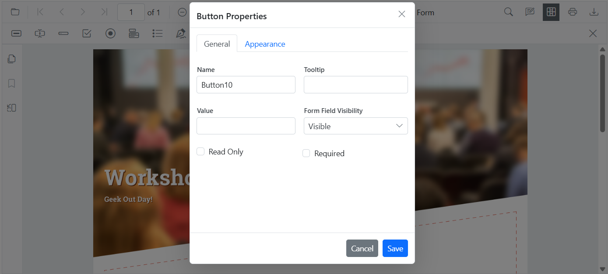
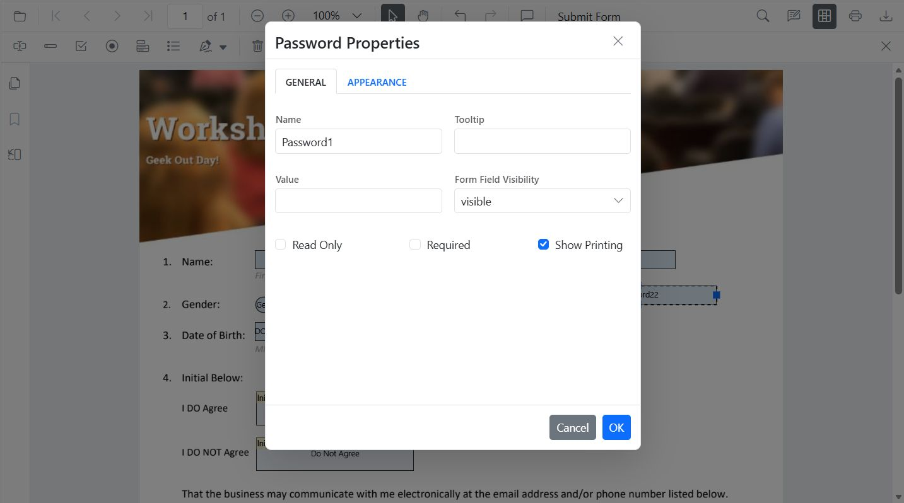
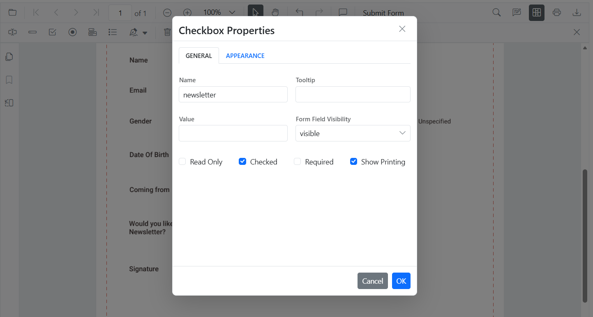
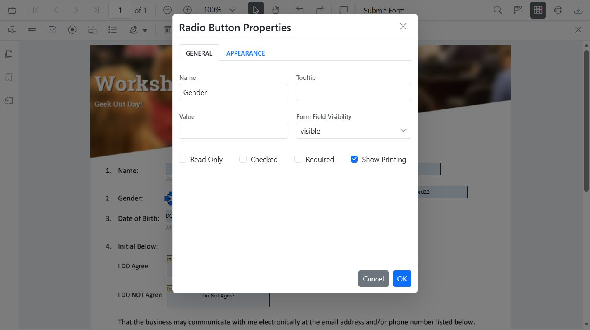

# Modify form fields in the Blazor SfPdfViewer

Modify form fields using the UI or programmatically via the API. Use the UI to adjust a single field interactively, or use the API to update one or more fields from code.

## Modify PDF form field properties using the UI
- Right-click a field, then choose **Properties** to update its settings.

- Drag a field to move it; use the handles to resize it.
- Use the toolbar to toggle form-fill mode or add new fields.

## Modify PDF form field properties programmatically
Use [UpdateFormFieldsAsync()](https://help.syncfusion.com/cr/blazor/Syncfusion.Blazor.SfPdfViewer.PdfViewerBase.html#Syncfusion_Blazor_SfPdfViewer_PdfViewerBase_UpdateFormFieldsAsync_System_Collections_Generic_List_Syncfusion_Blazor_SfPdfViewer_FormFieldInfo__) to change behavior or data (including position and size):




@using Syncfusion.Blazor.SfPdfViewer
@using Syncfusion.Blazor.Buttons

<SfButton @onclick="OnEditTextbox">Apply Textbox Changes</SfButton>

<SfPdfViewer2 @ref="@viewer" Height="100%" Width="100%" DocumentPath="@DocumentPath">
</SfPdfViewer2>

@code {
    private SfPdfViewer2? viewer;
    private string DocumentPath = "wwwroot/data/form-designer.pdf";

    private async Task OnEditTextbox()
    {
        if (viewer == null) return;

        List<FormFieldInfo> fields = await viewer.GetFormFieldsAsync();
        
        FormFieldInfo? field = fields?.FirstOrDefault(f => f.Name == "FirstName");
        
        if (field != null)
        {
            (field as TextBoxField).Value = "John";
            field.FontFamily = "Courier";
            field.FontSize = 12;
            field.Color = "black";
            field.BackgroundColor = "white";
            field.BorderColor = "black";
            field.Thickness = 2;
            field.TextAlignment = TextAlignment.Left;

            await viewer.UpdateFormFieldsAsync(new List<FormFieldInfo> { field });
        }
    }
}



## Modify PDF Form Field Properties by Field Type

### Textbox
- UI: Update value, font, size, colors, border thickness, alignment, max length, multiline.

- API: [UpdateFormFieldsAsync()](https://help.syncfusion.com/cr/blazor/Syncfusion.Blazor.SfPdfViewer.PdfViewerBase.html#Syncfusion_Blazor_SfPdfViewer_PdfViewerBase_UpdateFormFieldsAsync_System_Collections_Generic_List_Syncfusion_Blazor_SfPdfViewer_FormFieldInfo__) for value, typography, alignment, colors, borders.




@using Syncfusion.Blazor.SfPdfViewer
@using Syncfusion.Blazor.Buttons

<SfButton @onclick="OnEditTextbox">Apply Textbox Changes</SfButton>

<SfPdfViewer2 @ref="@viewer" Height="100%" Width="100%" DocumentPath="@DocumentPath">
</SfPdfViewer2>

@code {
    private SfPdfViewer2? viewer;
    private string DocumentPath = "wwwroot/data/form-designer.pdf";

    private async Task OnEditTextbox()
    {
        if (viewer == null) return;

        List<FormFieldInfo> fields = await viewer.GetFormFieldsAsync();
        
        FormFieldInfo? field = fields?.FirstOrDefault(f => f.Name == "FirstName");
        
        if (field != null)
        {
            (field as TextBoxField).Value = "John";
            field.FontFamily = "Courier";
            field.FontSize = 12;
            field.Color = "black";
            field.BackgroundColor = "white";
            field.BorderColor = "black";
            field.Thickness = 2;
            field.TextAlignment = TextAlignment.Left;

            await viewer.UpdateFormFieldsAsync(new List<FormFieldInfo> { field });
        }
    }
}



### Button
- UI: Update appearance, tooltip, font, colors, borders.

- API: [UpdateFormFieldsAsync()](https://help.syncfusion.com/cr/blazor/Syncfusion.Blazor.SfPdfViewer.PdfViewerBase.html#Syncfusion_Blazor_SfPdfViewer_PdfViewerBase_UpdateFormFieldsAsync_System_Collections_Generic_List_Syncfusion_Blazor_SfPdfViewer_FormFieldInfo__) for tooltip, typography, colors, borders.




@using Syncfusion.Blazor.SfPdfViewer
@using Syncfusion.Blazor.Buttons

<SfButton @onclick="OnEditButton">Edit Button</SfButton>

<SfPdfViewer2 @ref="@viewer" Height="100%" Width="100%" DocumentPath="@DocumentPath">
</SfPdfViewer2>

@code {
    private SfPdfViewer2? viewer;
    private string DocumentPath = "wwwroot/data/form-designer.pdf";

    private async Task OnEditButton()
    {
        if (viewer == null) return;

        List<FormFieldInfo> fields = await viewer.GetFormFieldsAsync();
        
        FormFieldInfo? field = fields?.FirstOrDefault(f => f.Name == "SubmitButton");
        
        if (field != null)
        {
            field.BackgroundColor = "#008000";
            field.Color = "white";
            field.FontFamily = "Arial";
            field.FontSize = 12;
            field.BorderColor = "black";
            field.Thickness = 2;
            field.TooltipText = "Click to submit";

            await viewer.UpdateFormFieldsAsync(new List<FormFieldInfo> { field });
        }
    }
}



### Password
- UI: Tooltip, required, max length, font, appearance.

- API: [UpdateFormFieldsAsync()](https://help.syncfusion.com/cr/blazor/Syncfusion.Blazor.SfPdfViewer.PdfViewerBase.html#Syncfusion_Blazor_SfPdfViewer_PdfViewerBase_UpdateFormFieldsAsync_System_Collections_Generic_List_Syncfusion_Blazor_SfPdfViewer_FormFieldInfo__) for tooltip, validation flags, typography, colors, alignment, borders.




@using Syncfusion.Blazor.SfPdfViewer
@using Syncfusion.Blazor.Buttons

<SfButton @onclick="OnEditPassword">Edit PasswordBox</SfButton>

<SfPdfViewer2 @ref="@viewer" Height="100%" Width="100%" DocumentPath="@DocumentPath">
</SfPdfViewer2>

@code {
    private SfPdfViewer2? viewer;
    private string DocumentPath = "wwwroot/data/form-designer.pdf";

    private async Task OnEditPassword()
    {
        if (viewer == null) return;

        List<FormFieldInfo> fields = await viewer.GetFormFieldsAsync();
        
        FormFieldInfo? field = fields?.FirstOrDefault(f => f.Name == "Password");
        
        if (field != null)
        {
            (field as PasswordField).TooltipText = "Enter your password";
            field.IsReadOnly = false;
            field.IsRequired = true;
            field.FontFamily = "Courier";
            field.FontSize = 10;
            field.Color = "black";
            field.BorderColor = "black";
            field.BackgroundColor = "white";
            field.TextAlignment = TextAlignment.Left;
            field.Thickness = 1;

            await viewer.UpdateFormFieldsAsync(new List<FormFieldInfo> { field });
        }
    }
}



### CheckBox
- UI: Toggle checked state.

- API: [UpdateFormFieldsAsync()](https://help.syncfusion.com/cr/blazor/Syncfusion.Blazor.SfPdfViewer.PdfViewerBase.html#Syncfusion_Blazor_SfPdfViewer_PdfViewerBase_UpdateFormFieldsAsync_System_Collections_Generic_List_Syncfusion_Blazor_SfPdfViewer_FormFieldInfo__) for `IsChecked`, tooltip, colors, borders.




@using Syncfusion.Blazor.SfPdfViewer
@using Syncfusion.Blazor.Buttons

<SfButton @onclick="OnEditCheckbox">Edit CheckBox</SfButton>

<SfPdfViewer2 @ref="@viewer" Height="100%" Width="100%" DocumentPath="@DocumentPath">
</SfPdfViewer2>

@code {
    private SfPdfViewer2? viewer;
    private string DocumentPath = "wwwroot/data/form-designer.pdf";

    private async Task OnEditCheckbox()
    {
        if (viewer == null) return;

        List<FormFieldInfo> fields = await viewer.GetFormFieldsAsync();
        
        FormFieldInfo? cb = fields?.FirstOrDefault(f => f.Name == "Subscribe");
        
        if (cb != null)
        {
            (cb as CheckBoxField).IsChecked = true;
            cb.BackgroundColor = "white";
            cb.BorderColor = "black";
            cb.Thickness = 2;
            cb.TooltipText = "Subscribe to newsletter";

            await viewer.UpdateFormFieldsAsync(new List<FormFieldInfo> { cb });
        }
    }
}



### RadioButton
- UI: Set selected item in a group (same Name).

- API: [UpdateFormFieldsAsync()](https://help.syncfusion.com/cr/blazor/Syncfusion.Blazor.SfPdfViewer.PdfViewerBase.html#Syncfusion_Blazor_SfPdfViewer_PdfViewerBase_UpdateFormFieldsAsync_System_Collections_Generic_List_Syncfusion_Blazor_SfPdfViewer_FormFieldInfo__) to set selected value and border appearance.




@using Syncfusion.Blazor.SfPdfViewer
@using Syncfusion.Blazor.Buttons

<SfButton @onclick="OnEditRadio">Edit RadioButton</SfButton>

<SfPdfViewer2 @ref="@viewer" Height="100%" Width="100%" DocumentPath="@DocumentPath">
</SfPdfViewer2>

@code {
    private SfPdfViewer2? viewer;
    private string DocumentPath = "wwwroot/data/form-designer.pdf";

    private async Task OnEditRadio()
    {
        if (viewer == null) return;

        List<FormFieldInfo> fields = await viewer.GetFormFieldsAsync();
        
        List<FormFieldInfo>? genderRadios = fields?.Where(f => f.Name == "Gender").ToList();
        
        if (genderRadios?.Count > 1)
        {
            (genderRadios[0] as RadioButtonField).IsSelected = false;
            (genderRadios[1] as RadioButtonField).IsSelected = true;
            genderRadios[1].Thickness = 2;
            genderRadios[1].BorderColor = "yellow";

            await viewer.UpdateFormFieldsAsync(genderRadios);
        }
    }
}



### ListBox
- UI: Add/remove items, set selection, adjust fonts/colors.

- API: [UpdateFormFieldsAsync()](https://help.syncfusion.com/cr/blazor/Syncfusion.Blazor.SfPdfViewer.PdfViewerBase.html#Syncfusion_Blazor_SfPdfViewer_PdfViewerBase_UpdateFormFieldsAsync_System_Collections_Generic_List_Syncfusion_Blazor_SfPdfViewer_FormFieldInfo__) for items, selection, borders.




@using Syncfusion.Blazor.SfPdfViewer
@using Syncfusion.Blazor.Buttons

<SfButton @onclick="UpdateFormField">Edit ListBox</SfButton>
<SfPdfViewer2 @ref="@viewer" Height="100%" Width="100%" DocumentPath="@DocumentPath">
</SfPdfViewer2>

@code {
    private SfPdfViewer2? viewer;
    private string DocumentPath = "wwwroot/data/formDesigner_Document.pdf";

    private async Task UpdateFormField()
    {
    if (viewer == null) return;
    List<FormFieldInfo> formFields = await viewer.GetFormFieldsAsync();
        // Find and update ListBoxField
        ListBoxField? listBox = formFields?.FirstOrDefault(f => f.Name == "InterestListBox" && f is ListBoxField) as ListBoxField;
        if (listBox != null)
        {
            listBox.Items = new List<ListItem> {
                new ListItem { Name = "item 1", Value = "Item 1" },
                new ListItem { Name = "item 2", Value = "Item 2" },
                new ListItem { Name = "item 3", Value = "Item 3" }
            };
            listBox.FontFamily = "Courier";
            listBox.FontSize = 10;
            listBox.Color = "black";
            listBox.BorderColor = "black";
            listBox.BackgroundColor = "white";
            await viewer.UpdateFormFieldsAsync(new List<FormFieldInfo> { listBox });
        }
    }
}



### DropDown
- UI: Add/remove items, default value, appearance.

- API: [UpdateFormFieldsAsync()](https://help.syncfusion.com/cr/blazor/Syncfusion.Blazor.SfPdfViewer.PdfViewerBase.html#Syncfusion_Blazor_SfPdfViewer_PdfViewerBase_UpdateFormFieldsAsync_System_Collections_Generic_List_Syncfusion_Blazor_SfPdfViewer_FormFieldInfo__) for items, value, borders.




@using Syncfusion.Blazor.SfPdfViewer
@using Syncfusion.Blazor.Buttons

<SfButton @onclick="UpdateFormField">Edit DropDown</SfButton>
<SfPdfViewer2 @ref="@viewer" Height="100%" Width="100%" DocumentPath="@DocumentPath">
</SfPdfViewer2>

@code {
    private SfPdfViewer2? viewer;
    private string DocumentPath = "wwwroot/data/formDesigner_Document.pdf";

    private async Task UpdateFormField()
    {
        if (viewer == null) return;
        List<FormFieldInfo> formFields = await viewer.GetFormFieldsAsync();
        // Find only the specific dropdown by name
        DropDownField? dropDown = formFields?.FirstOrDefault(f => f.Name == "CountryDropdown" && f is DropDownField) as DropDownField;
        if (dropDown != null)
        {
            dropDown.Items = new List<ListItem> {
                new ListItem { Name = "option 1", Value = "Option 1" },
                new ListItem { Name = "option 2", Value = "Option 2" },
                new ListItem { Name = "option 3", Value = "Option 3" }
            };
            dropDown.FontFamily = "Courier";
            dropDown.FontSize = 10;
            dropDown.Color = "black";
            dropDown.BorderColor = "black";
            dropDown.BackgroundColor = "white";
            await viewer.UpdateFormFieldsAsync(new List<FormFieldInfo> { dropDown });
        }
    }
}



### Signature
- UI: Tooltip, thickness, indicator text, required/visibility.

- API: [UpdateFormFieldsAsync()](https://help.syncfusion.com/cr/blazor/Syncfusion.Blazor.SfPdfViewer.PdfViewerBase.html#Syncfusion_Blazor_SfPdfViewer_PdfViewerBase_UpdateFormFieldsAsync_System_Collections_Generic_List_Syncfusion_Blazor_SfPdfViewer_FormFieldInfo__) for tooltip, required, colors, borders.




@using Syncfusion.Blazor.SfPdfViewer
@using Syncfusion.Blazor.Buttons

<SfButton @onclick="OnEditSignature">Edit Signature</SfButton>

<SfPdfViewer2 @ref="@viewer" Height="100%" Width="100%" DocumentPath="@DocumentPath">
</SfPdfViewer2>

@code {
    private SfPdfViewer2? viewer;
    private string DocumentPath = "wwwroot/data/form-designer.pdf";

    private async Task OnEditSignature()
    {
        if (viewer == null) return;

        List<FormFieldInfo> fields = await viewer.GetFormFieldsAsync();
        
        FormFieldInfo? sig = fields?.FirstOrDefault(f => f.Name == "Sign");
        
        if (sig != null)
        {
            sig.TooltipText = "Please sign here";
            sig.Thickness = 3;
            sig.IsRequired = true;
            sig.BackgroundColor = "white";
            sig.BorderColor = "black";

            await viewer.UpdateFormFieldsAsync(new List<FormFieldInfo> { sig });
        }
    }
}



[View Sample on GitHub](https://github.com/SyncfusionExamples/blazor-pdf-viewer-examples/tree/master/Form%20Designer/Components/Pages)

## See also

- [Form Designer overview](../overview)
- [Create form fields programmatically](../create-form-fields-programmatically)
- [Create form fields](./create-form-fields)
- [Remove form Fields](./remove-form-fields)
- [Style form fields](./customize-form-fields)
- [Group form fields](../group-form-fields)
- [Form validation](../form-validation)
- [Form fields API](../form-fields-api)
