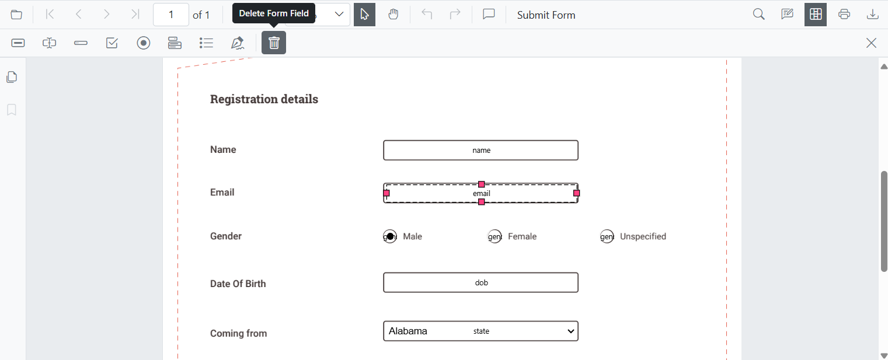
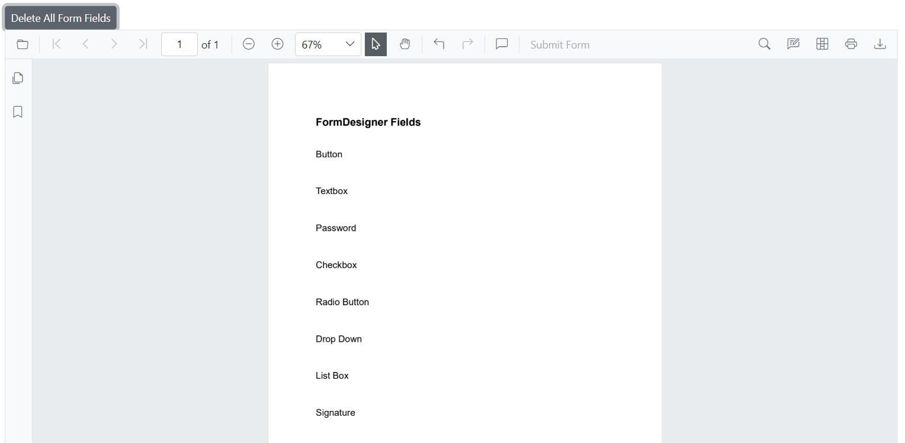
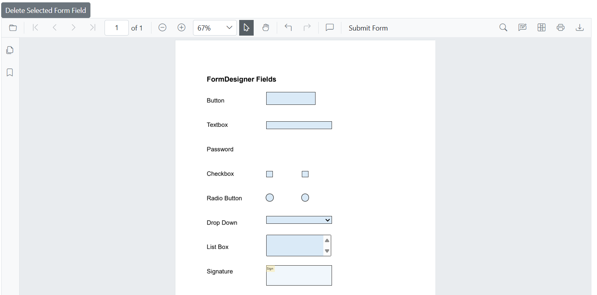

# Remove PDF Form Fields from a PDF in Blazor

The Blazor SfPdfViewer supports removing form fields using the Form Designer UI or programmatically via the API.

## Remove form fields using the UI
**Steps:**
1. Enable **Form Designer** mode.
2. Select the form field.
3. Click **Delete** in the toolbar or press the **Delete** key.

## Remove Form Fields Programmatically

The [DeleteFormFieldsAsync()](https://help.syncfusion.com/cr/blazor/Syncfusion.Blazor.SfPdfViewer.PdfViewerBase.html#Syncfusion_Blazor_SfPdfViewer_PdfViewerBase_DeleteFormFieldsAsync_System_Boolean_) method removes form fields from the loaded PDF document.

### Delete all form fields  
Removes all form fields from the document using [DeleteFormFieldsAsync()](https://help.syncfusion.com/cr/blazor/Syncfusion.Blazor.SfPdfViewer.PdfViewerBase.html#Syncfusion_Blazor_SfPdfViewer_PdfViewerBase_DeleteFormFieldsAsync_System_Boolean_) when called with `true`, clearing all interactive elements at once.




@using Syncfusion.Blazor.Buttons

<!-- Button to delete all form fields -->
<SfButton OnClick="DeleteAllFormFields">Delete All Form Fields</SfButton>

<!-- PDF Viewer component with reference binding and document loading -->
<SfPdfViewer2 @ref="@viewer" Height="100%" Width="100%" DocumentPath="@DocumentPath">
</SfPdfViewer2>

@code {
    // Reference to the PDF Viewer instance
    private SfPdfViewer2 viewer;
    
    // Path to the PDF document
    private string DocumentPath = "wwwroot/data/formDesigner_Document.pdf";
    
    private async Task DeleteAllFormFields() 
    {
        // Deletes all form fields from the PDF Viewer.
        await viewer.DeleteFormFieldsAsync(true);
    }
}


The following image illustrates deleting all form fields in Blazor SfPdfViewer:  

[View sample in GitHub](https://github.com/SyncfusionExamples/blazor-pdf-viewer-examples/blob/master/Form%20Designer/Components/Pages/DeleteAllFields.razor).

### Delete selected form fields  
Deletes only the currently selected form field using [DeleteFormFieldsAsync()](https://help.syncfusion.com/cr/blazor/Syncfusion.Blazor.SfPdfViewer.PdfViewerBase.html#Syncfusion_Blazor_SfPdfViewer_PdfViewerBase_DeleteFormFieldsAsync_System_Boolean_) when called with `false`, leaving the rest of the form structure intact.




@using Syncfusion.Blazor.Buttons

<!-- Button to delete the selected form fields -->
<SfButton OnClick="DeleteSelectedFormField">Delete Selected Form Field</SfButton>

<!-- PDF Viewer component with reference binding and document loading -->
<SfPdfViewer2 @ref="@viewer" Height="100%" Width="100%" DocumentPath="@DocumentPath">
</SfPdfViewer2>

@code {
    // Reference to the PDF Viewer instance
    private SfPdfViewer2 viewer;
    
    // Path to the PDF document
    private string DocumentPath = "wwwroot/data/formDesigner_Document.pdf";
    
    private async Task DeleteSelectedFormField() 
    {
        // Delete selected form field from the PDF Viewer.
        await viewer.DeleteFormFieldsAsync(false);
    }
}


The following image illustrates deleting a selected form field in Blazor SfPdfViewer:  

[View sample in GitHub](https://github.com/SyncfusionExamples/blazor-pdf-viewer-examples/blob/master/Form%20Designer/Components/Pages/DeleteSelectedField.razor).

### Delete form fields by IDs  
Removes specific form fields using the [DeleteFormFieldsAsync(List<string>)](https://help.syncfusion.com/cr/blazor/Syncfusion.Blazor.SfPdfViewer.PdfViewerBase.html#Syncfusion_Blazor_SfPdfViewer_PdfViewerBase_DeleteFormFieldsAsync_System_Collections_Generic_List_System_String__) overload based on their unique identifiers, allowing precise control over which fields are deleted without affecting others. The following example deletes multiple fields by ID; pass a single ID in the list to delete one field.




@using Syncfusion.Blazor.Buttons

<!-- Delete form fields by ID -->
<SfButton @onclick="DeleteFormFields">Delete Form Field By ID</SfButton>

<!-- PDF Viewer component with reference binding and document loading -->
<SfPdfViewer2 @ref="@viewer" Height="100%" Width="100%" DocumentPath="@DocumentPath">
</SfPdfViewer2>

@code {
    // Reference to the PDF Viewer instance
    private SfPdfViewer2 viewer;

    // Path to the PDF document that will be loaded into the viewer
    private string DocumentPath = "wwwroot/data/formDesigner_Document.pdf";

    // Method to delete form fields based on their ID
    private async Task DeleteFormFields()
    {
        List<FormFieldInfo> formFields = await viewer.GetFormFieldsAsync();
        // Delete the first two form fields by ID
        await viewer.DeleteFormFieldsAsync(new List<string> { formFields[0].Id, formFields[1].Id });
    }
}


The following image illustrates deleting form fields by their IDs in Blazor SfPdfViewer:  
 

[View sample in GitHub](https://github.com/SyncfusionExamples/blazor-pdf-viewer-examples/blob/master/Form%20Designer/Components/Pages/DeleteById.razor).

## See also

- [Form Designer overview](../overview)
- [Form Designer Toolbar](../../toolbar-customization/form-designer-toolbar)
- [Create form fields](./create-form-fields)
- [Modify form fields](./modify-form-fields)
- [Customize form fields](./customize-form-fields)
- [Group form fields](../group-form-fields)
- [Form validation](../form-validation)
- [Add custom data to form fields](../custom-data)
- [Form fields API](../form-fields-api)