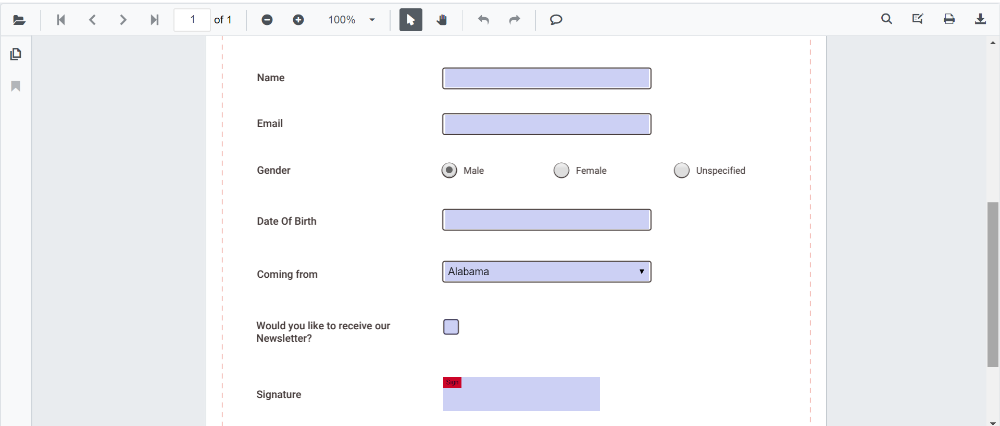
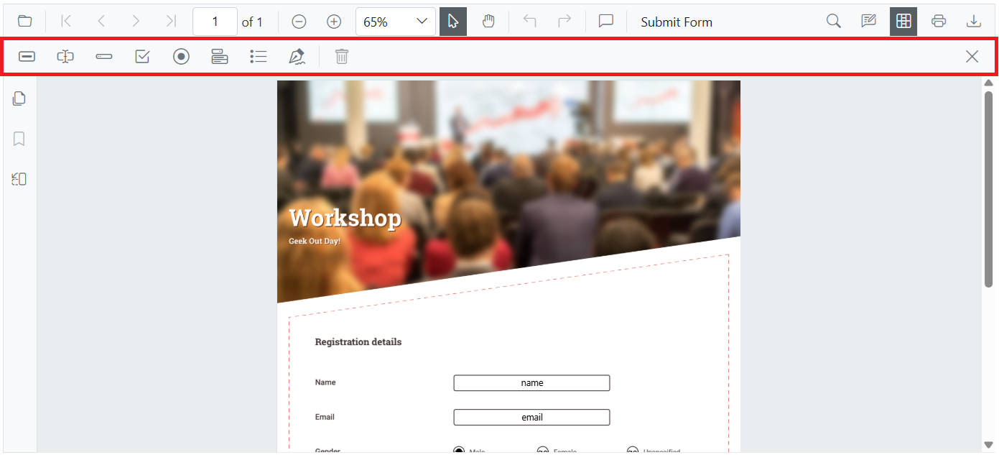

# Overview of Forms in Blazor SfPdfViewer

The Blazor `SfPdfViewer` provides PDF forms capabilities that let users read, fill, add, edit, and delete form fields directly within PDF documents through the viewer UI or programmatically via the Blazor APIs.

The viewer includes import and export support for form data for backend integration. Developers have fine-grained API control while end users interact with a streamlined form-filling interface.

## Supported form field types

The Forms features support the following field types. Each link explains how to add the field using the Form Designer UI and programmatically.

- [Textbox](./manage-form-fields/create-form-fields#textbox)
- [Password](./manage-form-fields/create-form-fields#password)
- [CheckBox](./manage-form-fields/create-form-fields#checkbox)
- [RadioButton](./manage-form-fields/create-form-fields#radiobutton)
- [ListBox](./manage-form-fields/create-form-fields#listbox)
- [DropDown](./manage-form-fields/create-form-fields#dropdown)
- [Signature field](./manage-form-fields/create-form-fields#signature-field)

## Filling PDF Forms

Fill PDF forms through the viewer UI or programmatically using the Blazor APIs. The viewer also supports importing and exporting form data.

See the [Filling PDF Forms](./form-filling) page for full details.

Use the following code snippet to enable form filling in Blazor. Form filling is enabled by default.



@using Syncfusion.Blazor.SfPdfViewer

<SfPdfViewer2 Height="100%"
              Width="100%"
              DocumentPath="@DocumentPath"
              EnableFormFields="true" />

@code{
    private string DocumentPath { get; set; } = "wwwroot/Data/FormFillingDocument.pdf";
}



1. [Programmatically Form fill](./form-filling#fill-pdf-forms-programmatically)
2. [Form Fill Using UI](./form-filling#fill-pdf-forms-through-the-user-interface)
3. [Import the Form data](./form-filling#fill-pdf-forms-through-import-data)

## Form Designer

A built-in Form Designer lets you quickly add, edit, move, and delete form fields in a PDF document. You can design fillable PDF forms interactively using the built-in form designer tools, or build your own customized form designer tools.

See the [Form Designer](./form-designer) page for full details.

Use the following code snippet to enable the Form Designer in Blazor. The Form Designer is enabled by default.



@using Syncfusion.Blazor.SfPdfViewer

<SfPdfViewer2 Height="100%"
              Width="100%"
              DocumentPath="@DocumentPath"
              EnableFormDesigner="true" />

@code{
    private string DocumentPath { get; set; } = "wwwroot/Data/FormFillingDocument.pdf";
}



Create and customize interactive fields directly on the PDF page.
- [Create form fields](./manage-form-fields/create-form-fields)
- [Edit form fields](./manage-form-fields/modify-form-fields)
- [Remove form fields](./manage-form-fields/remove-form-fields)
- [Move and resize form fields](./manage-form-fields/move-resize-form-fields)
- [Set form field constraints](./form-constrain)

## See also

- [Form field events](./form-field-events)
- [Read form field values](./read-form-field-values)
- [Import and export form data](./export-import-formfields)
- [Flatten form fields](./flatten-form-fields)
- [Group form fields](./group-form-fields)
- [Custom data in form fields](./custom-data)
- [Custom fonts in form fields](./custom-font)
- [Form handling best practices](./form-handling-best-practices)