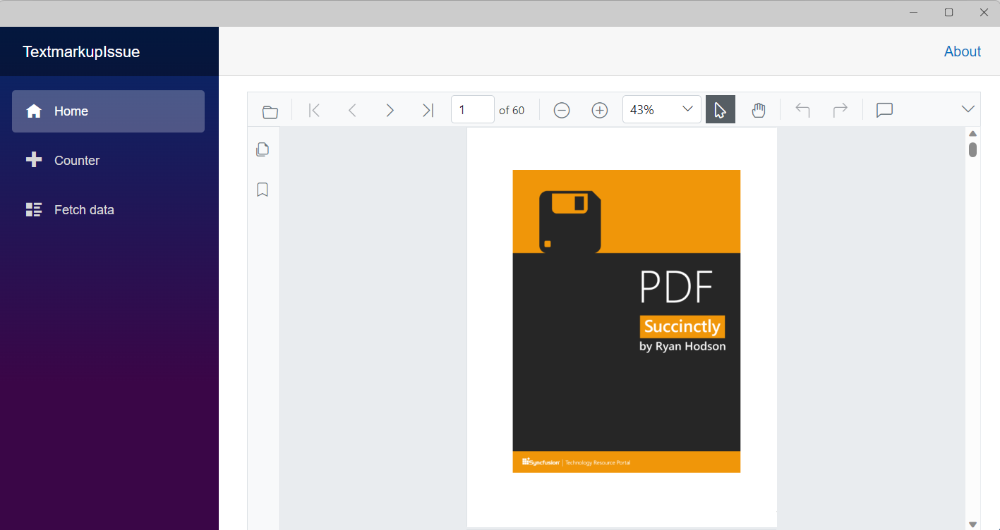
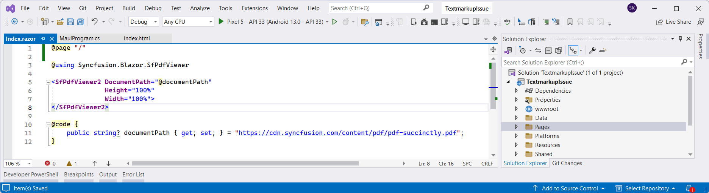
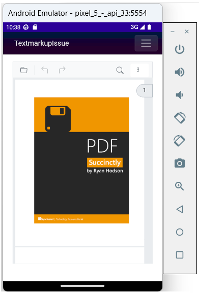

# View PDF files using the PDF Viewer in a Blazor .NET MAUI app

This article describes how to add the Syncfusion&reg; Blazor PDF Viewer component to a Blazor .NET MAUI app and deploy it on Windows.

## Prerequisites

To use the .NET MAUI project templates, install the Mobile development with .NET workload for Visual Studio. For installation details, see the Microsoft documentation: [Install .NET MAUI](https://learn.microsoft.com/en-us/dotnet/MAUI/get-started/installation?tabs=vswin).

## Create a new Blazor .NET MAUI app in Visual Studio

Create a new Blazor .NET MAUI app and name it **PDFViewerGettingStarted**.

N> The PDF Viewer component is supported on .NET 8.0 and later.

## Install PDF Viewer NuGet packages in the Blazor .NET MAUI app

Add the following NuGet packages to the Blazor .NET MAUI app.

* [Syncfusion.Blazor.SfPdfViewer](https://www.nuget.org/packages/Syncfusion.Blazor.SfPdfViewer) 
* [Syncfusion.Blazor.Themes](https://www.nuget.org/packages/Syncfusion.Blazor.Themes)

## Register Syncfusion&reg; Blazor Service

* In the **~/_Imports.razor** file, add the following namespaces:




@using Syncfusion.Blazor
@using Syncfusion.Blazor.SfPdfViewer




* Register the Syncfusion&reg; Blazor Service in the **~/MauiProgram.cs** file.




using Microsoft.Extensions.Logging;
using MauiBlazorWindow.Data;
using Syncfusion.Blazor;

namespace MauiBlazorWindow;

public static class MauiProgram
{
    public static MauiApp CreateMauiApp()
    {
        var builder = MauiApp.CreateBuilder();
        builder
            .UseMauiApp<App>()
            .ConfigureFonts(fonts =>
            {
                fonts.AddFont("OpenSans-Regular.ttf", "OpenSansRegular");
            });

        builder.Services.AddMauiBlazorWebView();
        builder.Services.AddMemoryCache();

#if DEBUG
        builder.Services.AddBlazorWebViewDeveloperTools();
        builder.Logging.AddDebug();
#endif

        builder.Services.AddSingleton<WeatherForecastService>();
        builder.Services.AddSyncfusionBlazor();
        return builder.Build();
    }
}




## Adding stylesheet and script

Add the following stylesheet and script to the head section of the **~/wwwroot/index.html** file.




<head>
    <!-- Syncfusion Blazor PDF Viewer control's theme style sheet -->
    <link href="_content/Syncfusion.Blazor.Themes/bootstrap5.css" rel="stylesheet" />
</head>
<body>
    <!-- Syncfusion Blazor PDF Viewer control's scripts -->
    
</body>




## Add the PDF Viewer component

Add the Syncfusion&reg; PDF Viewer (Next-Gen) component in the **~/Pages/Index.razor** file.




@page "/"

@using Syncfusion.Blazor.SfPdfViewer

<SfPdfViewer2 DocumentPath="@DocumentPath"
              Height="100%"
              Width="100%">
</SfPdfViewer2>

@code {
    public string DocumentPath { get; set; } = "https://cdn.syncfusion.com/content/pdf/pdf-succinctly.pdf";
}




N> If the [DocumentPath](https://help.syncfusion.com/cr/blazor/Syncfusion.Blazor.SfPdfViewer.PdfViewerBase.html#Syncfusion_Blazor_SfPdfViewer_PdfViewerBase_DocumentPath) property is not set, the PDF Viewer renders without loading a PDF document. Users can use the Open option in the toolbar to browse and open a PDF as needed.

## Run on Windows

Run the sample on a Windows machine to execute the Blazor .NET MAUI app.

After the application launches, the PDF Viewer renders the specified PDF document.

## Run on Android

To run the PDF Viewer in a Blazor .NET MAUI Android application using the Android emulator, follow these steps:

For setup and usage, see [Android Emulator setup for .NET MAUI](https://learn.microsoft.com/en-us/dotnet/maui/android/emulator/device-manager#android-device-manager-on-windows).

N> If any errors occur while using the Android Emulator, see [Troubleshooting Android Emulator](https://learn.microsoft.com/en-us/dotnet/maui/android/emulator/troubleshooting).

>[View the sample on GitHub](https://github.com/SyncfusionExamples/blazor-pdf-viewer-examples/tree/master/Getting%20Started/MAUI%20Blazor%20App/MauiBlazorWindow).

## See also

* [Getting Started with Blazor PDF Viewer Component in WinForms Blazor Hybrid App](./winforms-blazor-app)

* [Getting Started with Blazor PDF Viewer Component in WPF Blazor Hybrid App](./wpf-blazor-app)

* [Supported features: desktop vs. mobile](./features#supported-features-desktop-vs-mobile)

* [Render a PDF document from an embedded source in the .NET MAUI Android app](../faqs/how-to-deploy-maui-using-android-emulator)
