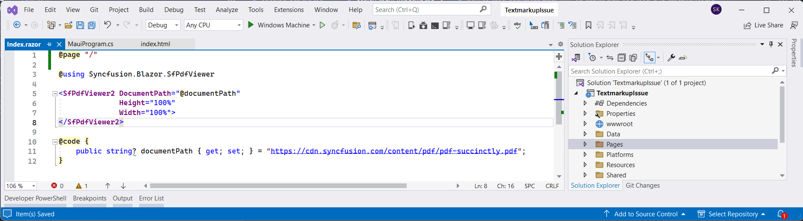
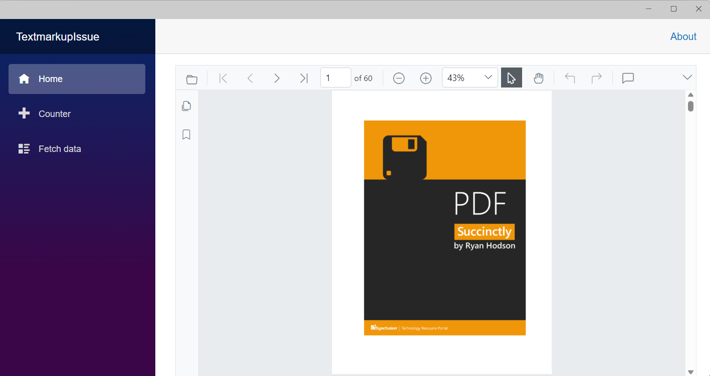
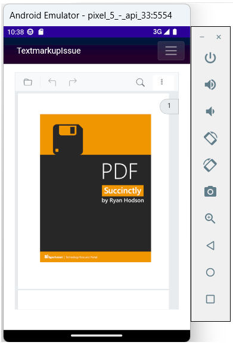

# Getting Started with the PDF Viewer in a .NET MAUI Blazor Hybrid App

This section explains how to create and run a .NET MAUI Blazor Hybrid application using the [Blazor PDF Viewer](https://www.syncfusion.com/pdf-viewer-sdk/blazor-pdf-viewer) component.

## Prerequisites

* Visual Studio 2022 (17.8 or later) with the **Mobile development with .NET** workload installed.
* .NET 8.0 SDK or later.
* Windows 10/11 (version 1809 or later) to build and run the Windows target.
* To use the .NET MAUI project templates, install the Mobile development with .NET workload for Visual Studio. For installation details, see the Microsoft documentation: [Install .NET MAUI](https://learn.microsoft.com/en-us/dotnet/MAUI/get-started/installation?tabs=vswin).

## Create a new Blazor .NET MAUI app in Visual Studio

1. Open Visual Studio and choose **File → New → Project**.
2. Search for **Blazor MAUI App**, select it, and click **Next**.
3. Name the project **PDFViewerGettingStarted** and click **Create** using the [Microsoft templates](https://learn.microsoft.com/en-us/aspnet/core/blazor/hybrid/tutorials/maui?view=aspnetcore-8.0).

N> The PDF Viewer supports .NET 8.0 and later.

## Install Blazor SfPdfViewer NuGet Packages

To add the **Blazor SfPdfViewer (Next-Gen)** component in the app, open the NuGet package manager in Visual Studio (*Tools → NuGet Package Manager → Manage NuGet Packages for Solution*), search and install:

* [Syncfusion.Blazor.SfPdfViewer](https://www.nuget.org/packages/Syncfusion.Blazor.SfPdfViewer)
* [Syncfusion.Blazor.Themes](https://www.nuget.org/packages/Syncfusion.Blazor.Themes/)

Alternatively, you can use the following Package Manager command to install the same packages.




Install-Package Syncfusion.Blazor.SfPdfViewer -Version {{ site.releaseversion }}
Install-Package Syncfusion.Blazor.Themes -Version {{ site.releaseversion }}




## Import namespaces

Open the `~/_Imports.razor` file and import the `Syncfusion.Blazor` and `Syncfusion.Blazor.SfPdfViewer` namespaces.




@using Syncfusion.Blazor
@using Syncfusion.Blazor.SfPdfViewer




Add the `Syncfusion.Blazor` namespace to the `MauiProgram.cs` file.




using Syncfusion.Blazor;




## Register Syncfusion&reg; Blazor Service

Register the Syncfusion&reg; Blazor service in the `~/MauiProgram.cs` file after the **builder** is created.




// Enable memory caching
builder.Services.AddMemoryCache();
// Register Syncfusion Blazor service
builder.Services.AddSyncfusionBlazor();




## Add stylesheet and script resources

The theme stylesheet and script can be accessed from NuGet through [Static Web Assets](https://blazor.syncfusion.com/documentation/appearance/themes#static-web-assets).

Add the stylesheet at the end of the `<head>` section in the `~/wwwroot/index.html` file to apply proper layout and theme styling.




<!-- Blazor PDF Viewer control's theme stylesheet -->
<link href="_content/Syncfusion.Blazor.Themes/bootstrap5.css" rel="stylesheet" />




Add the required script at the end of the `<body>` section in the `~/wwwroot/index.html` file to enable component functionality.




<!-- Blazor PDF Viewer control's script -->




N> Check out the [Blazor Themes](https://blazor.syncfusion.com/documentation/appearance/themes) topic to explore supported ways (such as static assets, CDN, and CRG) to apply themes in your Blazor application. Also, check out the [Adding Script Reference](https://blazor.syncfusion.com/documentation/common/adding-script-references) topic to learn different approaches for adding script references in your Blazor application.

## Add Blazor PDF Viewer component

Add the Blazor PDF Viewer (Next-Gen) component to `~/Pages/Index.razor`.




@using Syncfusion.Blazor.SfPdfViewer

<SfPdfViewer2 DocumentPath="https://cdn.syncfusion.com/content/pdf/pdf-succinctly.pdf"
              Height="100%"
              Width="100%">
</SfPdfViewer2>




N>
* The sample [`DocumentPath`](https://help.syncfusion.com/cr/blazor/Syncfusion.Blazor.SfPdfViewer.PdfViewerBase.html#Syncfusion_Blazor_SfPdfViewer_PdfViewerBase_DocumentPath) points to a remote URL. The device running the app must have internet access for the PDF to load. For offline scenarios, bundle the PDF in the project and load it with `LoadAsync` from embedded resources, or use the **Open** toolbar option to pick a local file. For more information, see [Render a PDF document from an embedded source in the .NET MAUI Android app](../faqs/how-to-deploy-maui-using-android-emulator).
* If the [DocumentPath](https://help.syncfusion.com/cr/blazor/Syncfusion.Blazor.SfPdfViewer.PdfViewerBase.html#Syncfusion_Blazor_SfPdfViewer_PdfViewerBase_DocumentPath) property is not set, the PDF Viewer displays an empty viewer without a document. Use the **Open** toolbar option to browse and open a PDF.

## Run on Windows

1. In the Visual Studio toolbar, change the **Solution Platforms** dropdown to **Windows Machine**.
2. Press <kbd>F5</kbd> (with the debugger) or <kbd>Ctrl</kbd>+<kbd>F5</kbd> (without the debugger) to build and run the app.

After the application launches, the PDF Viewer displays the specified PDF document.

## Run on Android

1. In Visual Studio, change the **Solution Platforms** dropdown to **Android Emulators** and select a running emulator. If no emulator is available, create one using the **Android Device Manager**.
2. Press <kbd>F5</kbd> to build and deploy the app to the emulator.

For setup and usage, see [Android Emulator setup for .NET MAUI](https://learn.microsoft.com/en-us/dotnet/maui/android/emulator/device-manager#android-device-manager-on-windows).

N> If any errors occur while using the Android Emulator, see [Troubleshooting Android Emulator](https://learn.microsoft.com/en-us/dotnet/maui/android/emulator/troubleshooting).

## See also

* [Getting Started with Blazor PDF Viewer Component in WinForms Blazor Hybrid App](./winforms-blazor-app)
* [Getting Started with Blazor PDF Viewer Component in WPF Blazor Hybrid App](./wpf-blazor-app)
* [Render a PDF document from an embedded source in the .NET MAUI Android app](../faqs/how-to-deploy-maui-using-android-emulator)