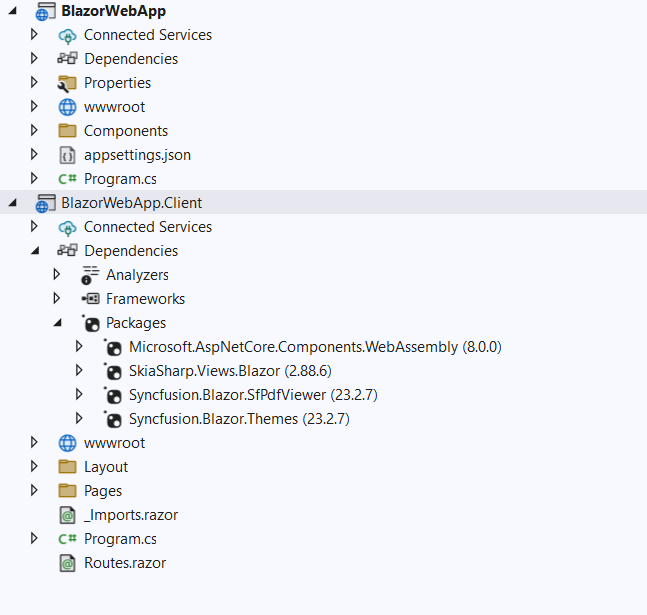

# View PDF files using the PDF Viewer in a Blazor Web App

This article shows how to add the Syncfusion&reg; Blazor PDF Viewer to a Blazor Web App using [Visual Studio](https://visualstudio.microsoft.com/vs/) or Visual Studio Code.





## Prerequisites

* [System requirements for Blazor components](https://blazor.syncfusion.com/documentation/system-requirements)

N> If using an interactive render mode such as `WebAssembly` or `Auto`, ensure the required .NET workloads are installed for SkiaSharp usage in a Blazor Web App. Run the following command:
* dotnet workload install wasm-tools
* The above code will only install the latest available workload on the machine, such as .NET 10. If you need to install a specific .NET version like .NET 9 or .NET 8, please use a command such as `dotnet workload install wasm-tools-net8` and `dotnet workload install wasm-tools-net9`.

## Create a new Blazor Web App in Visual Studio

Create a Blazor Web App using Visual Studio 2022 via [Microsoft Templates](https://learn.microsoft.com/en-us/aspnet/core/blazor/tooling?view=aspnetcore-10.0&pivots=vs) or the [Syncfusion&reg; Blazor Extension](https://blazor.syncfusion.com/documentation/visual-studio-integration/template-studio).

N> Configure the appropriate [interactive render mode](https://learn.microsoft.com/en-us/aspnet/core/blazor/components/render-modes?view=aspnetcore-10.0#render-modes) and [interactivity location](https://learn.microsoft.com/en-us/aspnet/core/blazor/tooling?view=aspnetcore-10.0&pivots=vs) when creating a Blazor Web App.

## Install Syncfusion&reg; Blazor SfPdfViewer and Themes NuGet packages

To add the Blazor PDF Viewer component, open the NuGet package manager in Visual Studio (*Tools → NuGet Package Manager → Manage NuGet Packages for Solution*), or the integrated terminal in Visual Studio Code (dotnet add package).

Alternatively, run the following command in the Package Manager Console to achieve the same.





dotnet add package Syncfusion.Blazor.SfPdfViewer -v {{ site.releaseversion }}
dotnet add package Syncfusion.Blazor.Themes -v {{ site.releaseversion }}
dotnet restore





If using the `WebAssembly` or `Auto` interactive render mode, install the NuGet packages in the client project to add the component to the Web App.

N> Syncfusion&reg; uses SkiaSharp.Views.Blazor version 3.119.1. Ensure this version is referenced.
* [SkiaSharp.Views.Blazor](https://www.nuget.org/packages/SkiaSharp.Views.Blazor/3.119.1)





## Prerequisites

* [System requirements for Blazor components](https://blazor.syncfusion.com/documentation/system-requirements)

N> If using an interactive render mode such as WebAssembly or Auto, ensure the required .NET workloads are installed for SkiaSharp usage in a Blazor Web App. Run the following command:
* dotnet workload install wasm-tools
* The above code will only install the latest available workload on the machine, such as .NET 10. If you need to install a specific .NET version like .NET 9 or .NET 8, please use a command such as `dotnet workload install wasm-tools-net8` and `dotnet workload install wasm-tools-net9`.

## Create a new Blazor Web App in Visual Studio Code

Create a **Blazor Web App** using Visual Studio Code via [Microsoft Templates](https://learn.microsoft.com/en-us/aspnet/core/blazor/tooling?view=aspnetcore-10.0&pivots=vsc) or the [Syncfusion&reg; Blazor Extension](https://blazor.syncfusion.com/documentation/visual-studio-code-integration/create-project).

For example, in a Blazor Web App with the `Auto` interactive render mode, use the following commands in the integrated terminal (<kbd>Ctrl</kbd>+<kbd>`</kbd>).




dotnet new blazor -o BlazorWebApp -int Auto
cd BlazorWebApp
cd BlazorWebApp.Client




N> Configure the appropriate [interactive render mode](https://learn.microsoft.com/en-us/aspnet/core/blazor/components/render-modes?view=aspnetcore-10.0#render-modes) and [interactivity location](https://learn.microsoft.com/en-us/aspnet/core/blazor/tooling?view=aspnetcore-10.0&pivots=vsc) when creating a Blazor Web App.

## Install Syncfusion&reg; Blazor SfPdfViewer and Themes NuGet packages

To add the Blazor PDF Viewer component, open the NuGet package manager in Visual Studio (*Tools → NuGet Package Manager → Manage NuGet Packages for Solution*), or the integrated terminal in Visual Studio Code (dotnet add package).

Alternatively, run the following command in the Package Manager Console to achieve the same.





dotnet add package Syncfusion.Blazor.SfPdfViewer -v {{ site.releaseversion }}
dotnet add package Syncfusion.Blazor.Themes -v {{ site.releaseversion }}
dotnet restore





If using the `WebAssembly` or `Auto` interactive render mode, install the NuGet packages in the client project to add the component to the Web App.

N> Syncfusion&reg; uses SkiaSharp.Views.Blazor version 3.119.1. Ensure this version is referenced.
* [SkiaSharp.Views.Blazor](https://www.nuget.org/packages/SkiaSharp.Views.Blazor/3.119.1)





## Add import namespaces

After the package is installed, open the ~/_Imports.razor file from the client project and import the `Syncfusion.Blazor` and `Syncfusion.Blazor.SfPdfViewer` namespaces.




@using Syncfusion.Blazor
@using Syncfusion.Blazor.SfPdfViewer




## Register Syncfusion&reg; Blazor service

Register the Syncfusion&reg; Blazor service in the **~/Program.cs** file of your Blazor Web App.

N> If the interactive render mode is set to WebAssembly or Auto, register the Syncfusion&reg; Blazor service in both **~/Program.cs** files of the Blazor Web App.




using BlazorWebAppServer.Components;
using Syncfusion.Blazor;

var builder = WebApplication.CreateBuilder(args);

builder.Services.AddRazorComponents() 
        .AddInteractiveServerComponents();

builder.Services.AddSignalR(o => { o.MaximumReceiveMessageSize = 102400000; });

builder.Services.AddMemoryCache();
//Add Syncfusion Blazor service to the container.
builder.Services.AddSyncfusionBlazor();

var app = builder.Build();

....





using BlazorWebApp.Client.Pages;
using BlazorWebApp.Components;
using Syncfusion.Blazor;

var builder = WebApplication.CreateBuilder(args);
builder.Services.AddRazorComponents()
.AddInteractiveWebAssemblyComponents();

builder.Services.AddMemoryCache();
//Add Syncfusion Blazor service to the container
builder.Services.AddSyncfusionBlazor();

var app = builder.Build();

....





using BlazorWebAppAuto.Client.Pages;
using BlazorWebAppAuto.Components;
using Syncfusion.Blazor;

var builder = WebApplication.CreateBuilder(args);
builder.Services.AddRazorComponents()
.AddInteractiveServerComponents() .AddInteractiveWebAssemblyComponents();

builder.Services.AddSignalR(o => { o.MaximumReceiveMessageSize = 102400000; });

builder.Services.AddMemoryCache();
//Add Syncfusion Blazor service to the container
builder.Services.AddSyncfusionBlazor();

var app = builder.Build();

....




N> [Processing Large Files Without Increasing Maximum Message Size in SfPdfViewer Component](../faqs/how-to-processing-large-files-without-increasing-maximum-message-size)

## Add stylesheet and script

Add the following stylesheet and script to the head section of **~/Components/App.razor**.




<head>
    <!-- Syncfusion Blazor PDF Viewer control's theme style sheet -->
    <link href="_content/Syncfusion.Blazor.Themes/bootstrap5.css" rel="stylesheet" />
</head>
<body>
    <!-- Syncfusion Blazor PDF Viewer control's scripts -->
    
</body>




## Add Blazor PDF Viewer component

Add the Syncfusion® PDF Viewer (Next-Gen) component in the **~/Pages/*.razor** file. If interactivity location is Per page/component, define a render mode at the top of the page as follows:

| Interactivity location | RenderMode | Code |
| --- | --- | --- |
| Per page/component | Auto | @rendermode InteractiveAuto |
|  | WebAssembly | @rendermode InteractiveWebAssembly |
|  | Server | @rendermode InteractiveServer |
|  | None | --- |

N> If the interactivity location is set to Global and the render mode is set to Auto, WebAssembly, or Server, the render mode is configured in the App.razor file by default.

 Enable interactivity only via client-side rendering (CSR) by using the WebAssembly or Auto option




@* Your App render mode define here *@
@rendermode InteractiveAuto




Add the Syncfusion&reg; PDF Viewer component in **~/Pages/Index.razor**.




@page "/"
<SfPdfViewer2 DocumentPath="https://cdn.syncfusion.com/content/pdf/pdf-succinctly.pdf"
              Height="100%"
              Width="100%">
</SfPdfViewer2>




N> If the [DocumentPath](https://help.syncfusion.com/cr/blazor/Syncfusion.Blazor.SfPdfViewer.PdfViewerBase.html#Syncfusion_Blazor_SfPdfViewer_PdfViewerBase_DocumentPath) property is not set, the PDF Viewer renders without loading a PDF. Use the **Open** toolbar option to browse and open a PDF.

## Run the app

Run the app to display the PDF in the Syncfusion&reg; Blazor PDF Viewer in the browser.



N> [View the sample on GitHub](https://github.com/SyncfusionExamples/Blazor-Getting-Started-Examples/tree/main/PDFViewer2/NET10/PDFViewer2_WebAppServerMode).

## See also

* [Getting Started with Blazor PDF Viewer Component in Blazor WASM App](./web-assembly-application)

* [Getting Started with Blazor PDF Viewer Component in WSL mode](../deployment/wsl-application)

* [Learn different ways to add script reference in Blazor Application](https://blazor.syncfusion.com/documentation/common/adding-script-references)

* [Processing Large Files Without Increasing Maximum Message Size in SfPdfViewer Component](../faqs/how-to-processing-large-files-without-increasing-maximum-message-size)

* [.NET 9 Native Linking Issues with SkiaSharp and Emscripten 3.1.56](https://help.syncfusion.com/document-processing/faq/how-to-fix-skiasharp-native-reference-issue-in-blazor-net90-app)
