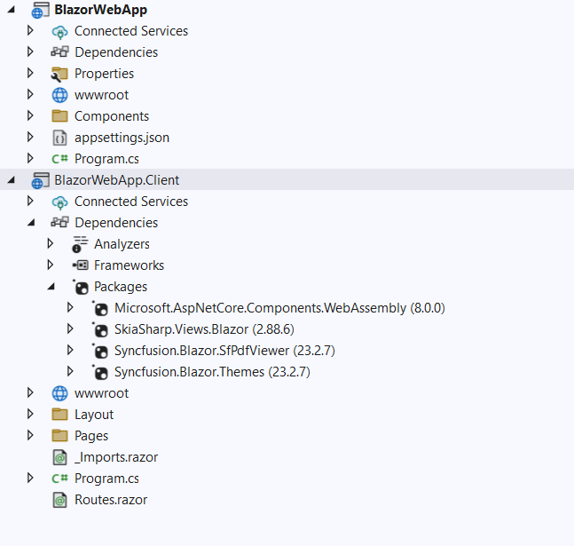

# View PDF files using the PDF Viewer in a Blazor Web App

This article describes how to add the Syncfusion&reg; Blazor PDF Viewer component to a Blazor Web App using [Visual Studio](https://visualstudio.microsoft.com/vs/) or Visual Studio Code.





## Prerequisites

* [System requirements for Blazor components](https://blazor.syncfusion.com/documentation/system-requirements)

* If using an interactive render mode such as WebAssembly or Auto, ensure the required .NET workloads are installed for SkiaSharp usage in a Blazor Web App. Run the following command:
    * dotnet workload install wasm-tools

## Create a new Blazor Web App in Visual Studio

You can create a Blazor Web App using Visual Studio 2022 via [Microsoft Templates](https://learn.microsoft.com/en-us/aspnet/core/blazor/tooling?view=aspnetcore-8.0&pivots=windows) or the [Syncfusion&reg; Blazor Extension](https://blazor.syncfusion.com/documentation/visual-studio-integration/template-studio).

Configure the appropriate [interactive render mode](https://learn.microsoft.com/en-us/aspnet/core/blazor/components/render-modes?view=aspnetcore-8.0#render-modes) and [interactivity location](https://learn.microsoft.com/en-us/aspnet/core/blazor/tooling?view=aspnetcore-8.0&pivots=windows) when creating a Blazor Web App.

## Install Blazor PDF Viewer NuGet package in Blazor Web App

To add **Blazor PDF Viewer** component in the app, open the NuGet package manager in Visual Studio (*Tools → NuGet Package Manager → Manage NuGet Packages for Solution*), search and install

* [Syncfusion.Blazor.SfPdfViewer](https://www.nuget.org/packages/Syncfusion.Blazor.SfPdfViewer) 
* [Syncfusion.Blazor.Themes](https://www.nuget.org/packages/Syncfusion.Blazor.Themes)

If using the WebAssembly or Auto interactive render mode, install the NuGet packages in the client project to add the component to the Web App.

N> Syncfusion&reg; uses SkiaSharp.Views.Blazor version 3.119.1. Ensure this version is referenced.
* [SkiaSharp.Views.Blazor](https://www.nuget.org/packages/SkiaSharp.Views.Blazor)





## Prerequisites

* [System requirements for Blazor components](https://blazor.syncfusion.com/documentation/system-requirements)

* If using an interactive render mode such as WebAssembly or Auto, ensure the required .NET workloads are installed for SkiaSharp usage in a Blazor Web App. Run the following command:
    * dotnet workload install wasm-tools

## Create a new Blazor Web App in Visual Studio Code

You can create a **Blazor Web App** using Visual Studio Code via [Microsoft Templates](https://learn.microsoft.com/en-us/aspnet/core/blazor/tooling?view=aspnetcore-8.0&pivots=vsc) or the [Syncfusion&reg; Blazor Extension](https://blazor.syncfusion.com/documentation/visual-studio-code-integration/create-project).

Configure the appropriate [interactive render mode](https://learn.microsoft.com/en-us/aspnet/core/blazor/components/render-modes?view=aspnetcore-8.0#render-modes) and [interactivity location](https://learn.microsoft.com/en-us/aspnet/core/blazor/tooling?view=aspnetcore-8.0&pivots=vsc) when creating a Blazor Web App.

For example, in a Blazor Web App with the `Auto` interactive render mode, use the following commands.




dotnet new blazor -o BlazorWebApp -int Auto
cd BlazorWebApp
cd BlazorWebApp.Client




N> For more information on creating a Blazor Web App with various interactive modes and locations, see [Render interactive modes](https://blazor.syncfusion.com/documentation/getting-started/blazor-web-app?tabcontent=visual-studio-code#render-interactive-modes).

## Install Syncfusion&reg; Blazor SfPdfViewer and Themes NuGet packages in the app

If using WebAssembly or Auto render modes in the Blazor Web App, install the Syncfusion&reg; Blazor component NuGet packages within the client project.

* Press <kbd>Ctrl</kbd>+<kbd>`</kbd> to open the integrated terminal in Visual Studio Code.
* Ensure you’re in the project root directory where your `.csproj` file is located.
* Run the following commands to install the [Syncfusion.Blazor.SfPdfViewer](https://www.nuget.org/packages/Syncfusion.Blazor.SfPdfViewer) and [Syncfusion.Blazor.Themes](https://www.nuget.org/packages/Syncfusion.Blazor.Themes/) NuGet packages and ensure all dependencies are installed.





dotnet add package Syncfusion.Blazor.SfPdfViewer -v {{ site.releaseversion }}
dotnet add package Syncfusion.Blazor.Themes -v {{ site.releaseversion }}
dotnet restore





N> Syncfusion&reg; Blazor components are available on [nuget.org](https://www.nuget.org/packages?q=syncfusion.blazor). See [NuGet packages](https://blazor.syncfusion.com/documentation/nuget-packages) for the list of available packages and component details.

N> Syncfusion&reg; uses [SkiaSharp.Views.Blazor](https://www.nuget.org/packages/SkiaSharp.Views.Blazor) version 3.119.1. Ensure this version is referenced.
* dotnet add package SkiaSharp.Views.Blazor -v 3.119.1





## Register Syncfusion&reg; Blazor Service

| Interactive Render Mode | Description |
| -- | -- |
| WebAssembly or Auto | Open **~/_Imports.razor** from the client project.|
| Server | Open **~/Components/_Imports.razor**.|

* In the **~/_Imports.razor** file, add the following namespaces:




@using Syncfusion.Blazor;
@using Syncfusion.Blazor.SfPdfViewer;




* Register the Syncfusion&reg; Blazor Service in the **~/Program.cs** file of your Blazor Web App.

If the interactive render mode is set to WebAssembly or Auto, register the Syncfusion&reg; Blazor service in both **~/Program.cs** files of the Blazor Web App.

If the interactive render mode is set to Server, the project contains a single **~/Program.cs** file. Register the Syncfusion&reg; Blazor Service only in that file.




using BlazorWebAppServer.Components;
using Syncfusion.Blazor;

var builder = WebApplication.CreateBuilder(args);

builder.Services.AddRazorComponents() 
        .AddInteractiveServerComponents();

builder.Services.AddSignalR(o => { o.MaximumReceiveMessageSize = 102400000; });

builder.Services.AddMemoryCache();
//Add Syncfusion Blazor service to the container.
builder.Services.AddSyncfusionBlazor();

var app = builder.Build();

if (!app.Environment.IsDevelopment())
{
    app.UseExceptionHandler("/Error", createScopeForErrors: true);
    app.UseHsts();
}

app.UseHttpsRedirection();
app.UseStaticFiles();
app.UseAntiforgery();

app.MapRazorComponents<App>()
    .AddInteractiveServerRenderMode();

app.Run();





using BlazorWebApp.Client.Pages;
using BlazorWebApp.Components;
using Syncfusion.Blazor;

var builder = WebApplication.CreateBuilder(args);
builder.Services.AddRazorComponents()
.AddInteractiveWebAssemblyComponents();

builder.Services.AddMemoryCache();
//Add Syncfusion Blazor service to the container
builder.Services.AddSyncfusionBlazor();

var app = builder.Build();
if (app.Environment.IsDevelopment())
{
app.UseWebAssemblyDebugging();
}
else
{
app.UseExceptionHandler("/Error", createScopeForErrors: true);
    app.UseHsts();
}

app.UseHttpsRedirection();
app.UseStaticFiles();
app.UseAntiforgery();

app.MapRazorComponents<App>()
    .AddInteractiveWebAssemblyRenderMode()
    .AddAdditionalAssemblies(typeof(Counter).Assembly);

app.Run();





using BlazorWebAppAuto.Client.Pages;
using BlazorWebAppAuto.Components;
using Syncfusion.Blazor;

var builder = WebApplication.CreateBuilder(args);
builder.Services.AddRazorComponents()
.AddInteractiveServerComponents() .AddInteractiveWebAssemblyComponents();

builder.Services.AddSignalR(o => { o.MaximumReceiveMessageSize = 102400000; });

builder.Services.AddMemoryCache();
//Add Syncfusion Blazor service to the container
builder.Services.AddSyncfusionBlazor();

var app = builder.Build();
if (app.Environment.IsDevelopment())
{
app.UseWebAssemblyDebugging();
}
else
{ app.UseExceptionHandler("/Error", createScopeForErrors: true);
    app.UseHsts();
}
app.UseHttpsRedirection();
app.UseStaticFiles();
app.UseAntiforgery();

app.MapRazorComponents<App>()
.AddInteractiveServerRenderMode() .AddInteractiveWebAssemblyRenderMode()
    .AddAdditionalAssemblies(typeof(Counter).Assembly);




N> [Processing Large Files Without Increasing Maximum Message Size in SfPdfViewer Component](../faqs/how-to-processing-large-files-without-increasing-maximum-message-size)

## Adding stylesheet and script

Add the following stylesheet and script to the head section of the **~/Components/App.razor** file.




<head>
    <!-- Syncfusion Blazor PDF Viewer control's theme style sheet -->
    <link href="_content/Syncfusion.Blazor.Themes/bootstrap5.css" rel="stylesheet" />
</head>
<body>
    <!-- Syncfusion Blazor PDF Viewer control's scripts -->
    
</body>




## Adding Blazor PDF Viewer Component

Add the Syncfusion&reg; PDF Viewer (Next-Gen) component in the **~Pages/.razor** file. If the interactivity location is set to Per page/component, define a render mode at the top of the **~Pages/.razor** component as follows:

| Interactivity location | RenderMode | Code |
| --- | --- | --- |
| Per page/component | Auto | @rendermode InteractiveAuto |
|  | WebAssembly | @rendermode InteractiveWebAssembly |
|  | Server | @rendermode InteractiveServer |
|  | None | --- |

N> If the interactivity location is set to Global and the render mode is set to Auto, WebAssembly, or Server, the render mode is configured in the App.razor file by default.




@* Your App render mode define here *@
@rendermode InteractiveAuto




N> If the interactivity location is set to Global, a render mode does not need to be specified per page. The interactivity mode applies to the entire app.

Add the Syncfusion&reg; PDF Viewer component in the **~/Pages/Index.razor** file.




@page "/"
<SfPdfViewer2 DocumentPath="https://cdn.syncfusion.com/content/pdf/pdf-succinctly.pdf"
              Height="100%"
              Width="100%">
</SfPdfViewer2>




N> If the [DocumentPath](https://help.syncfusion.com/cr/blazor/Syncfusion.Blazor.SfPdfViewer.PdfViewerBase.html#Syncfusion_Blazor_SfPdfViewer_PdfViewerBase_DocumentPath) property is not set, the PDF Viewer renders without loading a PDF document. Users can use the **Open** option in the toolbar to browse and open a PDF as needed.

## Run the application

Run the application to display the PDF file in the Syncfusion&reg; Blazor PDF Viewer component in the browser.



N> [View the sample on GitHub](https://github.com/SyncfusionExamples/Blazor-Getting-Started-Examples/tree/main/PDFViewer2/NET10/PDFViewer2_WebApp).

## See also

* [Getting Started with Blazor PDF Viewer Component in Blazor WASM App](./web-assembly-application)

* [Getting Started with Blazor PDF Viewer Component in WSL mode](../deployment/wsl-application)

* [Learn different ways to add script reference in Blazor Application](https://blazor.syncfusion.com/documentation/common/adding-script-references)

* [Processing Large Files Without Increasing Maximum Message Size in SfPdfViewer Component](../faqs/how-to-processing-large-files-without-increasing-maximum-message-size)

* [.NET 9 Native Linking Issues with SkiaSharp and Emscripten 3.1.56](https://help.syncfusion.com/document-processing/faq/how-to-fix-skiasharp-native-reference-issue-in-blazor-net90-app)
