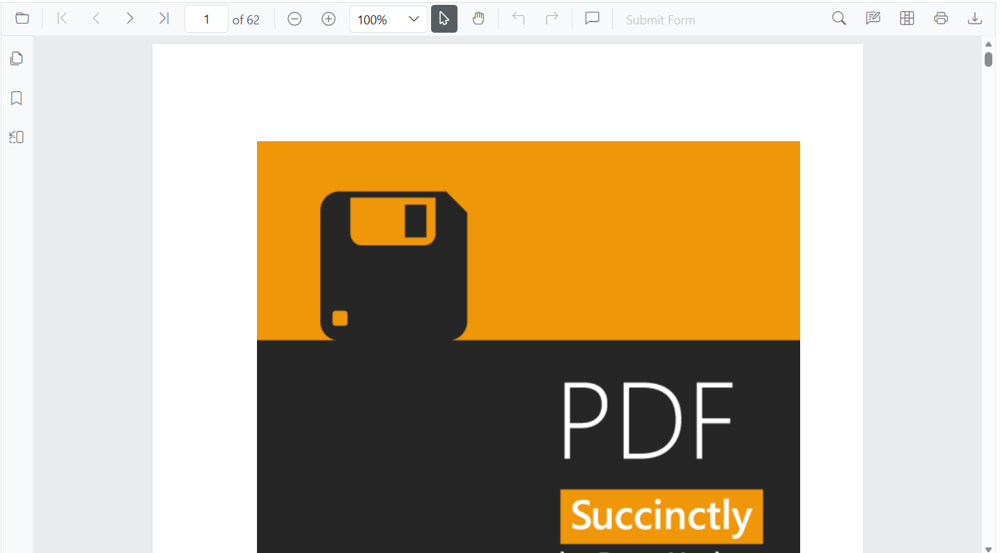

# Getting Started with the PDF Viewer in Blazor WebAssembly (WASM) app

This section explains how to include the [Blazor PDF Viewer](https://www.syncfusion.com/pdf-viewer-sdk/blazor-pdf-viewer) component in a Blazor WebAssembly App using [Visual Studio](https://visualstudio.microsoft.com/vs/) and [Visual Studio Code](https://code.visualstudio.com/).





## Prerequisites

* [System requirements for Blazor components](https://blazor.syncfusion.com/documentation/system-requirements)

### Install the required .NET workloads

If using **WebAssembly** Application, install the required workload for SkiaSharp. Run the following command in a command prompt (Windows), terminal (macOS), or shell (Linux):




dotnet workload install wasm-tools

 


The `wasm-tools` workload is installed for the active .NET SDK. When targeting a different .NET SDK version, ensure that the corresponding version-specific workload is installed.

## Create a new Blazor App in Visual Studio

You can create a **Blazor WebAssembly App** using Visual Studio via [Microsoft Templates](https://learn.microsoft.com/en-us/aspnet/core/blazor/tooling?view=aspnetcore-10.0&pivots=vs) or the [Syncfusion&reg; Blazor Extension](https://blazor.syncfusion.com/documentation/visual-studio-integration/template-studio).

## Install Blazor SfPdfViewer and Themes NuGet Packages

To add the **Blazor SfPdfViewer (Next-Gen)** component in the app, open the NuGet package manager in Visual Studio (*Tools → NuGet Package Manager → Manage NuGet Packages for Solution*), search and install [Syncfusion.Blazor.SfPdfViewer](https://www.nuget.org/packages/Syncfusion.Blazor.SfPdfViewer), [Syncfusion.Blazor.Themes](https://www.nuget.org/packages/Syncfusion.Blazor.Themes/), and [SkiaSharp.Views.Blazor](https://www.nuget.org/packages/SkiaSharp.Views.Blazor/) (version `3.119.1`).

Alternatively, you can use the following package manager command.




Install-Package Syncfusion.Blazor.SfPdfViewer -Version {{ site.releaseversion }}
Install-Package Syncfusion.Blazor.Themes -Version {{ site.releaseversion }}
Install-Package SkiaSharp.Views.Blazor -Version 3.119.1




N>
* Syncfusion&reg; Blazor components are available on [nuget.org](https://www.nuget.org/packages?q=syncfusion.blazor). Refer to [NuGet packages](https://blazor.syncfusion.com/documentation/nuget-packages) for a list of available packages.
* Syncfusion&reg; uses [SkiaSharp.Views.Blazor version 3.119.1](https://www.nuget.org/packages/SkiaSharp.Views.Blazor/3.119.1). Ensure this exact version to avoid runtime issues.





## Prerequisites

* [System requirements for Blazor components](https://blazor.syncfusion.com/documentation/system-requirements)

### Install the required .NET workloads

If using **WebAssembly** Application, install the required workload for SkiaSharp. Run the following command in a command prompt (Windows), terminal (macOS), or shell (Linux):




dotnet workload install wasm-tools

 


The `wasm-tools` workload is installed for the active .NET SDK. When targeting a different .NET SDK version, ensure that the corresponding version-specific workload is installed.

## Create a new Blazor App in Visual Studio Code

Create a **Blazor WebAssembly App** using Visual Studio Code via [Microsoft Templates](https://learn.microsoft.com/en-us/aspnet/core/blazor/tooling?view=aspnetcore-10.0&pivots=vsc) or the [Syncfusion&reg; Blazor Extension](https://blazor.syncfusion.com/documentation/visual-studio-code-integration/create-project).

Alternatively, create a WebAssembly application from the integrated terminal (open with <kbd>Ctrl</kbd>+<kbd>`</kbd>).





dotnet new blazorwasm -o BlazorApp
cd BlazorApp





## Install Blazor SfPdfViewer and Themes NuGet Packages

Press <kbd>Ctrl</kbd>+<kbd>`</kbd> to open the integrated terminal in Visual Studio Code.

* Ensure you are in the project root directory where your `.csproj` file is located.
* Run the following command to install [Syncfusion.Blazor.SfPdfViewer](https://www.nuget.org/packages/Syncfusion.Blazor.SfPdfViewer), [Syncfusion.Blazor.Themes](https://www.nuget.org/packages/Syncfusion.Blazor.Themes/), and [SkiaSharp.Views.Blazor](https://www.nuget.org/packages/SkiaSharp.Views.Blazor/) (version `3.119.1`), and to ensure all dependencies are restored.





dotnet add package Syncfusion.Blazor.SfPdfViewer -v {{ site.releaseversion }}
dotnet add package Syncfusion.Blazor.Themes -v {{ site.releaseversion }}
dotnet add package SkiaSharp.Views.Blazor -v 3.119.1
dotnet restore





N>
* Syncfusion&reg; Blazor components are available on [nuget.org](https://www.nuget.org/packages?q=syncfusion.blazor). Refer to [NuGet packages](https://blazor.syncfusion.com/documentation/nuget-packages) for a list of available packages.
* Syncfusion&reg; uses [SkiaSharp.Views.Blazor version 3.119.1](https://www.nuget.org/packages/SkiaSharp.Views.Blazor/3.119.1). Ensure this exact version to avoid runtime issues.





## Prerequisites

Install the latest version of [.NET SDK](https://dotnet.microsoft.com/en-us/download). If the .NET SDK is already installed, determine the installed version by running the following command in a command prompt (Windows), terminal (macOS), or command shell (Linux).




dotnet --version




### Install the required .NET workloads

If using **WebAssembly** Application, install the required workload for SkiaSharp. Run the following command in a command prompt (Windows), terminal (macOS), or shell (Linux):




dotnet workload install wasm-tools

 


The `wasm-tools` workload is installed for the active .NET SDK. When targeting a different .NET SDK version, ensure that the corresponding version-specific workload is installed.

## Create a Blazor WebAssembly App using .NET CLI

Run the following command to create a new Blazor WebAssembly App in a command prompt (Windows), terminal (macOS), or command shell (Linux). For detailed instructions, refer to the [Blazor WASM App Getting Started](https://blazor.syncfusion.com/documentation/getting-started/blazor-webassembly-app?tabcontent=.net-cli) documentation.




dotnet new blazorwasm -o BlazorApp
cd BlazorApp




## Install Blazor SfPdfViewer and Themes NuGet in the App

After creating the Blazor WebAssembly App, install the required Syncfusion NuGet packages using the .NET CLI.

* Open a command prompt, terminal, or shell.
* Ensure you are in the project root directory where your `.csproj` file is located.
* Run the following command to install [Syncfusion.Blazor.SfPdfViewer](https://www.nuget.org/packages/Syncfusion.Blazor.SfPdfViewer), [Syncfusion.Blazor.Themes](https://www.nuget.org/packages/Syncfusion.Blazor.Themes/), and [SkiaSharp.Views.Blazor](https://www.nuget.org/packages/SkiaSharp.Views.Blazor/) (version `3.119.1`), and to ensure all dependencies are restored.





dotnet add package Syncfusion.Blazor.SfPdfViewer -v {{ site.releaseversion }}
dotnet add package Syncfusion.Blazor.Themes -v {{ site.releaseversion }}
dotnet add package SkiaSharp.Views.Blazor -v 3.119.1
dotnet restore





N> Syncfusion&reg; uses [SkiaSharp.Views.Blazor version 3.119.1](https://www.nuget.org/packages/SkiaSharp.Views.Blazor/3.119.1). Ensure this exact version to avoid runtime issues.





## Add import namespaces

After the package is installed, open the `~/_Imports.razor` file and import the `Syncfusion.Blazor` and `Syncfusion.Blazor.SfPdfViewer` namespaces.




@using Syncfusion.Blazor
@using Syncfusion.Blazor.SfPdfViewer




Add the `Syncfusion.Blazor` namespace to the `Program.cs` file.




using Syncfusion.Blazor;




## Register Syncfusion&reg; Blazor Service

Register the Syncfusion&reg; Blazor service in the `~/Program.cs` file after the **builder** is created in your Blazor WebAssembly App.




// Enable memory caching
builder.Services.AddMemoryCache();
// Register Syncfusion Blazor service
builder.Services.AddSyncfusionBlazor();




## Add stylesheet and script resources

The theme stylesheet and script are exposed from NuGet through [Static Web Assets](https://blazor.syncfusion.com/documentation/appearance/themes#static-web-assets). The paths below assume a **Blazor WebAssembly Standalone** project; for hosted or Blazor Web App projects, the same `_content/...` paths apply in the host `wwwroot/index.html`.

Add the stylesheet at the end of the `<head>` section in the `wwwroot/index.html` file to apply proper layout and theme styling.




<!-- Blazor PDF Viewer control's theme style sheet -->
<link href="_content/Syncfusion.Blazor.Themes/bootstrap5.css" rel="stylesheet" />




Add the required script at the end of the `<body>` section in the `wwwroot/index.html` file to enable component functionality.




<!-- Blazor PDF Viewer control's scripts -->




## Add Blazor PDF Viewer Component

Add the Blazor PDF Viewer (Next-Gen) component to `~/Pages/Home.razor`.




<SfPdfViewer2 DocumentPath="https://cdn.syncfusion.com/content/pdf/pdf-succinctly.pdf"
              Height="100%"
              Width="100%">
</SfPdfViewer2>




N> If the [DocumentPath](https://help.syncfusion.com/cr/blazor/Syncfusion.Blazor.SfPdfViewer.PdfViewerBase.html#Syncfusion_Blazor_SfPdfViewer_PdfViewerBase_DocumentPath) property is not set, the PDF Viewer displays an empty viewer without a document. Use the **Open** toolbar option to browse and open a PDF.

## Run the application

* Press <kbd>F5</kbd> or <kbd>Ctrl</kbd>+<kbd>F5</kbd> (Windows) or <kbd>⌘</kbd>+<kbd>F5</kbd> (macOS) in the IDE to launch the application. From the CLI, run `dotnet run` from the project folder. The Blazor PDF Viewer will render in your default web browser.

## Next steps

* To learn how to open, save, or manage PDF documents in the PDF Viewer component, see [Open and Save PDF files](../opening-pdf-file).
* To learn how to add and manage highlights, strike-through, free text, and shape annotations in the PDF Viewer component, see [Annotations](../annotation/overview).
* To learn how to read, fill, and work with AcroForm fields in the PDF Viewer component, see [Form filling](../forms/form-filling).
* To learn how to add, remove, and rearrange toolbar items in the PDF Viewer component, see [Toolbar customization](../toolbar/overview).

You can also experiment directly using the interactive playground below for a quick demo.



N>
* For a hands-on reference with working code examples, explore the sample projects on [GitHub](https://github.com/SyncfusionExamples/Blazor-Getting-Started-Examples/tree/main/PDFViewer2/NET10/PDFViewer2_WasmStandalone).
* For an overview, features, pricing, and full documentation, visit the [Blazor PDF Viewer](https://www.syncfusion.com/pdf-viewer-sdk/blazor-pdf-viewer) page.

## See also

* [Getting Started with the Blazor PDF Viewer in a Blazor Web App Server app](./web-app)
* [Getting Started with the Blazor PDF Viewer in WSL mode](../deployment/wsl-application)
* [.NET 9 Native Linking Issues with SkiaSharp and Emscripten 3.1.56](https://help.syncfusion.com/document-processing/faq/how-to-fix-skiasharp-native-reference-issue-in-blazor-net90-app)