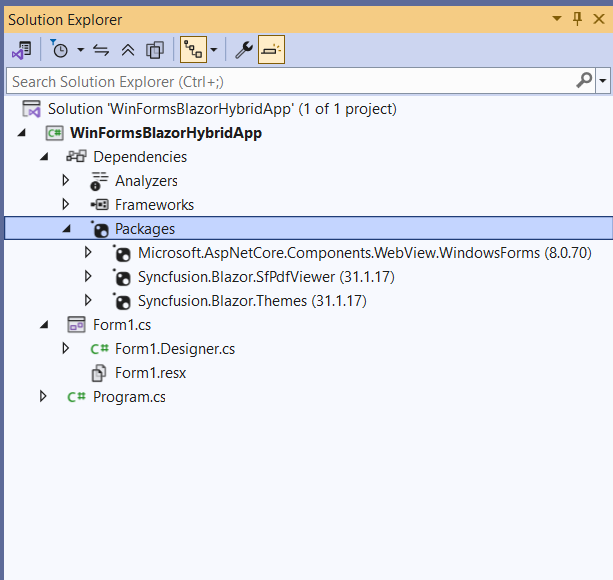
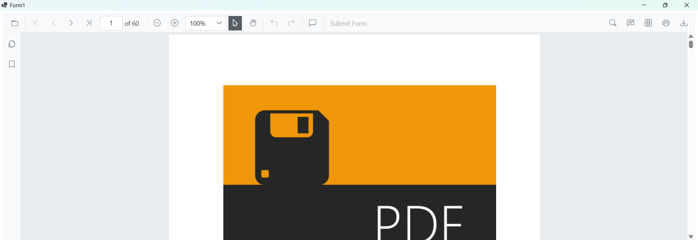

# Getting Started with the PDF Viewer in a WinForms Blazor Hybrid App

This section explains how to add the Blazor SfPdfViewer to a WinForms Blazor Hybrid App using [Visual Studio](https://visualstudio.microsoft.com/vs/) or Visual Studio Code. The result is a desktop (WinForms) application that hosts Blazor UI inside a BlazorWebView control.





## Prerequisites

* [System requirements for Blazor components](https://blazor.syncfusion.com/documentation/system-requirements)
* .NET 8.0 SDK installed (required by the pinned `Microsoft.AspNetCore.Components.WebView.WindowsForms` 8.0.16 package).
* Visual Studio 2022 version 17.8 or later with the **.NET desktop development** workload installed.

## Create a new WinForms app in Visual Studio

1. Open Visual Studio 2022.
2. Go to **File → New → Project…**.
3. Choose the **Windows Forms App (.NET)** template (C#) and click **Next**.
4. Set the project name to `WinFormsBlazorHybridApp` (or any preferred name) and click **Next**.
5. From the **Framework** dropdown, select **.NET 8.0 (Long Term Support)** and click **Create**.

The app hosts Blazor components via BlazorWebView. For reference, see [Microsoft Blazor tooling](https://learn.microsoft.com/en-us/aspnet/core/blazor/tooling?view=aspnetcore-8.0&pivots=windows) or the [Syncfusion&reg; Blazor Extension](https://blazor.syncfusion.com/documentation/visual-studio-integration/template-studio).

## Install Blazor PDF Viewer NuGet packages

To add the Blazor PDF Viewer component, open the NuGet package manager in Visual Studio (**Tools → NuGet Package Manager → Manage NuGet Packages for Solution**), then install:

* [Syncfusion.Blazor.SfPdfViewer](https://www.nuget.org/packages/Syncfusion.Blazor.SfPdfViewer)
* [Syncfusion.Blazor.Themes](https://www.nuget.org/packages/Syncfusion.Blazor.Themes)
* [Microsoft.AspNetCore.Components.WebView.WindowsForms](https://www.nuget.org/packages/Microsoft.AspNetCore.Components.WebView.WindowsForms)

N> Ensure the package `Microsoft.AspNetCore.Components.WebView.WindowsForms` is updated to version `8.0.16` so it is compatible with the .NET 8 target framework used by this tutorial.





## Prerequisites

* [System requirements for Blazor components](https://blazor.syncfusion.com/documentation/system-requirements)

## Create a new WinForms app in Visual Studio Code

Create a WinForms desktop project (not a WinForms Blazor Hybrid App) using the .NET CLI in Visual Studio Code. This WinForms project hosts Blazor UI through BlazorWebView. For guidance, see [Microsoft templates](https://learn.microsoft.com/en-us/aspnet/core/blazor/tooling?view=aspnetcore-8.0&pivots=vsc) or the [Syncfusion&reg; Blazor Extension](https://blazor.syncfusion.com/documentation/visual-studio-code-integration/create-project).




dotnet new winforms -n WinFormsBlazorHybridApp




## Install Blazor SfPdfViewer and Themes NuGet packages in the app

Install the required NuGet packages in the WinForms project that will host the Blazor UI.

* Press <kbd>Ctrl</kbd>+<kbd>`</kbd> to open the integrated terminal in Visual Studio Code.
* Ensure the current directory contains the WinForms project `.csproj` file.
* Run the following commands to install [Syncfusion.Blazor.SfPdfViewer](https://www.nuget.org/packages/Syncfusion.Blazor.SfPdfViewer), [Syncfusion.Blazor.Themes](https://www.nuget.org/packages/Syncfusion.Blazor.Themes/), and [Microsoft.AspNetCore.Components.WebView.WindowsForms](https://www.nuget.org/packages/Microsoft.AspNetCore.Components.WebView.WindowsForms). This adds the PDF Viewer, theme, and the BlazorWebView host control.





dotnet add package Syncfusion.Blazor.SfPdfViewer -v {{ site.releaseversion }}
dotnet add package Syncfusion.Blazor.Themes -v {{ site.releaseversion }}
dotnet add package Microsoft.AspNetCore.Components.WebView.WindowsForms
dotnet restore





N>
* Syncfusion&reg; Blazor components are available on [nuget.org](https://www.nuget.org/packages?q=syncfusion.blazor). See [NuGet packages](https://blazor.syncfusion.com/documentation/nuget-packages) for package details.
* Ensure the package `Microsoft.AspNetCore.Components.WebView.WindowsForms` is updated to version `8.0.16` so it is compatible with the .NET 8 target framework used by this tutorial.





## Configure the WinForms project

The WinForms project must target Windows, enable WinForms, and opt in to Razor components so that BlazorWebView and Syncfusion&reg; Blazor components can be hosted. A complete `WinFormsBlazorHybridApp.csproj` looks like the following.

 


<Project Sdk="Microsoft.NET.Sdk.Razor">

    ....

</Project>




N> The `Microsoft.AspNetCore.Components.WebView.WindowsForms` 8.0.16 package requires `TargetFramework` to be `net8.0-windows` (or any `net8.0-*` TFM) and `UseRazorComponents` to be `true`.

## Create the Component folder and _Imports.razor

1. Right-click the project node in **Solution Explorer** and select **Add → New Folder**. Name it `Components`.
2. Right-click the new `Components` folder and select **Add → New Item → Razor Component**. Name it `_Imports.razor`.
3. Add the required namespaces to the `_Imports.razor` file so they apply to every Razor component in this folder.




@using Microsoft.AspNetCore.Components.Web
@using Syncfusion.Blazor
@using Syncfusion.Blazor.SfPdfViewer




## Create the wwwroot folder and index.html

* In **Solution Explorer**, right-click the project and select **Add → New Folder**. Name it `wwwroot`.
* Right-click the `wwwroot` folder and select **Add → New Item → HTML Page**. Name it `index.html`. This file becomes the host page for the Blazor UI; it initializes the Blazor runtime and loads static assets such as themes and scripts.




<!DOCTYPE html>
<html>
<head>
    <meta charset="utf-8" />
    <meta name="viewport" content="width=device-width, initial-scale=1.0" />
    <title>WinForms Blazor Hybrid App</title>
    <base href="/" />
    <link href="_content/Syncfusion.Blazor.Themes/bootstrap5.css" rel="stylesheet" />
</head>
<body>
    
Loading...

    
    
</body>
</html>




* In **Solution Explorer**, right-click `wwwroot/index.html`, choose **Properties**, and set **Build Action** to **Content** and **Copy to Output Directory** to **Copy if newer** so the file is deployed next to the WinForms executable.

N> Ensure that the PDF Viewer static assets (themes and scripts) are loaded properly. If they are missing, the viewer UI will render without styling or scripting.

## Register Syncfusion&reg; Blazor services and the BlazorWebView

Add the following `using` directives to `Form1.cs` so the WinForms host can resolve Blazor types and the project's `Components` namespace.




using Microsoft.AspNetCore.Components.WebView.WindowsForms;
using Microsoft.Extensions.DependencyInjection;
using Syncfusion.Blazor;
using WinFormsBlazorHybridApp.Components;




Register the Syncfusion&reg; Blazor services and the BlazorWebView in `Form1.cs` so the WinForms window can host Blazor components.




ServiceCollection services = new ServiceCollection();
services.AddWindowsFormsBlazorWebView();
services.AddMemoryCache();
services.AddSyncfusionBlazor();
BlazorWebView blazorWebView = new BlazorWebView()
{
    HostPage = "wwwroot\\index.html",
    Services = services.BuildServiceProvider(),
    Dock = DockStyle.Fill
};
blazorWebView.RootComponents.Add<YourRazorFileName>("#app");
<!-- Replace 'YourRazorFileName' with the actual Razor component class (e.g., Main) in your project's namespace -->
this.Controls.Add(blazorWebView);




N> Replace `WinFormsBlazorHybridApp.Components` with the actual root namespace of your project if it differs from the project name.

## Add the Blazor PDF Viewer component

Create a Razor component inside the **Components** folder. In **Solution Explorer**, right-click `Components`, choose **Add → New Item → Razor Component**, and name it `PdfViewer.razor`.




@using Syncfusion.Blazor.SfPdfViewer

<SfPdfViewer2 DocumentPath="https://cdn.syncfusion.com/content/pdf/pdf-succinctly.pdf"
              Height="100%"
              Width="100%" />



N>
* If the [DocumentPath](https://help.syncfusion.com/cr/blazor/Syncfusion.Blazor.SfPdfViewer.PdfViewerBase.html#Syncfusion_Blazor_SfPdfViewer_PdfViewerBase_DocumentPath) property is not set, the PDF Viewer renders without loading a document. Users can use the **Open** toolbar option to browse and open a PDF.
* `DocumentPath` can point to a remote URL (as shown), a relative URL to a file copied to `wwwroot`, or a stream/byte array supplied programmatically. When loading a local file, ensure the file is configured to copy to the output directory.

## Run the app

* **Visual Studio:** Press <kbd>F5</kbd> (with debugging) or <kbd>Ctrl</kbd>+<kbd>F5</kbd> (without debugging).
* **Visual Studio Code:** From the terminal, run `dotnet run` in the project folder.

The Blazor PDF Viewer renders inside the WinForms window.

N> [View the sample on GitHub](https://github.com/SyncfusionExamples/blazor-pdf-viewer-examples/tree/master/Getting%20Started/Blazor%20Hybrid%20-%20WinForms). Looking for the full Blazor PDF Viewer component overview, features, pricing, and documentation? Visit the [Blazor PDF Viewer](https://www.syncfusion.com/pdf-viewer-sdk/blazor-pdf-viewer) page.

## See also

* [Getting Started with Blazor PDF Viewer Component in Blazor WASM App](./web-assembly-application)
* [Getting Started with Blazor PDF Viewer Component in Blazor Web App](./web-app)
* [Getting Started with Blazor PDF Viewer Component in WPF Blazor Hybrid App](./wpf-blazor-app)
* [Getting Started with Blazor PDF Viewer Component in MAUI Blazor App](./maui-blazor-app)

* [Processing Large Files Without Increasing Maximum Message Size in SfPdfViewer Component](../faqs/how-to-processing-large-files-without-increasing-maximum-message-size)