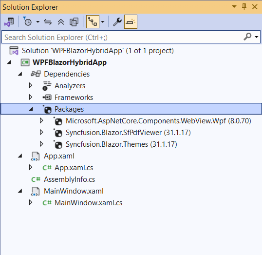
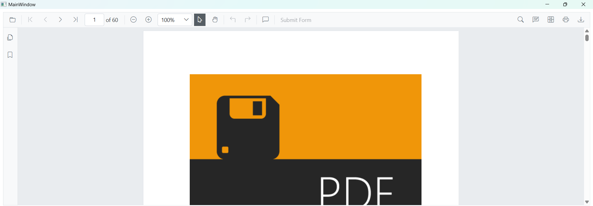

# Getting Started with the PDF Viewer in a WPF Blazor Hybrid App

This section explains how to add the Blazor PDF Viewer to a WPF Blazor Hybrid app using [Visual Studio](https://visualstudio.microsoft.com/vs/) or [Visual Studio Code](https://code.visualstudio.com/). The result is a desktop (WPF) application that hosts Blazor UI inside a `BlazorWebView` control.





## Prerequisites

* [System requirements for Blazor components](https://blazor.syncfusion.com/documentation/system-requirements)
* Install the **.NET 8 SDK** (or later) and the **.NET desktop development** workload in Visual Studio 2022 (includes the WPF template and the `Microsoft.WindowsDesktop.App` runtime).
* If you are not using the [Syncfusion&reg; Blazor Extension](https://blazor.syncfusion.com/documentation/visual-studio-integration/template-studio), make sure the [Syncfusion NuGet feed](https://www.nuget.org/packages?q=syncfusion.blazor) is reachable.
* A valid Syncfusion license key. Register it as described in [How to register a license in an application](https://help.syncfusion.com/common/essential-studio/licensing/how-to-register-in-an-application).

## Create a new WPF app in Visual Studio

1. In Visual Studio 2022, choose **Create a new project**.
2. Select the **WPF Application** (or **WPF App (.NET)**) template for **C#**, then choose **Next**.
3. Set the project name (for example, `WPFBlazorHybridApp`) and the solution name, then choose **Next**.
4. Set the **Target framework** to **.NET 8.0 (Long-term support)** and choose **Create**. The WPF project will host Blazor components through `BlazorWebView`.

For more details, see [Microsoft Blazor tooling](https://learn.microsoft.com/en-us/aspnet/core/blazor/tooling?view=aspnetcore-8.0&pivots=windows) or the [Syncfusion&reg; Blazor Extension](https://blazor.syncfusion.com/documentation/visual-studio-integration/template-studio).

## Install Blazor PDF Viewer NuGet packages

To add the Blazor PDF Viewer component, open the NuGet package manager in Visual Studio (Tools → NuGet Package Manager → Manage NuGet Packages for Solution), then install:

* [Syncfusion.Blazor.SfPdfViewer](https://www.nuget.org/packages/Syncfusion.Blazor.SfPdfViewer) — version `{{ site.releaseversion }}`
* [Syncfusion.Blazor.Themes](https://www.nuget.org/packages/Syncfusion.Blazor.Themes) — version `{{ site.releaseversion }}`
* [Microsoft.AspNetCore.Components.WebView.Wpf](https://www.nuget.org/packages/Microsoft.AspNetCore.Components.WebView.Wpf) — version `8.0.16` or later
* [Microsoft.Extensions.Caching.Memory](https://www.nuget.org/packages/Microsoft.Extensions.Caching.Memory) — required by `AddMemoryCache()`

N> Ensure the package `Microsoft.AspNetCore.Components.WebView.Wpf` is at least version `8.0.16`.





## Prerequisites

* [System requirements for Blazor components](https://blazor.syncfusion.com/documentation/system-requirements)
* Install the **.NET 8 SDK** (or later). On Windows, also install the **.NET 8 Desktop Runtime** (provides the WPF/AppContext runtime).
* A valid Syncfusion license key. Register it as described in [How to register a license in an application](https://help.syncfusion.com/common/essential-studio/licensing/how-to-register-in-an-application).
* The [Syncfusion&reg; Blazor Extension](https://blazor.syncfusion.com/documentation/visual-studio-integration/template-studio) (optional, but recommended for scaffolding).

## Create a new WPF app in Visual Studio Code

Create a WPF desktop project using the .NET CLI. This WPF project will host the Blazor UI through `BlazorWebView`.




dotnet new wpf -n WPFBlazorHybridApp -f net8.0-windows




For guidance, see [Microsoft templates](https://learn.microsoft.com/en-us/aspnet/core/blazor/tooling?view=aspnetcore-8.0&pivots=vsc) or the [Syncfusion&reg; Blazor Extension](https://blazor.syncfusion.com/documentation/visual-studio-integration/template-studio).

## Install Blazor PDF Viewer NuGet packages

Install the required NuGet packages in the WPF project that will host the Blazor UI.

* Press <kbd>Ctrl</kbd>+<kbd>`</kbd> to open the integrated terminal in Visual Studio Code.
* Ensure the current directory contains the WPF project `.csproj` file.
* Run the following commands to install the required packages:





dotnet add package Syncfusion.Blazor.SfPdfViewer -v {{ site.releaseversion }}
dotnet add package Syncfusion.Blazor.Themes -v {{ site.releaseversion }}
dotnet add package Microsoft.AspNetCore.Components.WebView.Wpf -v 8.0.16
dotnet add package Microsoft.Extensions.Caching.Memory
dotnet restore





N>
* Syncfusion&reg; Blazor components are available on [nuget.org](https://www.nuget.org/packages?q=syncfusion.blazor). See [NuGet packages](https://blazor.syncfusion.com/documentation/nuget-packages) for package details.
* Ensure the package `Microsoft.AspNetCore.Components.WebView.Wpf` is at least version `8.0.16`.





## Configure the project file

The WPF project must target Windows, enable WPF, and use the Razor SDK. Open `WPFBlazorHybridApp.csproj` and make sure the project file contains the following:

 


<Project Sdk="Microsoft.NET.Sdk.Razor">

    ....

</Project>




## Add the Razor imports file

Create an `_Imports.razor` file at the project root (next to the `.csproj`) with the following content. This makes the namespaces available to all `.razor` files in the project without re-declaring them.




@using Microsoft.AspNetCore.Components.Web
@using Syncfusion.Blazor
@using Syncfusion.Blazor.SfPdfViewer




Add the `Syncfusion.Blazor` namespace to the `~/MainWindow.xaml.cs` file.




using Microsoft.Extensions.DependencyInjection;
using Syncfusion.Blazor;




Register Syncfusion Blazor services and BlazorWebView in `~/MainWindow.xaml.cs` so that the WPF window can host Blazor components.




InitializeComponent();
ServiceCollection services = new ServiceCollection();
services.AddWpfBlazorWebView();
services.AddMemoryCache();
services.AddSyncfusionBlazor();
Resources.Add("services", services.BuildServiceProvider());




## Create wwwroot folder and index.html file 

* Create a new folder named `wwwroot` in the WPF project root.

* Inside `wwwroot`, create an `index.html` host page for the Blazor UI. This host page initializes the Blazor runtime and loads static assets (themes and scripts). A basic `index.html` might look like the following:

 


<!DOCTYPE html>
<html>
<head>
    <meta charset="utf-8" />
    <meta name="viewport" content="width=device-width, initial-scale=1.0, maximum-scale=1.0, user-scalable=no" />
    <title>WPF Blazor Hybrid App</title>
    <base href="/" />
    <link href="_content/Syncfusion.Blazor.Themes/bootstrap5.css" rel="stylesheet" />
</head>
<body>
    
Loading...

    
    
</body>
</html>




N> Ensure that the PDF Viewer static assets (themes and scripts) are loaded properly.

## Add the Syncfusion PDF Viewer Razor component

Create a Razor component (for example, `Main.razor`) at the project root and add the Syncfusion PDF Viewer component. The `_Imports.razor` file you created earlier already provides the `Syncfusion.Blazor.SfPdfViewer` namespace, so an additional `@using` is not required.




<SfPdfViewer2 DocumentPath="https://cdn.syncfusion.com/content/pdf/pdf-succinctly.pdf"
              Height="100%"
              Width="100%">
</SfPdfViewer2>




N> If the [DocumentPath](https://help.syncfusion.com/cr/blazor/Syncfusion.Blazor.SfPdfViewer.PdfViewerBase.html#Syncfusion_Blazor_SfPdfViewer_PdfViewerBase_DocumentPath) property is not set, the PDF Viewer renders without loading a document. Users can use the **Open** toolbar option to browse and open a PDF.

## Integrate Blazor into MainWindow.xaml

1. Open `MainWindow.xaml`.
2. Add the `Microsoft.AspNetCore.Components.WebView.Wpf` namespace and a `local:` namespace that points to your project's root (this is used by the `RootComponent` mapping).
3. Embed the `BlazorWebView` control, set `HostPage` to `wwwroot/index.html`, and map a `RootComponent` whose `Selector` matches the `
` element in `index.html` and whose `ComponentType` matches the Razor component class you created (for example, `Main`).




<Window x:Class="WPFBlazorHybridApp.MainWindow"
        ....
        xmlns:blazor="clr-namespace:Microsoft.AspNetCore.Components.WebView.Wpf;assembly=Microsoft.AspNetCore.Components.WebView.Wpf"
        ....
        Title="MainWindow" Height="450" Width="800">
    <Grid>
        <blazor:BlazorWebView HostPage="wwwroot\index.html" Services="{DynamicResource services}">
            <blazor:BlazorWebView.RootComponents>
                <blazor:RootComponent Selector="#app" ComponentType="{x:Type local:YourRazorFileName}" />
                <!-- Replace 'YourRazorFileName' with the actual Razor component class (e.g., Main) in your project's namespace -->
            </blazor:BlazorWebView.RootComponents>
        </blazor:BlazorWebView>
    </Grid>
</Window>




## Run the app

**Visual Studio**: Press <kbd>F5</kbd> (Debug) or <kbd>Ctrl</kbd>+<kbd>F5</kbd> (Run without debugging).

**Visual Studio Code**: Run `dotnet run` from the project folder, or press <kbd>F5</kbd> if you have the C# extension's debugger configured.

The WPF window opens and the Blazor PDF Viewer renders inside the `BlazorWebView`.

## Next steps

* Looking for the full Blazor PDF Viewer component overview, features, and pricing? Visit the [Blazor PDF Viewer](https://www.syncfusion.com/pdf-viewer-sdk/blazor-pdf-viewer) page.

N> [View the sample on GitHub](https://github.com/SyncfusionExamples/blazor-pdf-viewer-examples/tree/master/Getting%20Started/Blazor%20Hybrid%20-%20WPF). Looking for the full Blazor PDF Viewer component overview, features, pricing, and documentation? Visit the [Blazor PDF Viewer](https://www.syncfusion.com/pdf-viewer-sdk/blazor-pdf-viewer) page.

## See also

* [Getting Started with Blazor PDF Viewer Component in Blazor WASM App](./web-assembly-application)
* [Getting Started with Blazor PDF Viewer Component in Blazor Web App](./web-app)
* [Getting Started with Blazor PDF Viewer Component in WinForms Blazor Hybrid App](./winforms-blazor-app)
* [Getting Started with Blazor PDF Viewer Component in MAUI Blazor App](./maui-blazor-app)
* [Processing Large Files Without Increasing Maximum Message Size in SfPdfViewer Component](../faqs/how-to-processing-large-files-without-increasing-maximum-message-size)