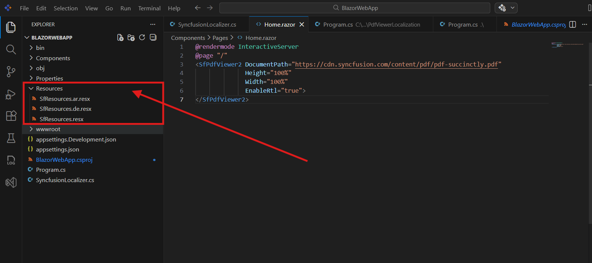
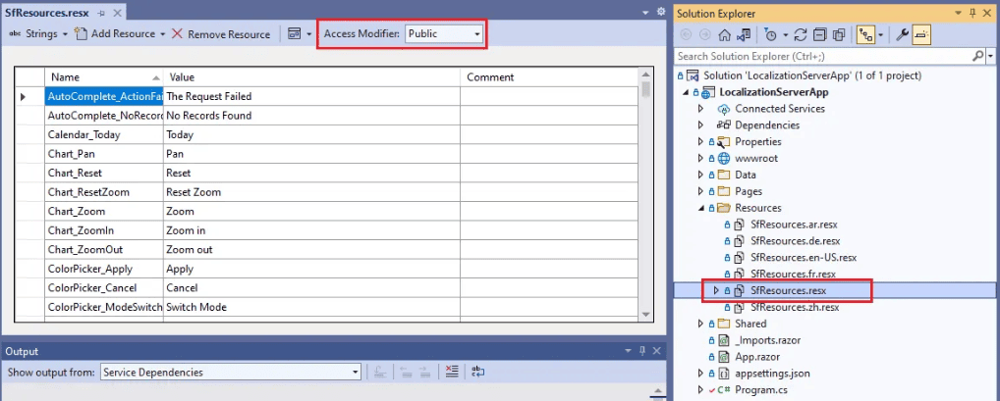
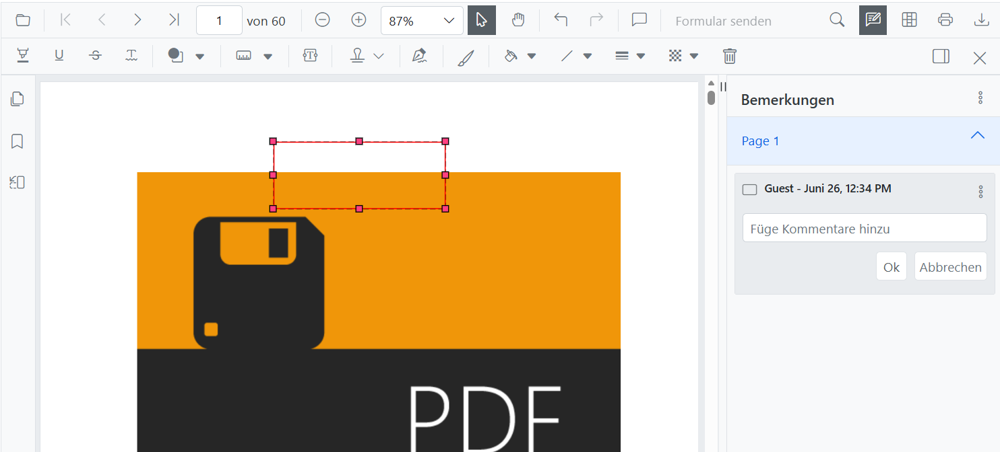

# Set Up Static Localization

This guide shows you how to enable static localization in your Blazor PDF Viewer application using culture-based resource files.

## Prerequisites

- A Blazor WebApp project (see [Getting Started](../getting-started/web-app))
- Syncfusion Blazor PDF Viewer installed
- Visual Studio 2022 or Visual Studio Code
- Basic knowledge of Blazor components and C#

## Supported Cultures

Blazor PDF Viewer supports multiple languages. Download culture-specific resource files from the [Syncfusion Blazor Locale GitHub repository](https://github.com/syncfusion/blazor-locale).

## Step 1: Create the Resources Folder

1. In your Blazor project root, create a new folder named `Resources`
2. This folder will contain all culture-specific .resx files

## Step 2: Add Culture-Based Resource Files

1. Navigate to the [Syncfusion Blazor Locale repository](https://github.com/syncfusion/blazor-locale)
2. Download the culture files you need (e.g., `SfResources.ar.resx` for Arabic)
3. Also download `SfResources.resx` (neutral/default culture)
4. Place all files in the `Resources` folder



**Folder structure example:**
```
YourBlazorApp/
├── Resources/
│   ├── SfResources.resx          (default)
│   ├── SfResources.ar.resx       (Arabic)
│   ├── SfResources.de.resx       (German)
│   └── SfResources.fr.resx       (French)
├── Program.cs
└── Pages/
```

## Step 3: Create the SyncfusionLocalizer Class

Create a new file named `SyncfusionLocalizer.cs` in your project root. The implementation differs based on your development environment.




For Visual Studio, the Designer.cs file is auto-generated:

1. Open `SfResources.resx` in the Resource Editor
2. Right-click → Properties
3. Set **Access Modifier** to **Public**



4. Visual Studio automatically generates `SfResources.Designer.cs`

Then, create `SyncfusionLocalizer.cs`:




using Syncfusion.Blazor;

public class SyncfusionLocalizer : ISyncfusionStringLocalizer
{
    public string GetText(string key)
    {
        return this.ResourceManager.GetString(key);
    }

    public System.Resources.ResourceManager ResourceManager
    {
        get
        {
            // Replace YourBlazorApp with your actual application namespace
            return YourBlazorApp.Resources.SfResources.ResourceManager;
            
            // For .NET MAUI Blazor App, use:
            // return YourBlazorApp.LocalizationResources.SfResources.ResourceManager;
        }
    }
}







For Visual Studio Code, manually define the ResourceManager:

Create `SyncfusionLocalizer.cs`:




using Syncfusion.Blazor;
using System.Resources;

public class SyncfusionLocalizer : ISyncfusionStringLocalizer
{
    // Replace BlazorWebApp with your application namespace
    private readonly ResourceManager resourceManager =
        new ResourceManager(
            "BlazorWebApp.Resources.SfResources",
            typeof(SyncfusionLocalizer).Assembly);

    public string GetText(string key)
    {
        return resourceManager.GetString(key) ?? key;
    }

    public ResourceManager ResourceManager => resourceManager;
}








## Step 4: Register Services in Program.cs

Open `Program.cs` and add the following code:



using Syncfusion.Blazor;

var builder = WebApplication.CreateBuilder(args);

// Add services to the container
builder.Services.AddRazorComponents()
    .AddInteractiveServerComponents();

// Add Syncfusion Blazor services
builder.Services.AddSyncfusionBlazor();

// Register the ISyncfusionStringLocalizer for localization
builder.Services.AddSingleton(typeof(ISyncfusionStringLocalizer), typeof(SyncfusionLocalizer));

var app = builder.Build();

// Configure the HTTP request pipeline
if (!app.Environment.IsDevelopment())
{
    app.UseExceptionHandler("/Error", createScopeForErrors: true);
    app.UseHsts();
}

app.UseHttpsRedirection();
app.UseStaticFiles();
app.UseAntiforgery();

app.MapRazorComponents<App>()
    .AddInteractiveServerRenderMode();

app.Run();



## Step 5: Set the Application Culture

In `Program.cs`, after `var app = builder.Build();`, set the culture using `UseRequestLocalization`:



var app = builder.Build();

// Set the application culture
app.UseRequestLocalization("ar");  // Arabic

// Common culture codes:
// "ar" - Arabic
// "de" - German
// "de-DE" - German (Germany)
// "en" - English
// "en-US" - English (United States)
// "fr" - French
// "es" - Spanish
// "ja" - Japanese
// "zh" - Chinese (Simplified)
// "zh-TW" - Chinese (Traditional)

// See supported culture codes at https://github.com/syncfusion/blazor-locale



## Step 6: Test Localization

Open `Pages/Home.razor` and add the PDF Viewer component:




<SfPdfViewer2 DocumentPath="https://cdn.syncfusion.com/content/pdf/pdf-succinctly.pdf"
              Height="100%"
              Width="100%">
</SfPdfViewer2>




Run your application and verify that:

- Toolbar buttons display in the selected language
- Dialog texts and messages appear in the selected language
- All UI elements reflect the chosen culture



[View Sample in GitHub](https://github.com/SyncfusionExamples/blazor-pdf-viewer-examples/tree/master/Localization)

## Troubleshooting

**Issue:** SfResources.Designer.cs not generated in Visual Studio

**Solution:** Make sure you:
1. Open `SfResources.resx` in the Resource Editor (double-click the file)
2. Right-click on the file in Solution Explorer
3. Select Properties (not Properties window)
4. Change Access Modifier from "Internal" to "Public"
5. Save the file (Ctrl+S)

**Issue:** ResourceManager throws exception in Visual Studio Code

**Solution:** Verify that:
1. The namespace in the ResourceManager string matches your project namespace exactly
2. The folder structure matches: `YourNamespace.Resources.SfResources`
3. Resource files are in the `Resources` folder at project root

## Related Resources

- [Blazor Common Localization](https://blazor.syncfusion.com/documentation/common/localization)
- [Supported Cultures - GitHub](https://github.com/syncfusion/blazor-locale)

## After Completing This Guide

You now have a localized Blazor PDF Viewer displaying UI strings in your chosen language. Your application supports switching between multiple languages with culture-based resource files.

## Next Steps

- [Enable right-to-left support](rtl-support) for RTL languages like Arabic
- [Configure dynamic localization](https://blazor.syncfusion.com/documentation/common/localization#dynamically-set-the-culture)
