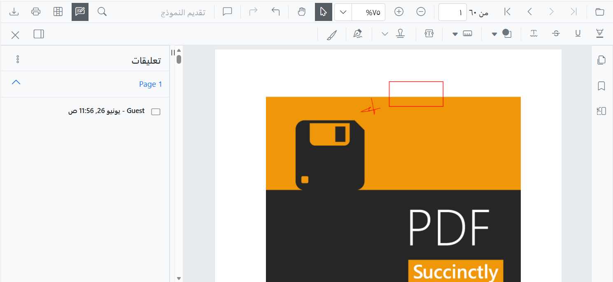

# Enable Right-to-Left Support

This guide shows you how to enable Right-to-Left (RTL) layout support for your Blazor PDF Viewer component.

## Prerequisites

- Blazor WebApp project with Blazor PDF Viewer installed
- (Recommended) Static localization already configured for an RTL language
- Basic knowledge of Blazor component properties

## Understanding Right-to-Left (RTL)

RTL layout reverses the text direction and UI element alignment for languages read from right to left. Blazor PDF Viewer uses the `EnableRtl` property to support RTL languages including:

- Arabic 
- Hebrew 
- Urdu
- Persian/Farsi

When RTL is enabled:

- Toolbar buttons and controls align to the right
- Dialog boxes and panels display from right to left
- Text alignment and flow reverse
- Scrollbars appear on the left side

## Enable RTL in PDF Viewer

### Basic RTL Implementation

In `Pages/Home.razor`, add the `EnableRtl` property to the PDF Viewer component:




<SfPdfViewer2 DocumentPath="https://cdn.syncfusion.com/content/pdf/pdf-succinctly.pdf"
              Height="100%"
              Width="100%"
              EnableRtl="true">
</SfPdfViewer2>




### RTL with Localization

Combine RTL with static localization for a complete right-to-left experience. First, ensure you have [set up static localization](./localization).

In `Pages/Home.razor`:



<SfPdfViewer2 DocumentPath="https://cdn.syncfusion.com/content/pdf/pdf-succinctly.pdf"
              Height="100%"
              Width="100%"
              EnableRtl="true">
</SfPdfViewer2>



Then in `Program.cs`, set an RTL culture:



var app = builder.Build();

// Set the application culture to an RTL language
app.UseRequestLocalization("ar");  // Arabic

// Other RTL culture codes:
// "he" - Hebrew
// "ur" - Urdu
// "fa" - Persian/Farsi
// "ug" - Uyghur



## Testing RTL Implementation

Follow these steps to verify your RTL implementation:

1. **Run your application** with the culture set to an RTL language
2. **Verify layout:**
   - Toolbar buttons appear on the right side
   - Navigation panels display on the right
   - Dialog boxes open from right to left
3. **Verify text direction:**
   - UI strings display in the RTL language
   - Text input fields support RTL text entry
4. **Verify functionality:**
   - All controls remain functional with RTL layout
   - Zoom, navigation, and annotation tools work correctly
   - Page navigation works as expected

## Common RTL Culture Codes

| Language | Code |
|----------|------|
| Arabic | ar |
| Hebrew | he |
| Urdu | ur |
| Persian/Farsi | fa |
| Uyghur | ug |

For the complete list of supported languages, visit the [Syncfusion Blazor Locale repository](https://github.com/syncfusion/blazor-locale).

[View Sample in GitHub](https://github.com/SyncfusionExamples/blazor-pdf-viewer-examples)

## RTL Property Reference

| Property | Type | Default | Description |
|----------|------|---------|-------------|
| `EnableRtl` | bool | false | Enables right-to-left layout for the PDF Viewer component |

## After Completing This Guide

Your Blazor PDF Viewer now displays in right-to-left layout for RTL languages. Users see a culturally appropriate interface with proper text direction and element alignment.

## Related Resources

- [Set Up Static Localization](localization.md)
- [Blazor Common Globalization](https://blazor.syncfusion.com/documentation/common/globalization)
- [Syncfusion Blazor Locale Cultures](https://github.com/syncfusion/blazor-locale)

## Next Steps

- [Set up static localization](localization)
- [Configure dynamic localization](https://blazor.syncfusion.com/documentation/common/localization#dynamically-set-the-culture)
