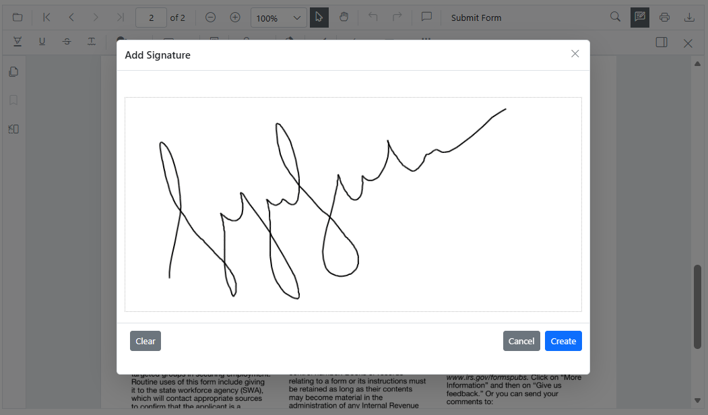
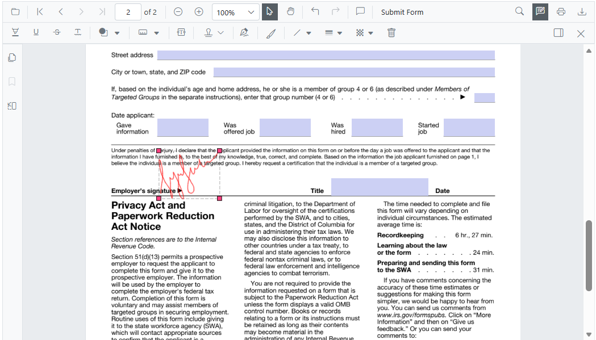
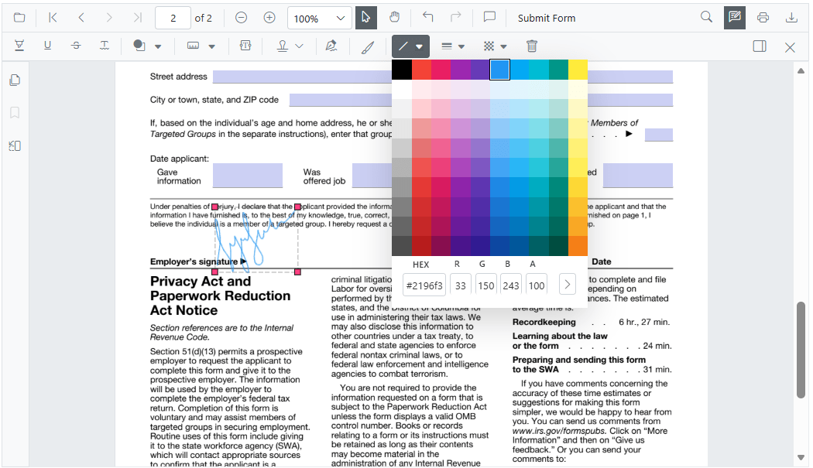

# Handwritten Signature in Blazor SfPdfViewer Component

The SfPdfViewer component supports adding handwritten signatures to PDF documents. Handwritten signatures reduce paperwork during review and enable digital verification within the document.

## Adding a handwritten signature to the PDF document

Add a handwritten signature using the annotation toolbar.

* Click the **Edit Annotation** in the SfPdfViewer toolbar to open the annotation toolbar.
* Select the **HandWritten Signature** tool to open the signature panel.

* Draw the signature in the signature panel using a mouse, or touch.

* Click **Create**, then move and place the signature at the desired location on the page.

The added signature becomes part of the PDF annotations and is preserved when saving or exporting the document.

## Editing the properties of handwritten signature

The stroke color, thickness, and opacity of a handwritten signature can be adjusted using the annotation toolbar’s edit stroke color tool, edit thickness tool, and edit opacity tools. Select the signature on the page to enable these property editors for that item. After placement, the signature can also be moved, resized, or removed like other annotations.

## See also

* [Form filling in Blazor SfPdfViewer Component](./form-filling)