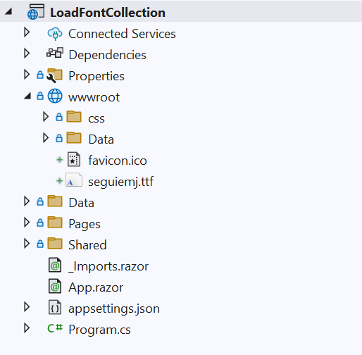

# Load a font collection in Blazor SfPdfViewer

In addition to loading a single custom font, the Blazor SfPdfViewer supports adding multiple fonts to the [FallbackFontCollection](https://help.syncfusion.com/cr/blazor/Syncfusion.Blazor.SfPdfViewer.PdfViewerBase.html#Syncfusion_Blazor_SfPdfViewer_PdfViewerBase_FallbackFontCollection). This is useful when a PDF uses various fonts that are not embedded or not available by default. Configuring multiple fallback fonts helps preserve text shaping, special characters, and overall fidelity.

To use FallbackFontCollection, follow these steps:

1. Add the required font files (for example, TTF/TTC/OTF) to the `wwwroot` folder so they are available as static assets at runtime.



The following example shows how to add fonts to the fallback collection at runtime.

```cshtml

<SfPdfViewer2 @ref="Viewer" 
              DocumentPath="https://cdn.syncfusion.com/content/pdf/pdf-succinctly.pdf"
              Height="100%"
              Width="100%">
    <PdfViewerEvents Created="@Created"></PdfViewerEvents>
</SfPdfViewer2>
 

@code {
    SfPdfViewer2 Viewer;
    
    public void Created()
    {
       Stream font = new MemoryStream(System.IO.File.ReadAllBytes("wwwroot/seguiemj.ttf"));
       Viewer.FallbackFontCollection.Add("seguiemj", font);
    }
}
    
```
[View the font collection sample on GitHub](https://github.com/SyncfusionExamples/blazor-pdf-viewer-examples/tree/master/Load%20and%20Save/Load%20font%20collection%20in%20PDF%20document).
