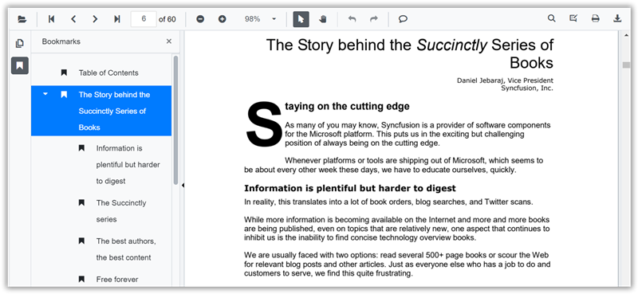

# Bookmark navigation in SfPdfViewer

Use the bookmark panel to jump to labeled destinations in the PDF.

Bookmarks embedded in the PDF are loaded automatically and listed in the bookmark panel. Selecting a bookmark navigates to its target. Nested bookmarks are supported. If a document has no bookmarks, the panel appears empty.



Show or hide the bookmark panel by setting the [EnableBookmarkPanel](https://help.syncfusion.com/cr/blazor/Syncfusion.Blazor.SfPdfViewer.PdfViewerBase.html#Syncfusion_Blazor_SfPdfViewer_PdfViewerBase_EnableBookmarkPanel) property. This property controls only the panel’s visibility; bookmarks are read from the PDF itself.

```cshtml

@using Syncfusion.Blazor.SfPdfViewer

<SfPdfViewer2 Height="100%" Width="100%" DocumentPath="@DocumentPath" EnableBookmarkPanel="true" />

@code{
    public string DocumentPath { get; set; } = "wwwroot/Data/PDF_Succinctly.pdf";
}

```

## See also

* [Page thumbnail navigation in Blazor SfPdfViewer](./page-thumbnail)